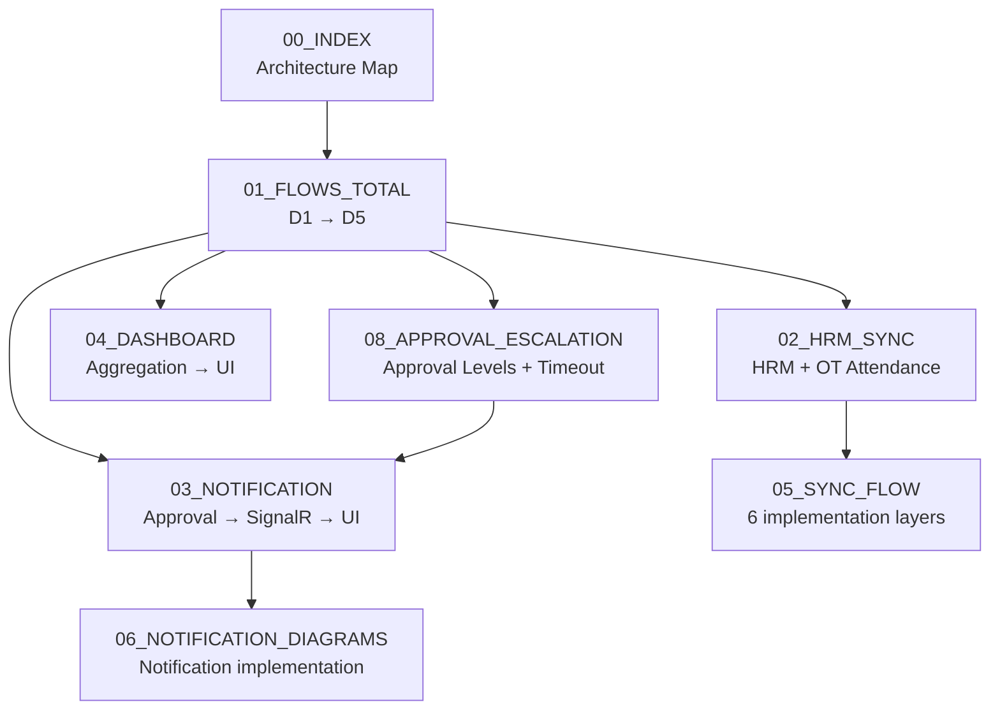
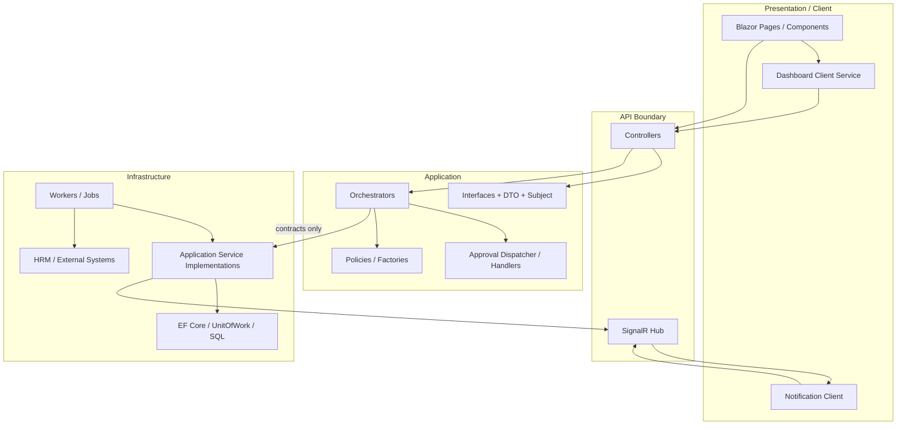
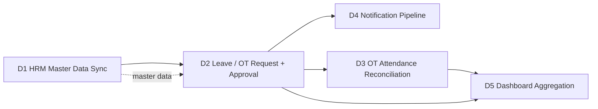
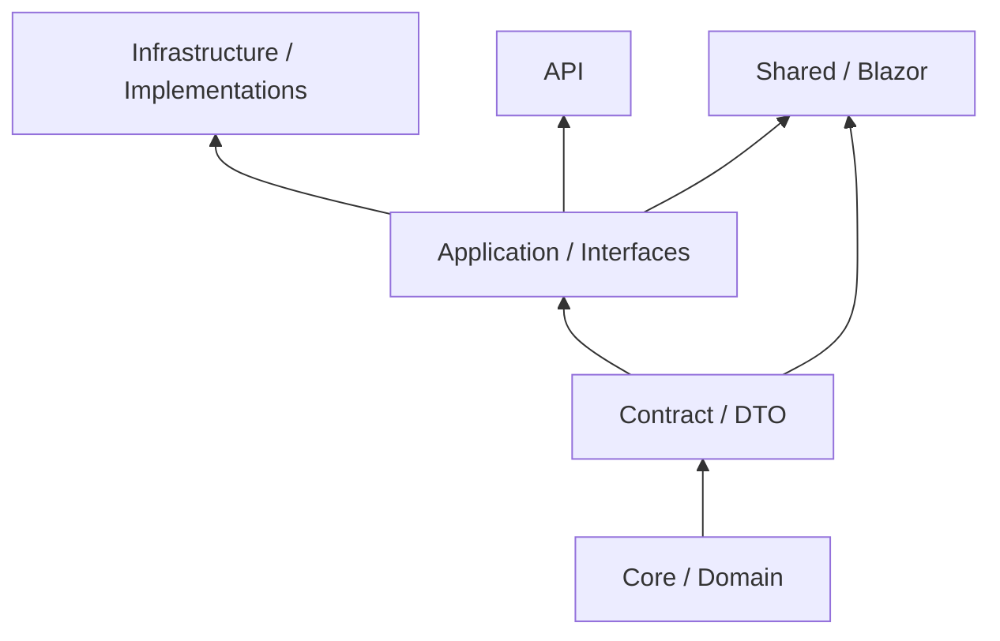

# FVN_REGISTER — Mô hình hệ thống

> Bộ tài liệu Markdown được chuẩn hóa từ các tài liệu TXT hiện có trong thư mục `MÔ HÌNH`.

## 1. Cách đọc tài liệu kiến trúc

Bộ tài liệu được tổ chức theo nguyên tắc **từ tổng thể → pipeline → component → implementation**:

- `00_INDEX.md`: bản đồ kiến trúc và dependency direction.
- `01_FLOWS_TOTAL.md`: kiến trúc tổng thể D1 → D5.
- `02_HRM_SYNC.md`: hai pipeline HRM Sync và OT Attendance ở mức service/application.
- `03_NOTIFICATION.md`: notification từ Approval đến persistence, SignalR và Blazor.
- `04_DASHBOARD.md`: request flow và module provider architecture.
- `05_SYNC_FLOW.md`: chi tiết triển khai HRM Sync theo 6 tầng.
- `06_NOTIFICATION_DIAGRAMS.md`: sequence và dependency chi tiết của Notification.
- `08_APPROVAL_ESCALATION.md`: nghiệp vụ cấp approval, email/in-app, timeout và auto-escalation cho Leave/OT.

## 2. Tài liệu

| Tài liệu | Nội dung |
|---|---|
| [01_FLOWS_TOTAL.md](./01_FLOWS_TOTAL.md) | Kiến trúc tổng hợp D1 → D5 và các nguyên tắc xuyên suốt |
| [02_HRM_SYNC.md](./02_HRM_SYNC.md) | HRM Master Data Sync và OT Attendance Reconciliation |
| [03_NOTIFICATION.md](./03_NOTIFICATION.md) | Notification Pipeline, Factory, Service, SignalR và Blazor client |
| [04_DASHBOARD.md](./04_DASHBOARD.md) | Dashboard aggregation và module providers |
| [05_SYNC_FLOW.md](./05_SYNC_FLOW.md) | Chi tiết tầng của pipeline HRM Sync, resolver, worker, management service và review flags |
| [06_NOTIFICATION_DIAGRAMS.md](./06_NOTIFICATION_DIAGRAMS.md) | Notification sequence, identity mapping và dependency |
| [08_APPROVAL_ESCALATION.md](./08_APPROVAL_ESCALATION.md) | Approval hierarchy, manual activation, timeout escalation, email + in-app/SignalR và idempotency |

## 3. Sơ đồ kiến trúc tổng thể

> Quy ước mũi tên: request/runtime flow đi xuống; dependency architecture phải giữ chiều **Application → abstraction**, Infrastructure thực thi abstraction. Không để Application phụ thuộc ngược vào implementation cụ thể.

## 4. Các pipeline chính

## 5. Dependency direction

Diễn giải: các lớp phía trên định nghĩa model/contract/use-case; Infrastructure cung cấp implementation. UI/API không được trở thành nơi chứa business persistence logic.

## 6. Nguyên tắc kiến trúc

- Contract/Application định nghĩa interface và DTO; Infrastructure cung cấp EF/SQL/SignalR implementation.
- Không có chiều phụ thuộc ngược từ Application về Infrastructure implementation.
- Orchestrator không truy cập trực tiếp `DbContext`.
- Entity không được lộ ra khỏi Application interface; giao tiếp qua DTO/Subject.
- Module mới phải mở rộng bằng implementation + DI registration, không sửa orchestrator/worker/dispatcher dùng chung.
- CRUD thủ công và HRM synchronization là hai luồng độc lập.
- OT attendance reconciliation là **command-with-result**, không phải query thuần vì thao tác reconciliation có ghi dữ liệu.
- Approval timeout dùng `DecisionType.Escalated`, không dùng `Rejected` để biểu diễn việc chuyển cấp.
- Manual approve và auto-escalation đều phải kích hoạt notification cho approver kế tiếp qua email + in-app/SignalR.
- Background escalation worker phải xử lý cả Leave và Overtime.

## 7. Namespace convention

| Thành phần | Namespace / vị trí |
|---|---|
| Interface nghiệp vụ | `Application/Interfaces/{Domain}` |
| Orchestrator | `Application/Orchestrators` |
| Dispatcher | `Application/Dispatchers` |
| Policy / Factory | `Application/Policies`, `Application/Factories` |
| Subject generic | `Application/Models/Subjects` |
| DTO | `Contract/Dtos/{Domain}` |
| Response | `Contract/Responses` |
| EF Entity | `Core/Entities/{Domain}` |
| Implementation | `Infrastructure/Services/{Domain}` |
| SignalR Hub | `Infrastructure/Hubs` |
| Background Worker / Job | `Infrastructure/Jobs` |
| Controller | `API/Controllers` |
| Blazor Page / Client Service | `Shared/Pages`, `Shared/Services/{Domain}` |

## 8. Trạng thái tài liệu

- Nội dung được chuẩn hóa từ TXT, không chủ động thay đổi business rule.
- Các mục được TXT đánh dấu `TODO`, `CẦN XÁC NHẬN`, `CHƯA BUILD` vẫn được giữ lại và đánh dấu rõ.
- Mermaid diagrams mô tả kiến trúc logic; khi implementation thực tế thay đổi, cập nhật Markdown cùng commit với thay đổi kiến trúc.
- `08_APPROVAL_ESCALATION.md` là tài liệu chuẩn cho approval level, notification activation và timeout escalation; code phải tuân theo các invariants trong tài liệu này.
