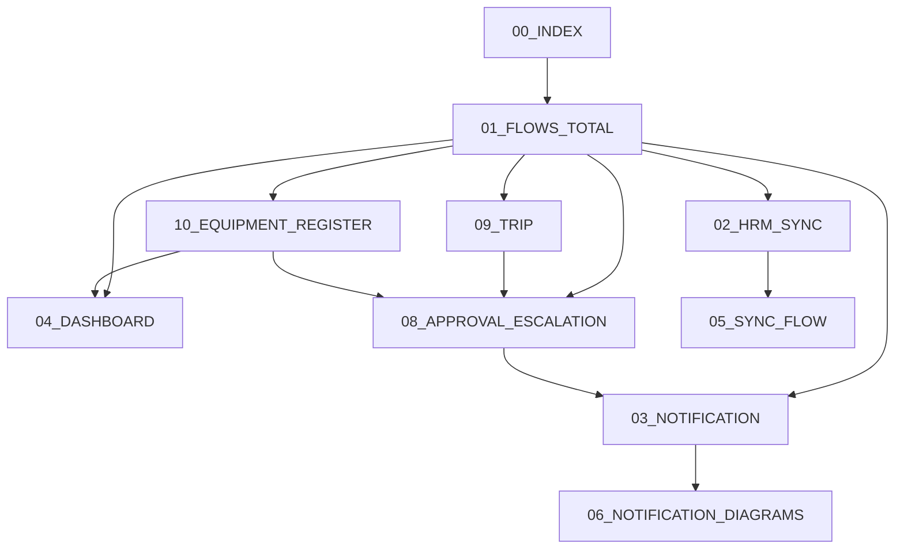
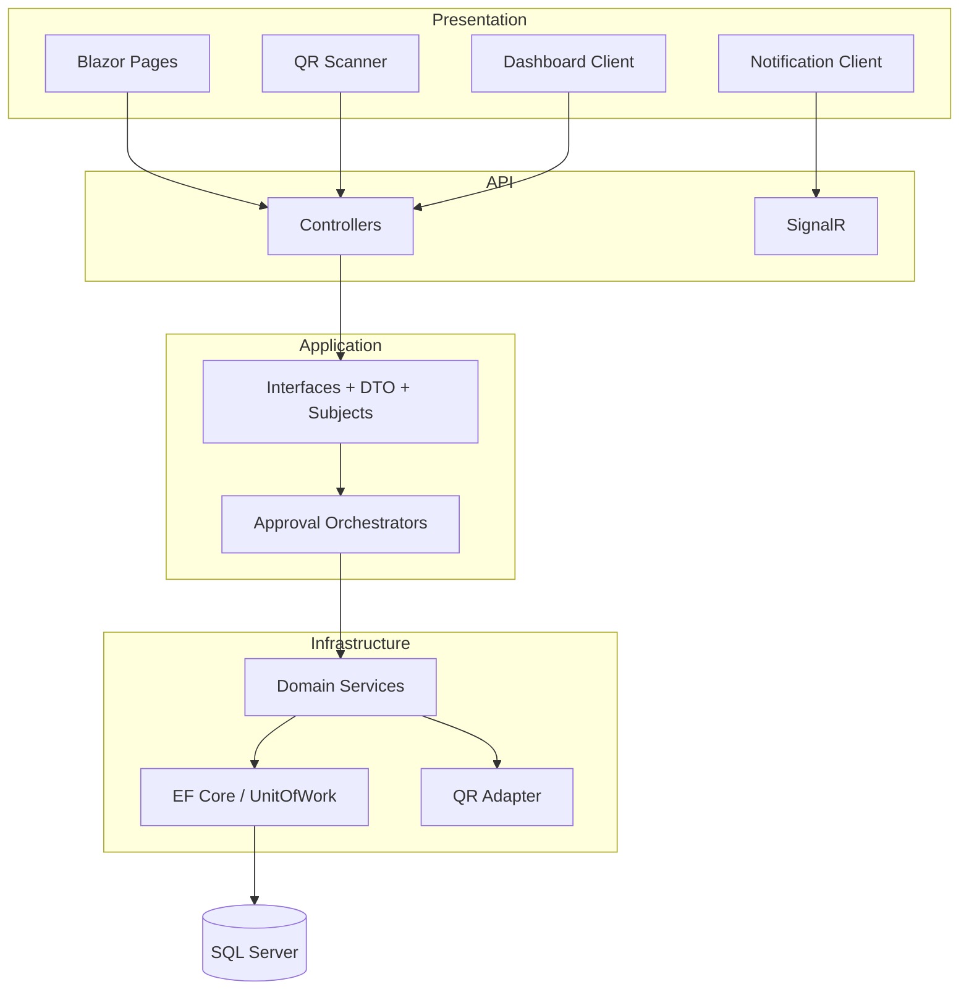
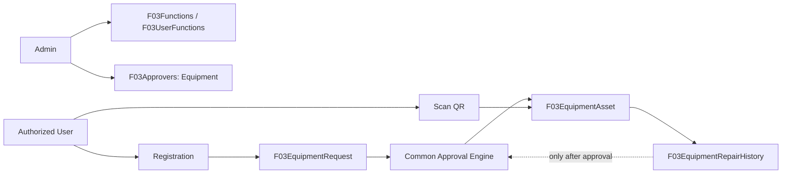
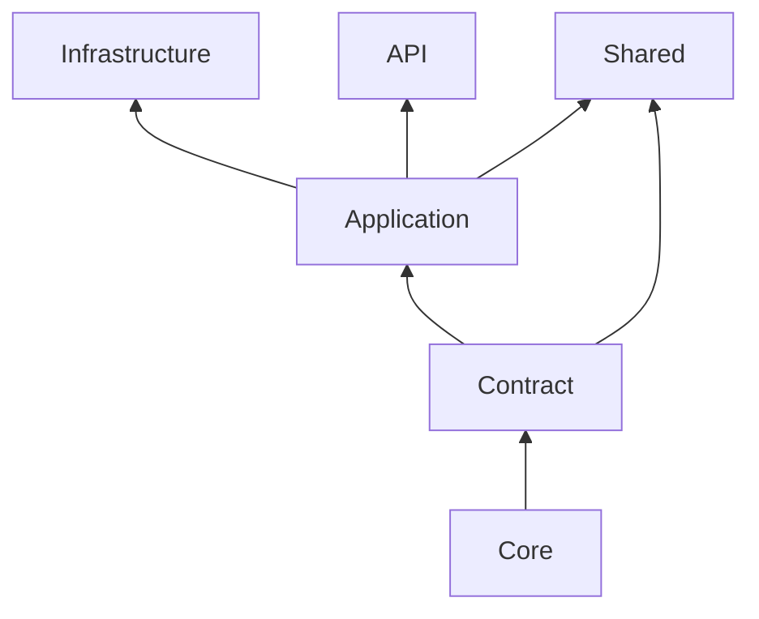

# FVN_REGISTER — Mô hình hệ thống

## Bản đồ tài liệu

`08_APPROVAL_ESCALATION.md` là chuẩn approval chung. `09_TRIP.md` là chuẩn Trip. `10_EQUIPMENT_REGISTER.md` là chuẩn Sổ quản lý thiết bị, QR lifecycle và repair approval.

> **HRM / Attendance:** `02_HRM_SYNC.md` và `05_SYNC_FLOW.md` là chuẩn mô tả hai pipeline: đồng bộ master/ca/lịch từ HRM vào F03 cục bộ và attendance/OT từ HRM → `F03AttendanceStaging` → `F03OTEmployees`.

## Kiến trúc tổng thể

## Equipment

QR token được sinh khi Draft để in/dán, nhưng chỉ request Approved mới tạo/activate asset. Repair history chính thức chỉ chứa record Approved.

## Dependency direction

Controller không query EF; Application không phụ thuộc Infrastructure. Module mới plug-in qua contract/service/provider và DI.

## Namespace convention

| Thành phần | Vị trí |
|---|---|
| Core entity | `FVN_REGISTER.Core/Entities/{Domain}` |
| Enum | `FVN_REGISTER.Core/Enums` |
| Contract DTO | `FVN_REGISTER.Models/Requests` + `Responses` |
| Application interface | `Application/Interfaces/{Domain}` |
| Subject | `Application/Models/Subjects` |
| Infrastructure service | `FVN_REGISTER.Infrastructure/Services/{Domain}` |
| EF configuration | `FVN_REGISTER.Infrastructure/Models/Data/Configurations/{Domain}` |
| API controller | `FVN_REGISTER.API/Controllers` |
| Shared client/page | `FVN_REGISTER/FVN_REGISTER.Shared/Services/{Domain}`, `Pages` |
| Database script | `Database/{Domain}` |

- [11 — Code Runtime Audit: Core → Application → Infrastructure → API → Web](./11_CODE_RUNTIME_AUDIT.md)
