# FVN_REGISTER — Kiến trúc tổng hợp D1 → D5

## 1. Mục tiêu

Tài liệu này là bản Markdown chuẩn hóa của `FolowsTotal.txt`, mô tả các domain/pipeline chính và các nguyên tắc kiến trúc xuyên suốt hệ thống.

## 2. Sơ đồ tổng thể

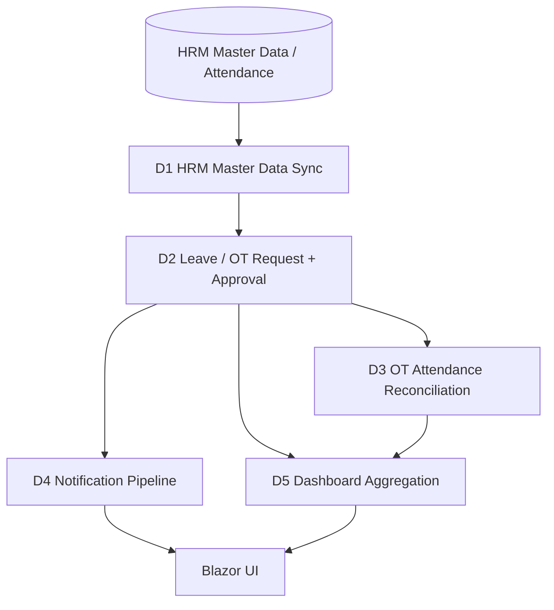

- **D1** cung cấp Employee / Department / Position / LeaveType / OTType sạch cho hệ thống.
- **D2** quản lý Leave/OT Request và Approval.
- **D3** đối chiếu chấm công OT thực tế với dữ liệu OT đã Approved.
- **D4** phát notification cho approver/employee khi workflow có thay đổi.
- **D5** tổng hợp widgets và pending approvals để hiển thị dashboard.

## 3. Sơ đồ deployment logic

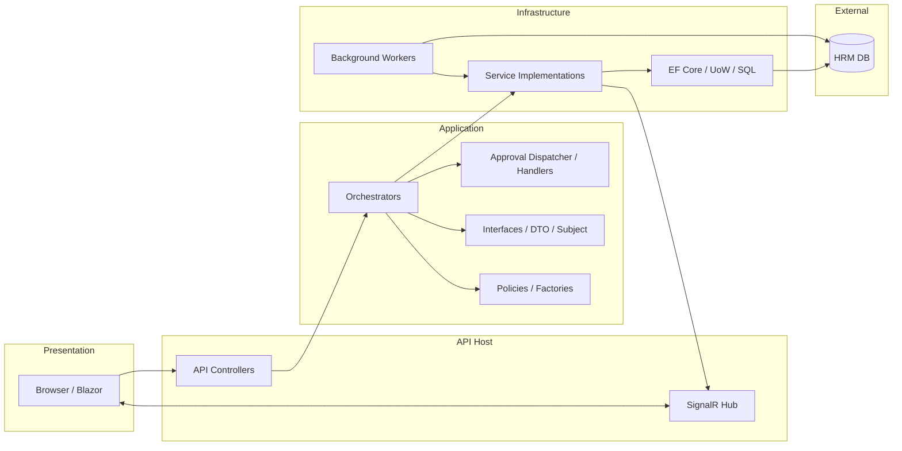

## 4. D1 — HRM Master Data Sync

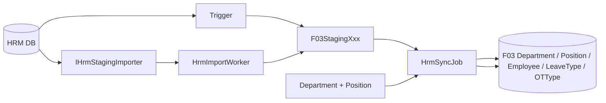

Các domain sync dùng chung staging và generic sync job. Thứ tự dependency bắt buộc: **Department và Position trước Employee**.

## 5. D2 — Leave / OT Request + Approval

### Request flow

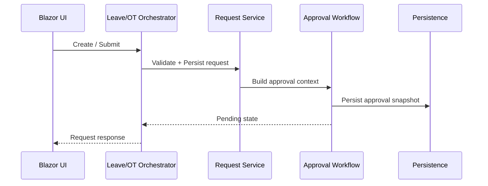

`LeaveOrchestrator` và `OTOrchestrator` là domain facade mỏng trên generic request/approval infrastructure.

### Approval workflow — 5 bước bất biến

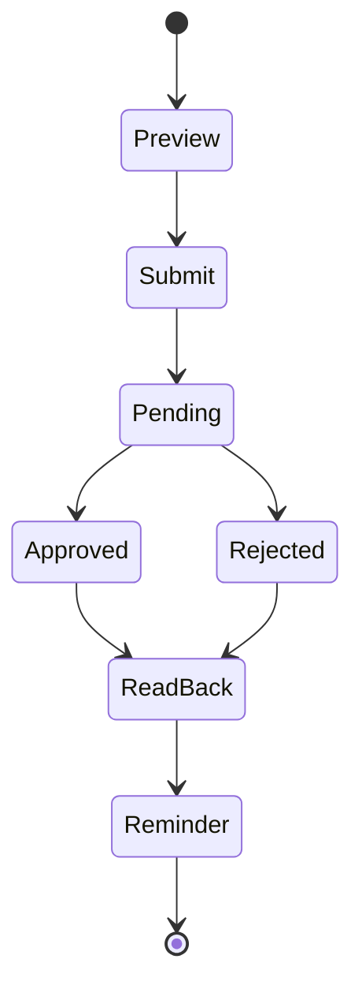

| Bước | Ý nghĩa | Persistence |
|---|---|---|
| 1. Preview | Dựng hierarchy cho form | Không persist |
| 2. Submit | Chụp snapshot vị trí approver | Persist một lần |
| 3. Approve/Reject | Ghi lịch sử quyết định | Append-only history |
| 4. Read back | Tính trạng thái từ snapshot + history | Không cache Calculated |
| 5. Reminder | Theo dõi nhắc duyệt | Reminder log riêng |

### Approve đa module

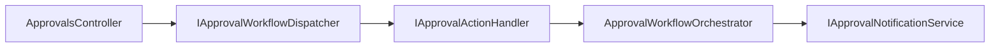

Một endpoint chung xử lý nhiều module; dispatcher/handler route tới workflow tương ứng.

## 6. D3 — OT Attendance Reconciliation

D3 gồm hai lớp dữ liệu phụ thuộc lẫn nhau nhưng khác trách nhiệm:

1. **HRM Shift Master Sync:** HRM cung cấp cấu hình ca/lịch; `usp_SyncHrmShiftMaster` đồng bộ vào `F03Shifts`, `F03ShiftSchedules`, `F03ShiftScheduleDays`, `F03EmployeeShiftSchedules`.
2. **Attendance Staging / Reconciliation:** `usp_SyncAttendanceStaging(@WorkDate)` đọc dữ liệu chấm công HRM và tự gọi `usp_SyncHrmShiftMaster` trước khi resolve ca. Sau đó ghi `F03AttendanceStaging`; `usp_SyncOTActualHours` dùng staging này để cập nhật actual OT vào `F03OTEmployees`.

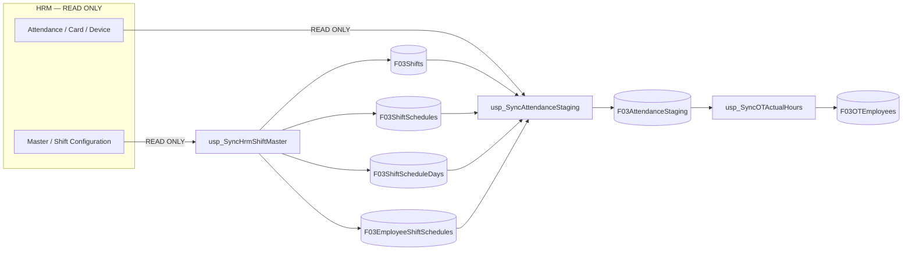

**Invariant:** FVN_REGISTER chỉ đọc HRM; không ghi ngược vào các bảng HRM. `tblBaoCao` được dùng làm dữ liệu tham chiếu/snapshot chấm công HRM, không phải bảng do FVN_REGISTER sở hữu.

## 7. D4 — Notification Pipeline

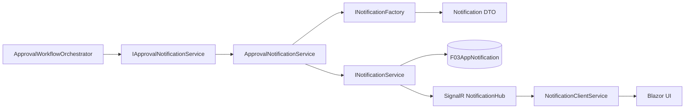

Factory chỉ chứa logic dựng notification; persistence và realtime thuộc Infrastructure.

## 8. D5 — Dashboard Aggregation

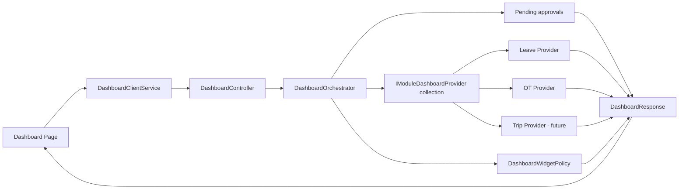

Mỗi module đóng góp dữ liệu qua `IModuleDashboardProvider`; thêm module không yêu cầu sửa `DashboardOrchestrator`.

## 9. Nguyên tắc kiến trúc xuyên suốt

### 9.1 Dependency direction

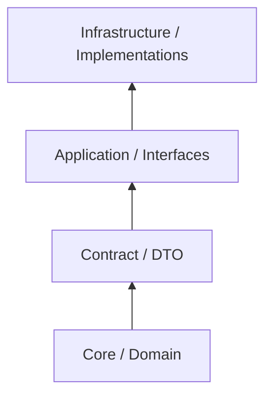

Chiều phụ thuộc được kiểm soát: Application không phụ thuộc implementation của Infrastructure.

### 9.2 Không truy cập DbContext từ Orchestrator

Orchestrator chỉ điều phối use-case thông qua application interfaces/service contracts. EF Core, SQL, SignalR và các implementation cụ thể thuộc Infrastructure.

### 9.3 Entity không được lộ qua Application contract

Application/Interfaces trao đổi bằng DTO, response và Subject; EF entity không trở thành contract cho UI/client.

### 9.4 Open/Closed cho module

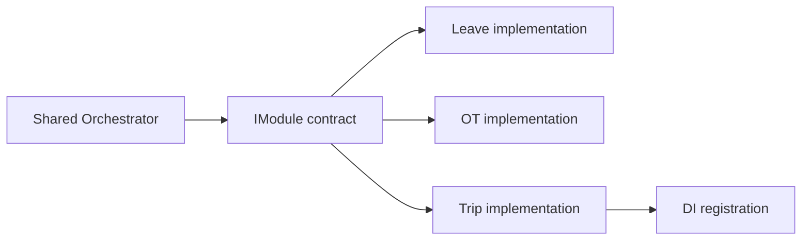

Thêm module mới phải ưu tiên thêm implementation + DI, không sửa orchestrator/worker/dispatcher dùng chung.

## 10. Namespace convention

| Thành phần | Vị trí |
|---|---|
| Interface nghiệp vụ | `Application/Interfaces/{Domain}` |
| Orchestrator | `Application/Orchestrators` |
| Dispatcher | `Application/Dispatchers` |
| Policy / Factory | `Application/Policies`, `Application/Factories` |
| Subject | `Application/Models/Subjects` |
| DTO | `Contract/Dtos/{Domain}` |
| Response | `Contract/Responses` |
| Entity | `Core/Entities/{Domain}` |
| Implementation | `Infrastructure/Services/{Domain}` |
| Hub | `Infrastructure/Hubs` |
| Worker / Job | `Infrastructure/Jobs` |
| Controller | `API/Controllers` |
| Blazor | `Shared/Pages`, `Shared/Services/{Domain}` |

## 11. Các điểm còn tồn đọng

- Xác nhận logic `HrmSyncResult.Success`.
- Xác nhận `IHrmStagingEntity.Id` dùng làm tiebreaker.
- Xác nhận thứ tự enum `SyncSourceTags` và giá trị mặc định an toàn.
- Migration cho `ApproverEmail` và `F03ApprovalReminderLog`.
- Hoàn thiện rule Admin override trong approval.
- Lộ trình loại bỏ `F03ApprovalStep` cũ.
- Resolve `ApproverCode → UserId` cho notification in-app.
- Hoàn thiện kiểu `Detail` của dashboard contribution.

## Shared Work Calendar Flow

```text
User
  |
  v
WorkCalendar UI
  |
  v
GET /api/calendar
  |
  v
WorkCalendarService
  +--> Company holidays
  +--> Leave requests
  +--> OT requests
  +--> Trip requests
  |
  v
WorkCalendarDto
  |
  +--> Leave registration
  +--> OT registration
  +--> Trip registration
```

The calendar is a read projection. Final authorization and business validation remain in the corresponding module service/validator.
