# HRM Sync & OT Attendance Reconciliation

## 1. Hai pipeline độc lập

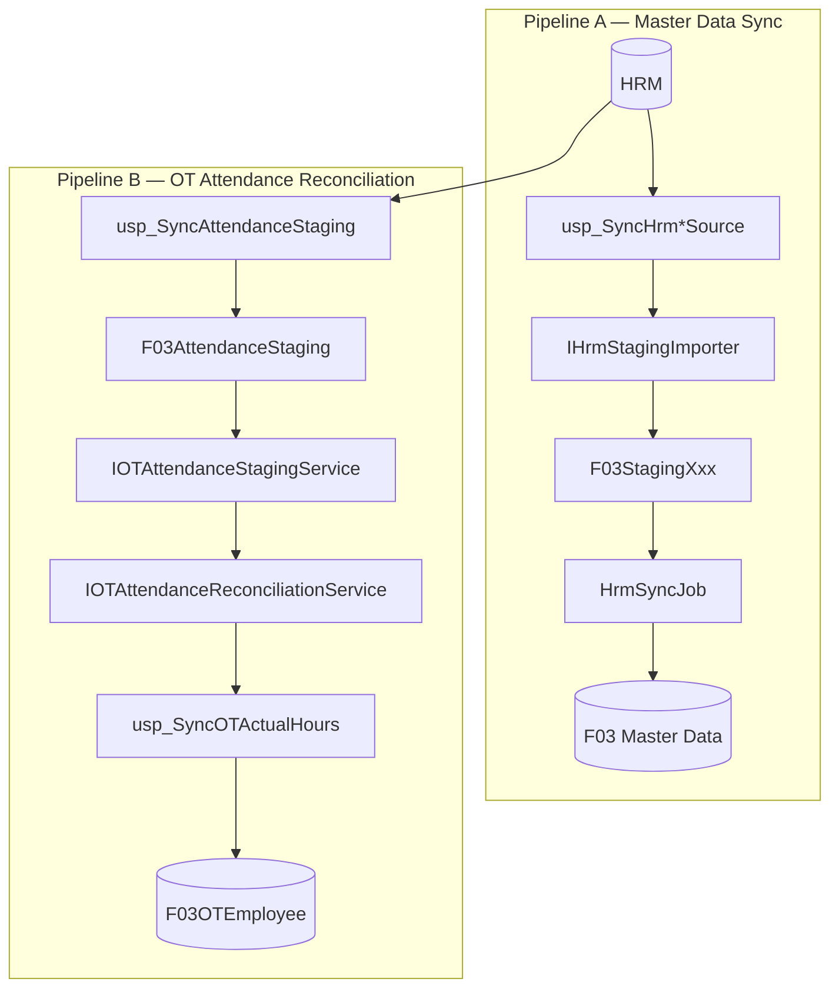

### Pipeline A — HRM Master Data Sync

Đối tượng: `LeaveType`, `OTType`, `Department`, `Position`, `Employee`.

Đặc điểm: dữ liệu tương đối ít thay đổi, cần theo dõi Insert/Update/Delete và nguồn thay đổi.

`HrmSyncJob` không cần biết staging đến từ trigger hay importer.

### Pipeline B — OT Attendance Reconciliation

Pipeline này **không sử dụng** `IHrmStagingEntity/HrmChangeAction` của Pipeline A.

Mỗi lần reconciliation là một thao tác ghi dữ liệu; vì vậy đây là command-with-result, không phải query thuần.

## 2. HRM staging importer

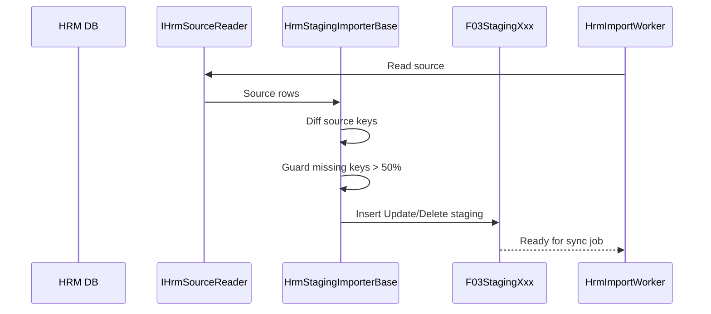

`IHrmSourceReader<TSourceRow>` đọc dữ liệu HRM. Implementation SQL dùng Dapper và gọi các source-contract stored procedure `dbo.usp_SyncHrm*Source` trong FVN. Các procedure này chỉ đọc `[HRM].[dbo].[tblXxx]`, chuẩn hóa kiểu/NULL/sentinel và trả alias ổn định cho SourceRow. Không đặt business update vào HRM.

`HrmStagingImporterBase<TSourceRow,TStaging,TEntity>` chịu trách nhiệm logic chung:

- `EntityType` xác định domain.
- `ImportAsync(asOfDate, ct)` là entry point.
- dọn stale pending staging cùng loại trước khi ghi batch mới;
- tạo staging `Update` cho source rows;
- so sánh source keys với existing keys để sinh `Delete` cho key bị mất;
- nếu số key mất vượt ngưỡng an toàn (`> 50%`) thì không phát Delete để tránh sự cố nguồn làm xóa hàng loạt.

Các hook: `GetSourceKey`, `GetEntityKeySelector`, `MapToStaging`, `BuildDeleteStaging`.

Master source contracts hiện có:

- `usp_SyncHrmLeaveTypeSource` → `HRM.dbo.tblLoaiNghi` → `F03StagingLeaveType` → `F03LeaveType`.
- `usp_SyncHrmDepartmentSource` → `HRM.dbo.tblBoPhan` → `F03StagingDepartment` → `F03Departments`.
- `usp_SyncHrmPositionSource` → `HRM.dbo.tblChucVu` → `F03StagingPosition` → `F03Positions`.
- `usp_SyncHrmEmployeeSource` → `HRM.dbo.tblNhanVien` → `F03StagingEmployee` → `F03Employees`.

Quy tắc mapping: `tblLoaiNghi.LNTinhDKNgayNghi` → `TinhPhep/IsCountedAsLeave`; `tblBoPhan.BPMaCha/BPUuTien/BPHienThiBC` → các field tương ứng; `tblNhanVien.NVMa` → `EmployeeNo`; ngày nghỉ sentinel `>= 9990-01-01` → `NULL`. `IsApprove`, `IsAllowApprove` và approval hierarchy cục bộ không bị HRM ghi đè khi nguồn không cung cấp dữ liệu tương ứng.

## 3. Staging contract

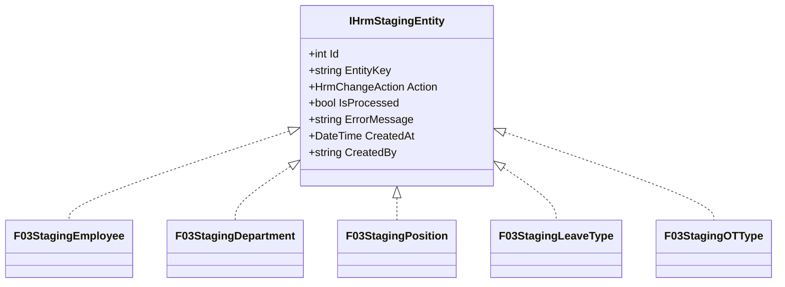

`Id` được đề xuất dùng làm tiebreaker khi `CreatedAt` trùng; trạng thái này vẫn cần xác nhận với model/database thực tế.

## 4. Generic HrmSyncJob

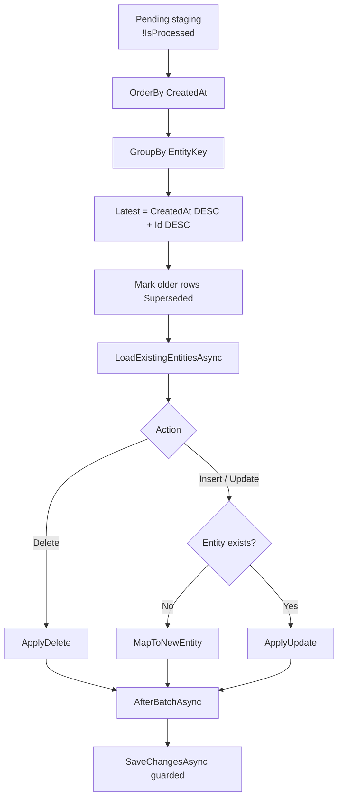

`HrmSyncJob<TStaging,TEntity>` có `EntityType`, `SyncOrder`, `IsBlockingDependency`, `RunAsync(ct)` thông qua `IHrmSyncJob`.

## 5. Sync order và dependency

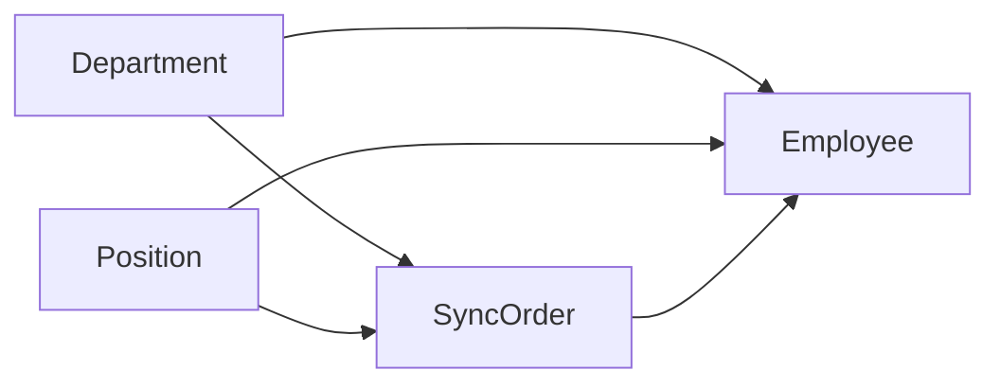

Employee phụ thuộc Department/Position. `IHrmSyncJobResolver.GetAll()` phải `OrderBy(j => j.SyncOrder)`; không phụ thuộc thứ tự registration của DI. Hiện resolver đã sắp xếp `SyncOrder` rồi `EntityType`.

Nếu một job có `IsBlockingDependency=true` và thất bại, `HrmSyncWorker` dừng chuỗi job còn lại; lỗi của từng job vẫn phải được catch/log riêng để worker không chết.

## 6. Source tracking

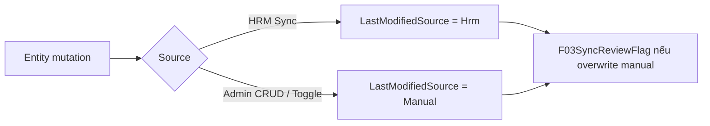

Quy tắc:

- HrmSyncJob ghi entity → `LastModifiedSource = Hrm`.
- Admin Create/Update/Toggle → `LastModifiedSource = Manual`.
- Delete thủ công bị chặn khi entity đang mang nguồn HRM.
- `ApplyUpdate` phải xác định entity từng bị chỉnh tay trước khi ghi đè.
- Khi HRM ghi đè thay đổi thủ công, `AfterBatchAsync` tạo `F03SyncReviewFlag`.

## 7. Management Service

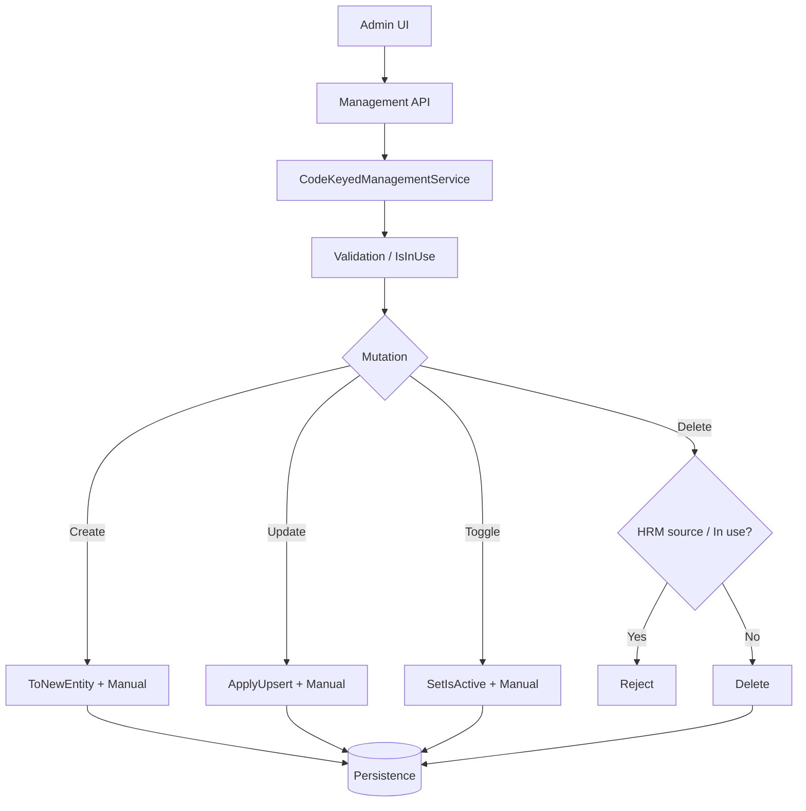

`SyncNowAsync` dùng chính `IHrmSyncJobResolver.Resolve(EntityType)` và `RunAsync(ct)`, không tạo engine sync thứ hai.

## 8. Review flags

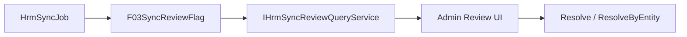

Các flag: `ManualEditOverwrittenByHrm`, `ManualDeactivationOverwrittenByHrm`, `DeactivatedButStillReferenced`.

`IsResolved/ResolvedAt/ResolvedBy` vẫn là mục cần xác nhận.

## 9. OT attendance staging

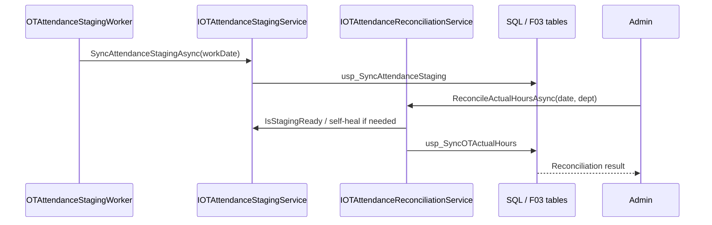

`F03AttendanceStaging` là staging riêng của Attendance. Worker nightly chỉ sync staging; **không tự động reconciliation**.

## 10. Worker

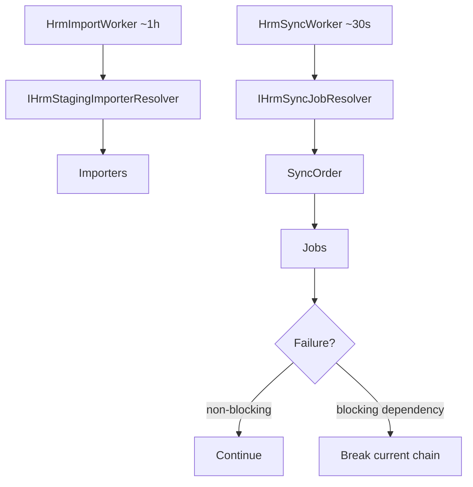

Một importer/job lỗi không được làm worker chết. Failure của blocking dependency có thể dừng phần còn lại của chuỗi để bảo vệ FK/dependency.

## 11. Shared service

`IDepartmentLookupService.GetActiveDepartmentsAsync()` là cross-cutting service dùng chung cho Leave, OT, Trip và Dashboard; không đặt trong `OTAttendanceReconciliationService`.


## 12. Automatic HRM synchronization

Pipeline A hỗ trợ **hai cơ chế chạy chung một engine**:

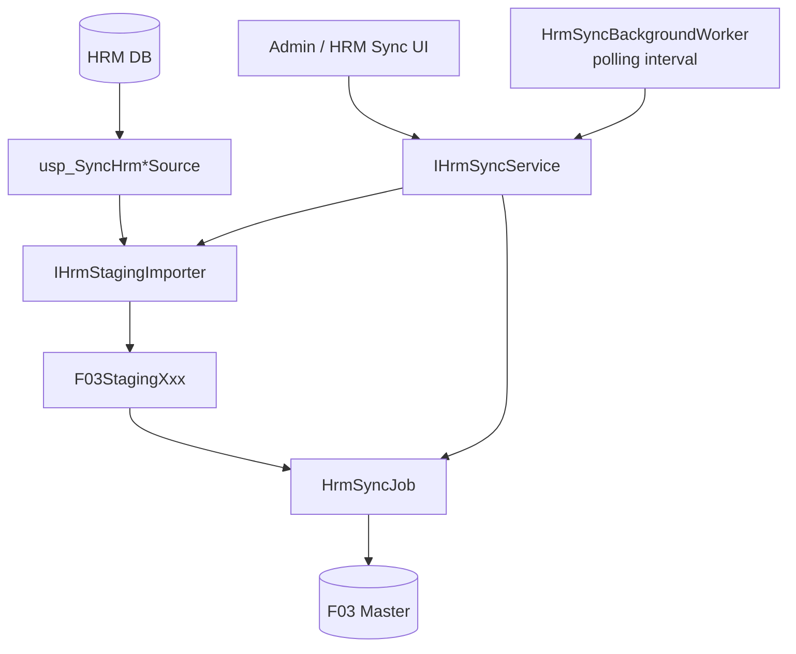

### Quy tắc an toàn đối với HRM

Không để trigger HRM thực hiện `INSERT/UPDATE` trực tiếp vào `FVN_REGISTER`.

Lý do: trigger SQL Server chạy trong transaction của thao tác HRM. Nếu database FVN, network, schema hoặc code downstream lỗi, trigger cross-database có thể làm transaction nghiệp vụ HRM thất bại.

Cơ chế mặc định của hệ thống là:

1. `FVN_REGISTER` **chỉ đọc** HRM thông qua các source stored procedure.
2. Background worker chạy polling định kỳ và đưa snapshot vào `F03StagingXxx`.
3. `HrmSyncJob` xử lý staging thành F03 master.
4. Nếu HRM tạm thời unavailable, worker ghi log/lỗi và lần chạy sau tự retry; không ghi ngược vào HRM.
5. Nếu snapshot HRM bị thiếu bất thường, `HrmStagingImporterBase` dùng delete guard `> 50%` để không soft-delete hàng loạt.
6. Admin vẫn có thể `Sync All` hoặc sync từng master bằng UI hiện có.

Nếu sau này cần near-real-time, trigger/Change Tracking/CDC chỉ nên tạo **outbox/change marker ở phía HRM**, còn FVN vẫn là bên polling/consuming. Không dùng trigger để cập nhật trực tiếp F03.

## 13. Automatic Employee → User provisioning

Sau khi `F03Employee` được tạo/cập nhật bởi HRM, hệ thống tự đồng bộ tài khoản:

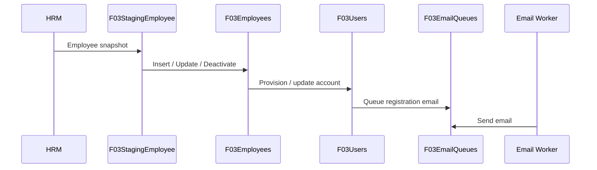

Quy tắc:

- Khóa liên kết tài khoản là `EmployeeCode`; không tạo user trùng.
- Nhân viên mới: tạo `F03User`, `EmployeeCode`, `FullName`, `DeptCode`, `Cvcode`, `PermissionCode`, `LevelApprove`.
- Mật khẩu mặc định là `Fcc@123` nhưng **chỉ lưu giá trị đã băm** theo cơ chế password hiện tại của hệ thống; không lưu plaintext vào `F03Users`.
- Email đăng ký được ghi vào `F03EmailQueues`, không gửi SMTP ngay trong transaction sync.
- Email được gửi bởi email worker riêng; lỗi SMTP không làm rollback việc đồng bộ nhân viên/user.
- Chỉ enqueue email khi user vừa được tạo hoặc khi có thay đổi email cần thông báo; phải có cơ chế idempotent để một lần sync không gửi nhiều mail trùng.
- Nhân viên nghỉ việc (`EndWorkingDate` có giá trị hoặc HRM làm mất key hợp lệ) → `F03Employee.IsActive=false` và `F03User.IsActive=false`.
- Khi khóa user, các session/refresh token đang hoạt động phải được revoke để tài khoản không tiếp tục sử dụng phiên cũ.

### Role theo phòng ban/chức vụ

Schema `F03Users` hiện có một `PermissionCode`, cùng `DeptCode` và `Cvcode`. Vì vậy không nên hard-code role trong `EmployeeHrmSyncJob`.

Quy tắc role nên được cấu hình bằng bảng mapping:

```text
F03HrmUserRoleRules
 ├─ DeptCode       nullable = wildcard
 ├─ PositionCode   nullable = wildcard
 ├─ PermissionCode
 ├─ Priority
 └─ IsActive
```

Resolution:

```text
Department + Position
        ↓
exact Dept + exact Position
        ↓
exact Dept + wildcard Position
        ↓
wildcard Dept + exact Position
        ↓
default PermissionCode = User
```

Mỗi user hiện chỉ có một `PermissionCode`; nếu nghiệp vụ sau này cần nhiều role đồng thời thì phải mở rộng mô hình RBAC riêng, không nhồi nhiều role vào `PermissionCode`.

## 14. Isolation giữa Employee Sync và Email

Không để lỗi email làm lỗi HRM sync:

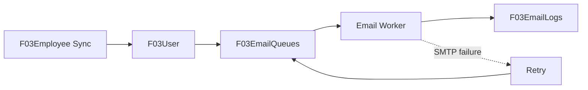

`F03EmailQueues` là durable queue hiện có. Email có `Pending/Retry/Processing` và retry limit; vì vậy việc tạo user không phụ thuộc trạng thái SMTP.

## 15. Manual sync và automatic sync dùng chung

```text
Admin UI
   └─ IHrmSyncService.RunAllAsync / RunOneAsync
             │
Background Worker
   └─ IHrmSyncService.RunAllAsync
             │
             ▼
       Importers → Staging → SyncJobs
             │
             ├─ F03 Master Data
             └─ Employee → User Provisioning → Email Queue
```

Không tạo engine thứ hai cho automatic sync. Manual và scheduled sync phải dùng cùng `IHrmSyncService`, cùng lock chống chạy đồng thời và cùng review/error tracking.

## 16. Failure policy

| Thành phần lỗi | Xử lý |
|---|---|
| HRM unavailable | Log + retry ở lần polling sau |
| Source stored procedure lỗi | Không tạo Delete; giữ dữ liệu F03 hiện tại |
| Missing keys > 50% | Không phát Delete |
| Một staging employee lỗi | Đánh dấu staging lỗi; các employee khác tiếp tục |
| User provisioning lỗi | Ghi lỗi provisioning để retry; không làm HRM transaction thất bại |
| Email SMTP lỗi | Giữ queue `Retry`; không rollback user |
| Employee nghỉ việc | Soft-lock `F03Employee` + `F03User`, revoke session |
| Role rule không khớp | Dùng `PermissionCode=User` và ghi log/review nếu cần |

## 17. Scope các master

Pipeline A hiện đã có source contract cho:

- `tblLoaiNghi` → `F03LeaveType`
- `tblBoPhan` → `F03Departments`
- `tblChucVu` → `F03Positions`
- `tblNhanVien` → `F03Employees`

`OTType` vẫn nằm trong generic pipeline nhưng hiện chưa có source contract HRM tương ứng trong SQL. Không tự suy diễn nguồn `OTType`; khi có bảng/procedure HRM thực tế thì bổ sung theo đúng contract hiện tại.

## 18. Implementation status

Phiên bản hiện tại đã chuyển `HrmSyncBackgroundWorker` sang polling tự động mỗi 5 phút. Worker gọi cùng `IHrmSyncService.RunAllAsync` đang được dùng bởi UI manual sync.

`EmployeeHrmSyncJob` thực hiện full reconciliation `F03Employees → F03Users` sau mỗi batch HRM. Vì vậy user bị thiếu có thể được tạo lại và thay đổi mapping phòng ban/chức vụ có thể áp dụng lại mà không cần chờ một thay đổi nhân viên mới.

Lỗi provisioning user không làm rollback dữ liệu HRM; lỗi được ghi vào `F03SyncReviewFlag` để Admin review.
