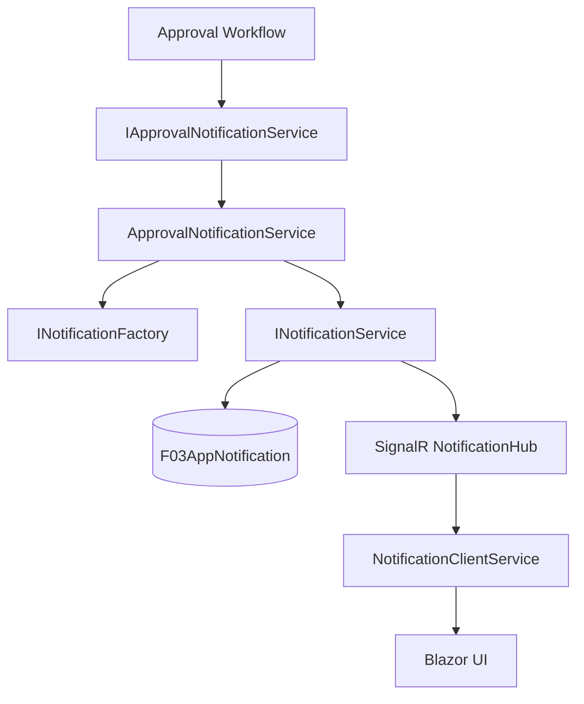
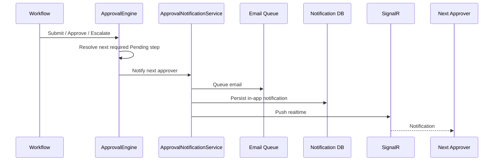
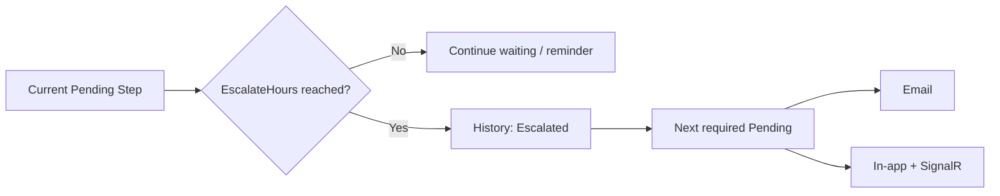
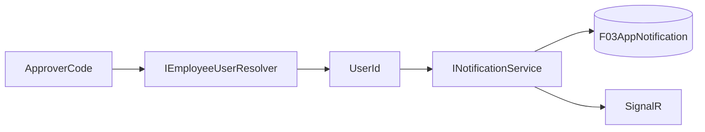

# Notification Pipeline

## 1. Mục tiêu

Notification là pipeline cross-cutting nối Approval workflow với lưu trữ notification, realtime SignalR và UI Blazor.

## 2. Luồng chuẩn



## 3. Application layer

### `IApprovalNotificationService`

Là application contract được Approval workflow gọi khi có step mới, step kế tiếp được kích hoạt hoặc một bước duyệt hoàn tất.

Các thời điểm bắt buộc:

```text
Submit
  → NotifyNewRequestAsync(first approver)
  → NotifyApproverInAppAsync(first approver)

Approve current step
  → activate next required Pending step
  → NotifyNewRequestAsync(next approver)
  → NotifyApproverInAppAsync(next approver)

Timeout / Escalate
  → record DecisionType.Escalated
  → activate next required Pending step
  → NotifyNewRequestAsync(next approver)
  → NotifyApproverInAppAsync(next approver)

Reject / Fully Approved
  → notify creator with final result
```

### `INotificationFactory`

Factory thuần logic, không I/O. Nhiệm vụ là chuyển ngữ cảnh nghiệp vụ thành:

- `Title`;
- `Body`;
- `ActionUrl`;
- các thông tin cần thiết cho notification DTO.

Factory không lưu database và không truy cập SignalR.

### `INotificationService`

Contract nghiệp vụ cho notification. Các API được tài liệu hóa gồm:

```text
CreateAsync(CreateNotificationDto, ct)
    → Task<NotificationDto>

GetByUserAsync(userId, page, pageSize, ct)
    → List<NotificationDto>

GetUnreadCountAsync(userId, ct)
    → int

MarkReadAsync(notificationId, userId, ct)
    → ServiceResult

MarkAllReadAsync(userId, ct)
    → ServiceResult
```

Contract trả DTO, không trả EF entity.

## 4. Infrastructure

### `ApprovalNotificationService`

Implementation thuộc `Infrastructure/Services/Approvals`:

1. gọi `INotificationFactory` để tạo nội dung;
2. gọi `INotificationService` để persistence và realtime;
3. dùng `IEmployeeUserResolver` để resolve `ApproverCode → UserId` cho in-app notification.

### `NotificationService`

Implementation thuộc `Infrastructure/Services/Notifications`:

- lưu `F03AppNotification` thông qua `IUnitOfWork`;
- map entity → `NotificationDto`;
- dùng `IHubContext<NotificationHub>` để gửi realtime tới user.

### `NotificationHub`

SignalR hub thuộc:

```text
Infrastructure/Hubs
```

Không đặt hub trong API controller layer.

## 5. Client

`NotificationClientService` thuộc:

```text
Shared/Services/Notifications
```

Nó quản lý kết nối/nhận notification từ SignalR và cung cấp dữ liệu cho UI.

`NotificationActionUIExtensions` thuộc `Shared/Utils`, chịu trách nhiệm map enum/action sang biểu diễn UI như icon hoặc màu.

## 6. Approval activation — invariant



Không có trạng thái nghiệp vụ hợp lệ nào mà step kế tiếp đã `Pending` nhưng không được đưa qua notification pipeline.

## 7. Auto-escalation

Timeout không phải Reject.



`Escalated` chỉ là system transition để chuyển quyền xử lý. `Rejected` chỉ dùng cho quyết định từ chối thực sự hoặc hard-deadline rule được cấu hình là auto reject.

## 8. Identity mapping cho in-app

Approval snapshot lưu `ApproverCode` để bảo toàn người duyệt tại thời điểm Submit. Khi cần gửi in-app:



Shared/UI không tự query employee hoặc user. Backend chịu trách nhiệm mapping này.

## 9. Điểm tích hợp Approval

Approval workflow phát notification tại bốn thời điểm:

```text
1. Submit
   → first approver

2. Manual Approve
   → next approver

3. Auto Escalate
   → next approver

4. Final Approve / Reject
   → requester
```

Notification là side effect của workflow; không đưa logic dựng nội dung notification vào domain Leave/OT.

## 10. Quy tắc dependency

```text
Application
 ├─ IApprovalNotificationService
 ├─ INotificationFactory
 └─ INotificationService

Infrastructure
 ├─ ApprovalNotificationService
 ├─ NotificationService
 └─ NotificationHub

Shared
 └─ NotificationClientService
```

Application chỉ biết contract. Infrastructure chứa EF/SignalR implementation. Shared không tham chiếu ngược Infrastructure.

## 11. Invariants

- Factory không I/O.
- Notification service không trả entity ra ngoài contract.
- SignalR hub thuộc Infrastructure.
- Approval workflow là nơi quyết định **khi nào** notification được phát; notification service quyết định **cách lưu/gửi**.
- Notification client thuộc Shared, không đặt logic UI notification trong domain Leave/OT.
- `EmployeeCode → UserId` được resolve ở backend qua `IEmployeeUserResolver`.
- Timeout escalation không ghi `DecisionType.Rejected`.
- Cả manual approval và auto-escalation đều notify approver mới qua email + in-app/SignalR.
