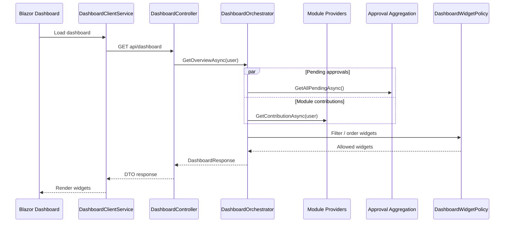
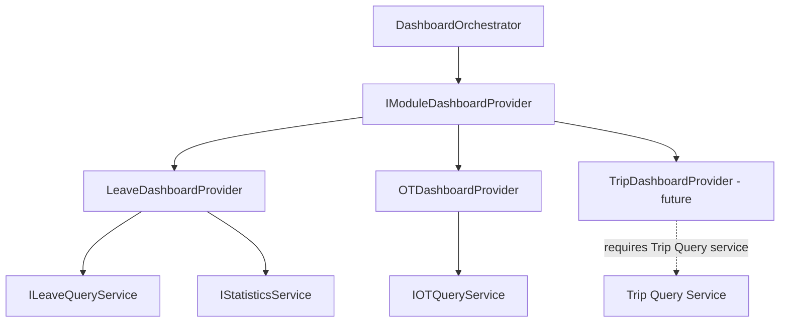
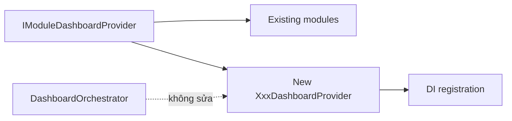
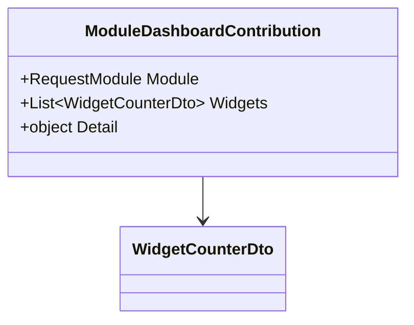
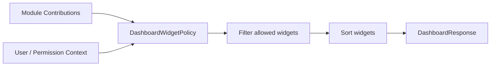
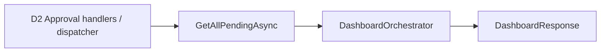
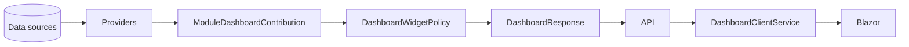

# Dashboard Aggregation

## 1. Mục tiêu

Dashboard là read-only aggregation layer. Nó tổng hợp pending approvals và đóng góp dashboard từ từng module, sau đó trả một `DashboardResponse` cho Blazor client.

## 2. Sơ đồ tổng thể

```mermaid
flowchart LR
    UI[DashboardPage / Home] --> CS[IDashboardClientService]
    CS --> API[DashboardController]
    API --> O[IDashboardOrchestrator]
    O --> P[IModuleDashboardProvider[]]
    O --> A[Pending Approval Aggregation]
    O --> POL[DashboardWidgetPolicy]
    P --> R[DashboardResponse]
    A --> R
    POL --> R
    R --> UI
```

## 3. Request sequence



## 4. DashboardOrchestrator

`DashboardOrchestrator` chịu trách nhiệm điều phối, không trực tiếp truy cập `DbContext`.

Các bước chính:

1. lấy pending approvals đa module từ approval infrastructure;
2. lặp qua collection `IModuleDashboardProvider`;
3. lấy contribution của từng module;
4. áp dụng `DashboardWidgetPolicy` để lọc/sắp xếp widget theo user;
5. dựng `DashboardResponse`.

## 5. Module Dashboard Provider



Contract:

```text
IModuleDashboardProvider
    GetContributionAsync(user, ct)
        → Task<ModuleDashboardContribution>
```

Mỗi module tự chịu trách nhiệm biết cách lấy dữ liệu dashboard của nó. Provider được đăng ký DI dạng collection.

### Nguyên tắc mở rộng



Thêm module mới không sửa `DashboardOrchestrator` chỉ để biết module mới.

## 6. Contribution model



`Detail` có thể khác kiểu giữa các module. Khi đọc contribution phải dùng kiểm tra kiểu an toàn (`is` pattern) và log warning nếu kiểu không đúng, thay vì dùng `as` khiến lỗi bị im lặng.

## 7. DashboardWidgetPolicy



`DashboardWidgetPolicy` thuộc `Application/Policies`. Đây là pure logic: không I/O, không query DB, lọc widget theo quyền/context user và sắp xếp thứ tự widget.

## 8. Approval aggregation

Dashboard cần pending approvals đa module nhưng không được query lại từng bảng Leave/OT.



Trong bản tài liệu tổng hợp cũ, component được gọi là `IApprovalInboxService`; bản chốt D1→D5 mô tả cơ chế inbox đa module được gộp vào approval handlers/dispatcher. Khi code thực tế được cập nhật, cần giữ một nguồn aggregation duy nhất để tránh duplicate query logic.

## 9. Response boundary



Không trả EF entities từ provider/API.

## 10. Namespace

| Thành phần | Vị trí |
|---|---|
| Orchestrator contract | `Application/Interfaces/Orchestrators` |
| Orchestrator | `Application/Orchestrators` |
| Provider contract | `Application/Interfaces/Dashboards` |
| Provider implementation | `Infrastructure/Services/Dashboards` |
| Policy | `Application/Policies` |
| DTO | `Application/Dtos/Dashboards` / `Contract` theo model thực tế |
| API controller | `API` |
| Client service | `Shared/Services/Dashboards` |
| Page | `Shared/Pages` / Blazor Pages |

## 11. Trạng thái

- Leave provider: đã được mô tả.
- OT provider: đã được mô tả.
- Trip provider: chưa build.
- Kiểu `Detail` và cơ chế runtime type-check cần được xác nhận trong implementation hiện tại.


## 12. Personal Work Calendar — Attendance + OT Reconciliation

Dashboard cá nhân không tự tính lại attendance/OT. Nó đọc projection từ D3 và hiển thị theo EmployeeId của user đăng nhập.

| Trạng thái | Hiển thị | Ý nghĩa |
|---|---|---|
| Matched | 🟢 | OT thực tế khớp OT effective đã duyệt |
| Mismatch | 🔴 | OT thực tế lệch OT effective |
| ActualWithoutApproval | 🔴 | Có OT thực tế nhưng không có OT được duyệt |
| ApprovedWithoutActual | ❓ | Đã duyệt OT nhưng chưa có attendance/actual; cần xác nhận |
| CancelledByNoAttendance | Không tính OT | Đã quá deadline xác nhận và mặc định không đi làm |

Ngày đỏ phải click được để lazy-load detail. Ngày ? phải click được để mở form xác nhận.

Security invariant: endpoint /me không nhận UserId từ client. Backend lấy identity hiện tại từ authenticated claims và chỉ query participant/attendance của user đó.


## 13. Shared Personal Work Calendar — Multi-module

Personal Work Calendar không còn là feature riêng của Attendance/OT. Đây là projection dùng chung cho các module có đăng ký Calendar Provider: OT, Leave, Trip và module mới.

### Calendar policy

Admin cấu hình theo ModuleCode:

| Policy | Ý nghĩa |
|---|---|
| IsEnabled | module có xuất hiện trên lịch hay không |
| DisplayMode | marker / summary / detail-on-click |
| NoteMode | có tạo ghi chú dưới lịch hay không |
| ConfirmationMode | có cần user/HR xác nhận hay không |
| ReconciliationMode | cách so planned/approved với actual/execution |
| Priority | thứ tự ưu tiên khi nhiều module cùng ngày |

Module mới chỉ cần đăng ký provider + definition; không sửa DashboardOrchestrator/CalendarAggregator dùng chung. Admin bật policy thì module mới được áp dụng.

### Calendar không làm vỡ ô lịch

Calendar cell chỉ hiển thị marker + trạng thái tổng quan + short summary. Không đặt approval history, evidence, revision, participant, actual in/out hoặc note dài vào cell.

Dưới lịch có CalendarAlertItem/confirmation list. Item có WorkDate, ModuleCode, Severity, Summary, RequiresAction, DetailRoute.

Một ngày có nhiều module thì giữ marker độc lập và gom cảnh báo ở bảng dưới. Click ngày mở tổng quan; click alert mở detail của module.

### Boundary

Calendar chỉ đọc projection và điều phối navigation/confirmation. Authorization và business mutation vẫn thuộc module owner.

/api/calendar/me lấy EmployeeId từ authenticated identity; không nhận UserId tùy ý từ client.
