# HRM Sync — Chi tiết tầng và flow chuẩn

## 1. Tổng quan — từ kiến trúc đến implementation

`SynFlow.txt` mô tả HRM synchronization theo 6 tầng. Đây là tài liệu chi tiết nhất của pipeline sync.

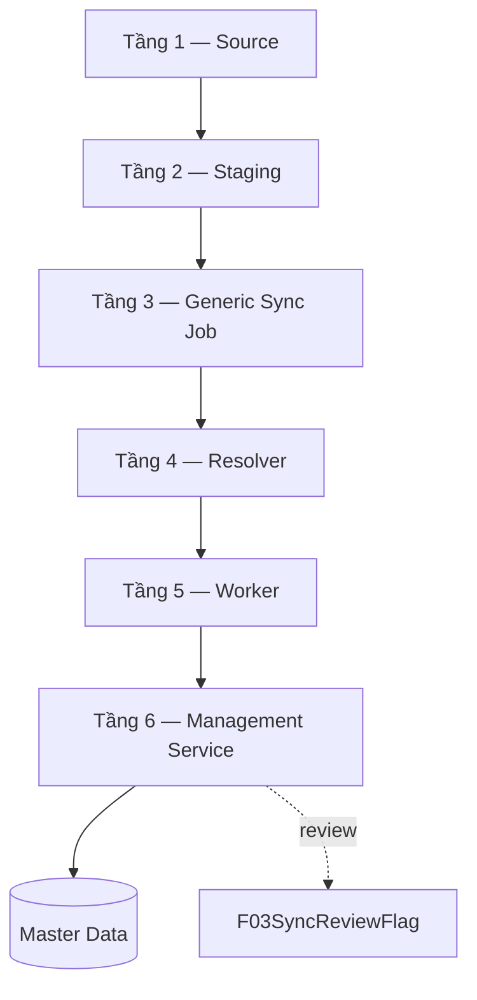

## 2. Tầng 1 — Source

### 2.1 Trigger / importer

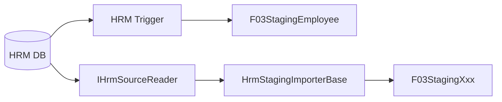

Có hai đường vào staging:

- Trigger cho bảng có quyền đặt trigger, ưu tiên realtime.
- Poll/backfill qua `IHrmSourceReader` + `HrmStagingImporterBase`.

Importer tạo Update staging và diff key để tạo Delete staging cho key biến mất. Có guard chống xóa hàng loạt khi missing keys bất thường; ngưỡng nguồn nêu `> 50% existingKeySet`.

## 3. Tầng 2 — Staging

Staging là **điểm hội tụ duy nhất**. `HrmSyncJob` không phân biệt trigger hay importer.

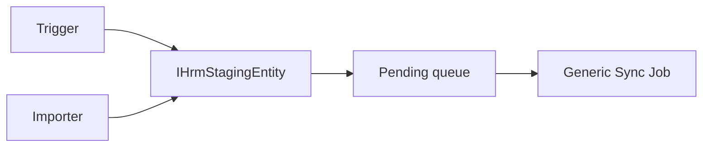

### Contract

```text
IHrmStagingEntity
 ├─ Id
 ├─ EntityKey : string
 ├─ Action : HrmChangeAction
 ├─ IsProcessed : bool
 ├─ ErrorMessage : string?
 ├─ CreatedAt : DateTime
 └─ CreatedBy : string
```

`Id` được dùng làm tiebreaker khi timestamp trùng; cần xác nhận schema thật.

## 4. Tầng 3 — Generic Sync Job

### 4.1 Contract

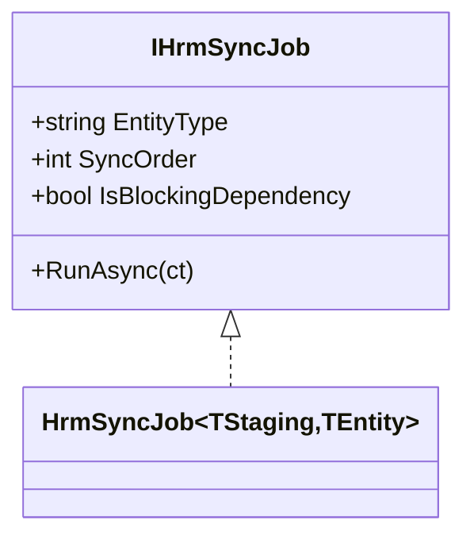

### 4.2 Processing algorithm

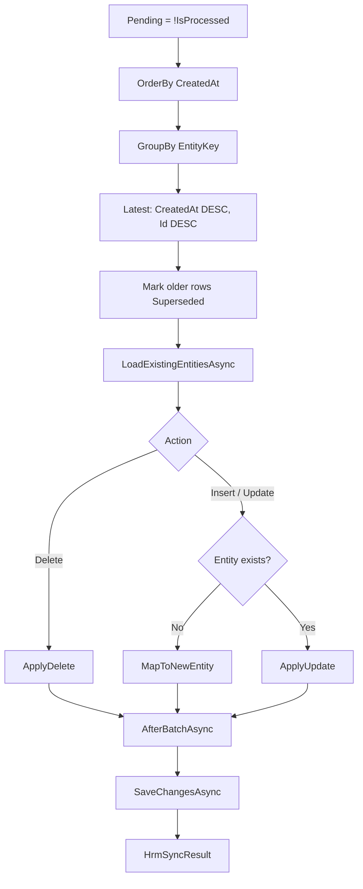

Mỗi staging row cần xử lý lỗi độc lập để ghi `ErrorMessage` và đưa lỗi vào result. `SaveChangesAsync` phải được bảo vệ; nếu persistence thất bại, result không được báo success giả.

### 4.3 Result

```text
HrmSyncResult
 ├─ TotalSource
 ├─ Added
 ├─ Updated
 ├─ Deactivated
 ├─ Unchanged
 ├─ Superseded
 ├─ Errors
 ├─ Success
 └─ Summary
```

Logic `Success` vẫn cần xác nhận trong code thực tế.

## 5. Domain job

Ví dụ `PositionHrmSyncJob`:

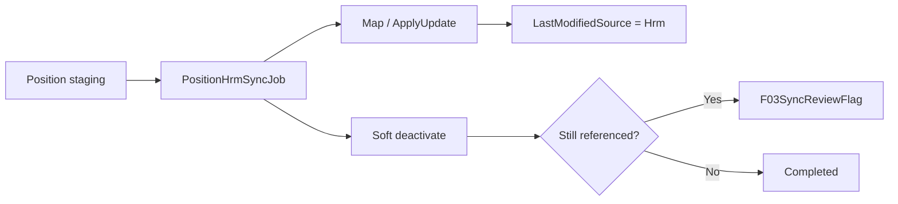

Các quy tắc domain:

- `EntityType = "Position"`;
- dependency của Employee phải có `SyncOrder` phù hợp;
- tạo mới từ HRM đánh dấu `LastModifiedSource = Hrm`;
- Update so sánh field trước khi ghi;
- phân biệt đổi tên và reactivate;
- Delete HRM thực hiện soft-deactivate (`IsActive=false`);
- nếu entity vẫn được tham chiếu thì ghi review flag.

## 6. Tầng 4 — Resolver

```mermaid
flowchart LR
    DI[DI IEnumerable<IHrmSyncJob>] --> R[IHrmSyncJobResolver]
    R --> MAP[Dictionary<EntityType, Job>]
    MAP --> ONE[Resolve(entityType)]
    MAP --> ALL[GetAll()]
    ALL --> SORT[OrderBy SyncOrder]
```

Có hai resolver:

```text
IHrmSyncJobResolver
IHrmStagingImporterResolver
```

Implementation build dictionary từ `IEnumerable<T>` đã đăng ký DI. `GetAll()` phải sort theo `SyncOrder`; `Resolve()` phải báo lỗi rõ ràng khi không tồn tại `EntityType`.

## 7. Tầng 5 — Workers

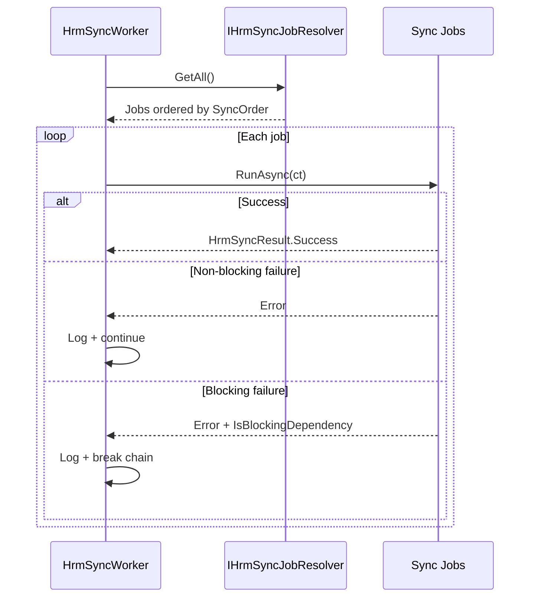

### `HrmImportWorker`

`resolver.GetAll()` → từng importer → `ImportAsync(asOfDate, ct)`. Lỗi của một importer không chặn importer khác.

### `HrmSyncWorker`

`resolver.GetAll()` đã sort `SyncOrder` → `RunAsync(ct)` → failure + blocking ? break : continue. Worker phải catch/log riêng từng job.

## 8. Tầng 6 — Management Service

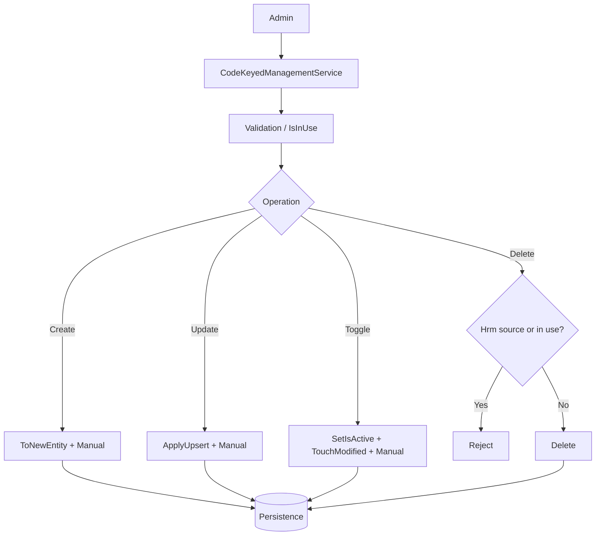

Hooks: `GetCode`, `GetIsActive`, `SetIsActive`, `TouchModified`, `ToDto`, `ToNewEntity`, `ApplyUpsert`, `KeyEqualsExpr`, `KeyNotEqualsExpr`, `CodeEqualsExpr`, `ApplyActiveFilter`, `ApplyDefaultOrder`, `IsInUseAsync`.

Mọi Admin mutation phải set `LastModifiedSource = Manual`.

## 9. SyncNow — không tạo engine thứ hai

```mermaid
flowchart LR
    ADMIN[Admin Sync Now] --> R[IHrmSyncJobResolver.Resolve(EntityType)]
    R --> J[Existing HrmSyncJob]
    J --> RUN[RunAsync(ct)]
    RUN --> RESULT[HrmSyncResult]
```

Admin sync một domain bằng chính resolver/job hiện hữu; không tạo `IHrmSyncEngine` riêng.

## 10. Source precedence và review queue

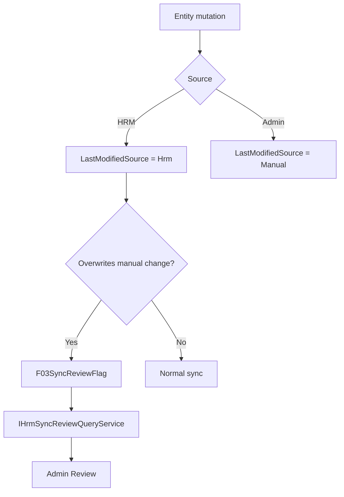

Flag types:

```text
ManualEditOverwrittenByHrm
ManualDeactivationOverwrittenByHrm
DeactivatedButStillReferenced
```

Các field resolution (`IsResolved`, `ResolvedAt`, `ResolvedBy`) vẫn cần xác nhận.

## 11. Dependency ordering

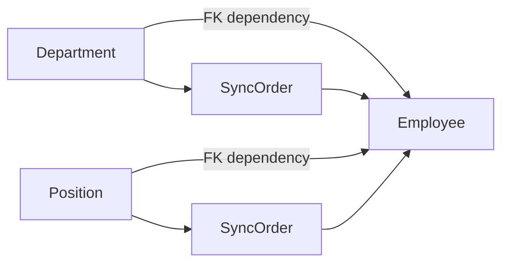

Nếu Department/Position là blocking job và thất bại, worker không tiếp tục Employee trong cùng chu kỳ.

## 12. Invariants cần bảo vệ

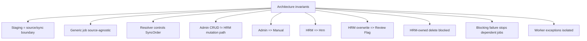

1. Staging là boundary giữa source và sync engine.
2. Generic job không biết source đến từ đâu.
3. Job không phụ thuộc DI registration order.
4. Admin CRUD và HRM sync không dùng chung mutation path.
5. Mọi Admin mutation ghi `Manual`.
6. Mọi HRM mutation ghi `Hrm`.
7. HRM overwrite manual change tạo review flag.
8. Delete không được phép xóa entity đang thuộc source HRM.
9. Blocking dependency failure ngăn job phụ thuộc chạy tiếp.
10. Worker exception không làm worker chết.
