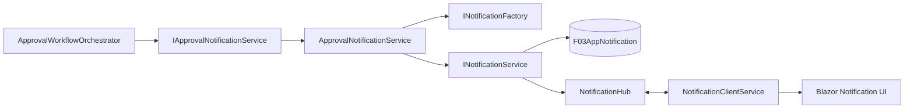
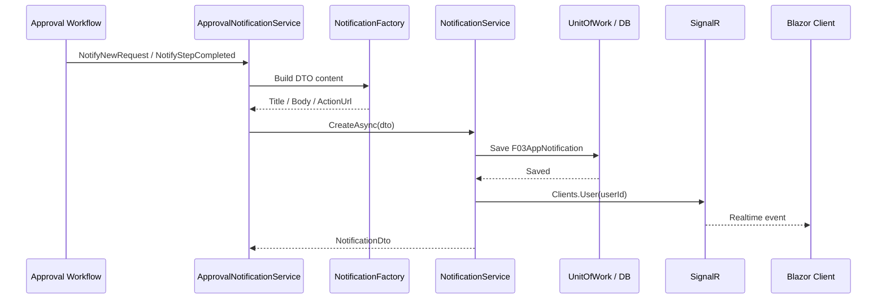
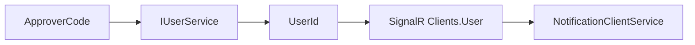
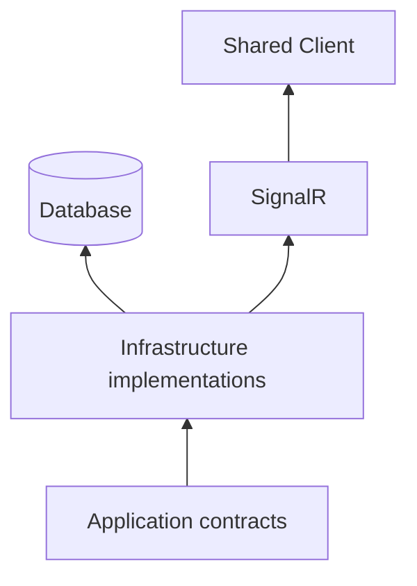

# Notification — Sơ đồ triển khai

> Tài liệu bổ sung cho `03_NOTIFICATION.md`, tập trung riêng vào sequence và dependency của notification pipeline.

## 1. End-to-end

## 2. Runtime sequence

## 3. Approver identity mapping

`ApproverCode → UserId` là boundary cần được xác nhận với implementation thực tế.

## 4. Dependency rule

- Factory không I/O.
- Persistence và SignalR nằm ở Infrastructure.
- Shared chỉ nhận notification qua client contract/realtime channel.
