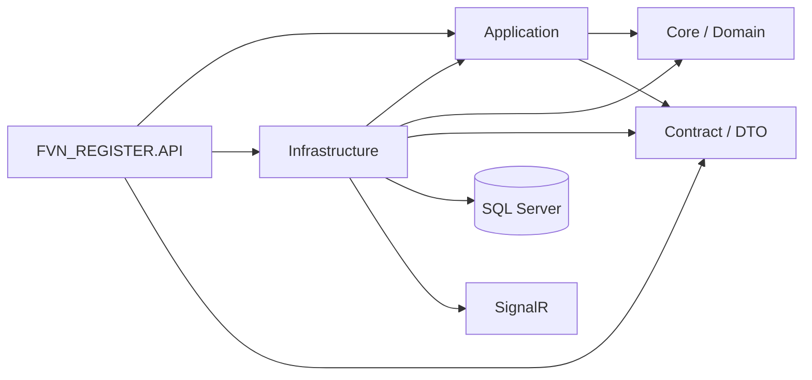
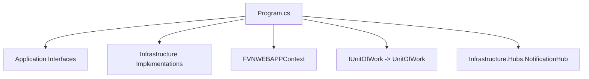
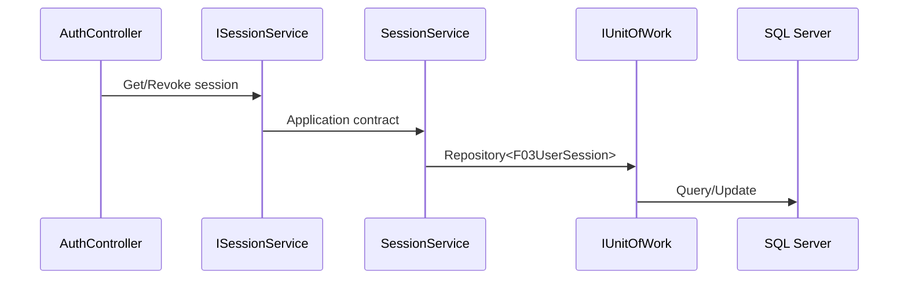

# 07 — Implementation Audit

> Tài liệu này ghi nhận trạng thái đối chiếu giữa kiến trúc trong `00_INDEX.md` → `06_NOTIFICATION_DIAGRAMS.md` và code thực tế của repository.

## 1. Kiến trúc mục tiêu



## 2. Những điểm đã sửa

### API → Application ports

`BaseApiController` và `DashboardController` đã chuyển dependency từ `Contract.Interfaces.*` sang `Application.Interfaces.*`.

### Composition Root

`FVN_REGISTER.API/Program.cs` đã được chuẩn hóa theo nguyên tắc:



`Program.cs` không còn tham chiếu các namespace `FVN_REGISTER.API.Services.*` cũ.

### Unit of Work

`IUnitOfWork` được đăng ký tại composition root và dùng cùng scoped `FVNWEBAPPContext` thông qua `DbContext`.

### SignalR

Hub thực tế nằm tại `Infrastructure.Hubs.NotificationHub`; API composition root map trực tiếp hub implementation này.

### Approval contract

`IApprovalEngine<TSubject>` đã loại bỏ nested resolver trùng tên; cross-module resolver là interface cấp Application riêng.

### Infrastructure SignalR package

Infrastructure dùng ASP.NET Core shared framework thay vì package `Microsoft.AspNetCore.SignalR.Core` phiên bản cũ.

## 3. Các điểm còn phải refactor

### P0 — API Controllers còn dependency legacy

Một số controller khác vẫn dùng:

```text
FVN_REGISTER.Contract.Interfaces.*
```

Mục tiêu:

```text
Controller
   ↓
Application.Interfaces
   ↓
Infrastructure implementation
```

Không để controller resolve trực tiếp implementation hoặc contract interface legacy.

### P0 — API còn truy cập DbContext trực tiếp

`AuthController` hiện vẫn có phần quản lý session truy cập `FVNWEBAPPContext` trực tiếp. Đây là bước chuyển tiếp.

Mục tiêu:



### P1 — Approval cross-module resolver

Cần hoàn thiện implementation của `IApprovalEngineResolver` để Dashboard/Approval API không biết engine implementation cụ thể của Leave/OT.

### P1 — Notification boundary

`NotificationHub` đã nằm ở Infrastructure, nhưng cần tiếp tục kiểm tra mapping `ApproverCode -> UserId` và đảm bảo Application không phụ thuộc SignalR types.

### P1 — HRM Sync

Tiếp tục đối chiếu:

```text
Source Reader
    ↓
Staging Importer
    ↓
Staging
    ↓
Sync Job
    ↓
Resolver
    ↓
Worker
    ↓
Management / Review
```

với implementation hiện tại trong `Infrastructure/Services/HrmSync` và `Application/Interfaces/HrmSync`.

## 4. Quy tắc refactor bắt buộc

1. Controller không chứa EF query.
2. Controller không tham chiếu Infrastructure implementation.
3. Application không tham chiếu Infrastructure.
4. Application interface không expose `DbContext`, `IQueryable<Entity>`, SignalR `Hub`, hoặc Infrastructure model.
5. Infrastructure implement Application ports.
6. Background Worker nằm ở Infrastructure nhưng gọi Application ports.
7. Dashboard chỉ aggregate qua Application services/providers; không query DB trực tiếp.
8. Approval snapshot là immutable sau khi submit.
9. Notification factory là pure logic, không I/O.
10. Mọi module mới phải plug-in qua interface/provider thay vì sửa orchestrator dùng chung.

## 5. Trạng thái

| Khu vực | Trạng thái |
|---|---|
| Project dependency direction | Đang chuẩn hóa |
| API composition root | Đã chuẩn hóa bước đầu |
| Base API controller | Đã chuyển sang Application ports |
| Dashboard controller | Đã chuyển sang Application ports |
| UnitOfWork registration | Đã chuẩn hóa |
| SignalR Hub location | Đã chuẩn hóa về Infrastructure |
| Approval interface | Đã dọn duplicate contract |
| Auth session boundary | Còn một bước tách EF khỏi Controller |
| Toàn bộ Controllers | Chưa hoàn tất |
| HRM Sync | Chưa hoàn tất audit implementation |
| Notification | Chưa hoàn tất audit implementation |
| Dashboard providers | Chưa hoàn tất audit implementation |
