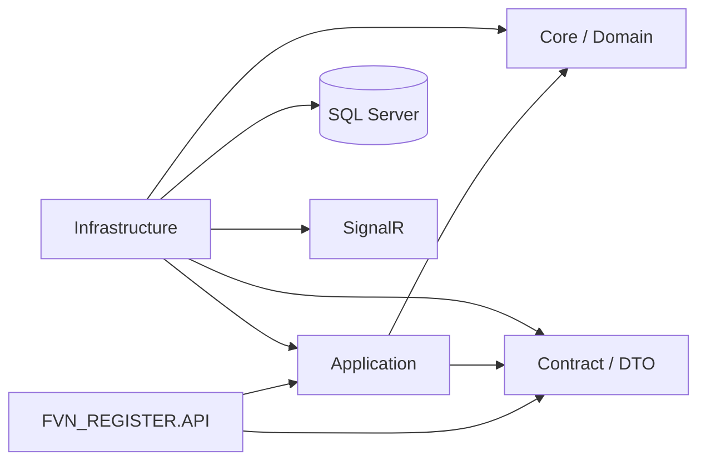
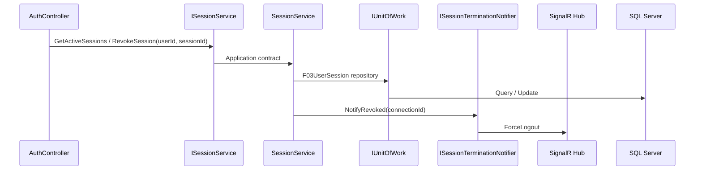
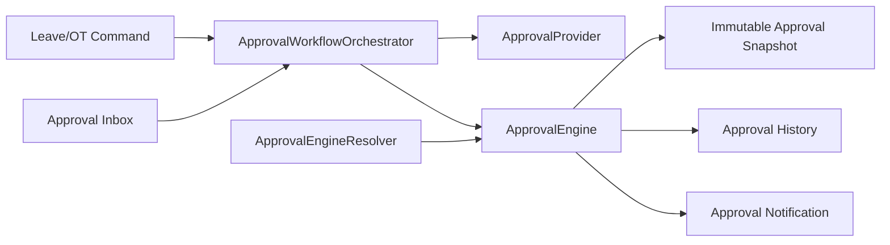
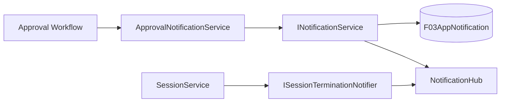
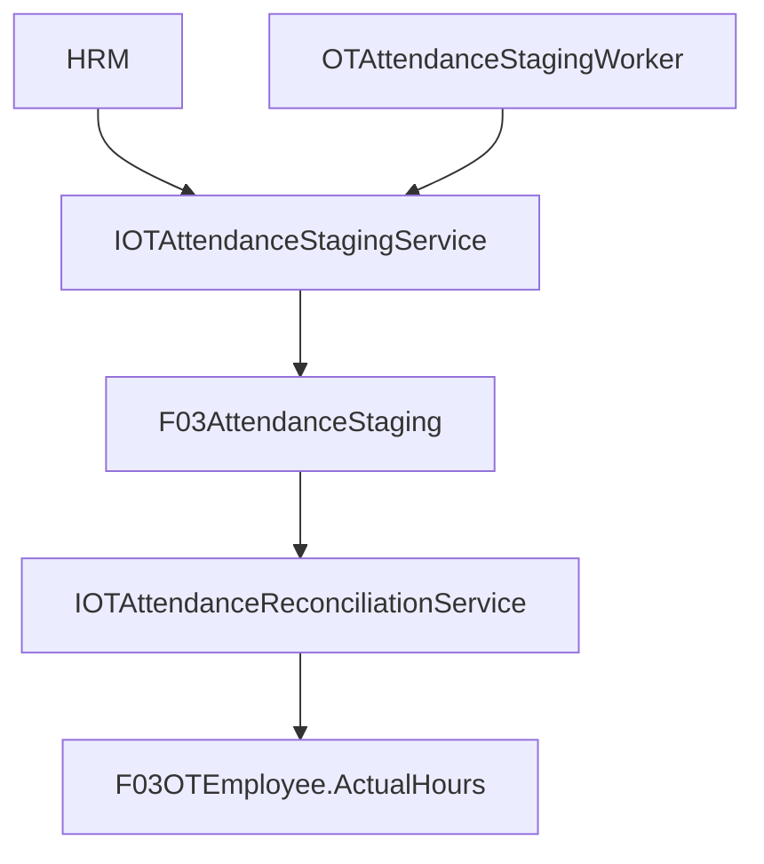
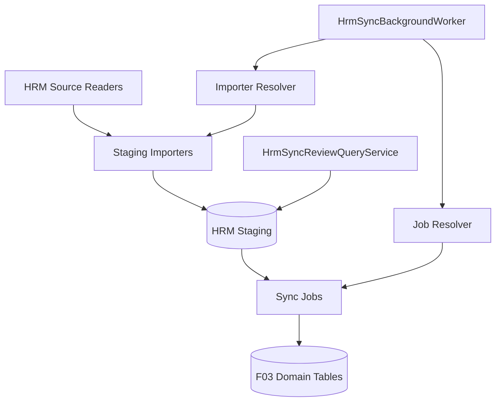

# 07 — Implementation Audit / Completion

> Đối chiếu implementation thực tế với bộ tài liệu `00_INDEX.md` → `06_NOTIFICATION_DIAGRAMS.md`.
>
> **Trạng thái:** boundary kiến trúc đã được refactor. Chưa claim build/runtime thành công vì môi trường hiện tại không chạy solution trực tiếp.

## 1. Kiến trúc mục tiêu



## 2. Completed boundaries

### API controllers

- `AuthController` → `IAuthService` + `ISessionService`.
- `ApprovalListController` → `IApprovalInboxService`.
- `ApproverController` → `IApproverManagementService`.
- `CommonController` → `IDepartmentLookupService`.
- `DepartmentManagementController` → `IDepartmentManagementService`.
- `DepartmentStatusController` → `IDepartmentStatusService`.
- `NotificationController` → `INotificationService`.
- `EmailQueueController` → `IEmailService`.
- `EmailTemplateController` → `IEmailTemplateManagementService`.
- `EmployeeManagementController` → `IEmployeeManagementService`.
- `HistoryController` → `IHistoryDispatcher`.
- `LeaveCalendarController` → `ILeaveQueryService`.
- `LeaveDaysController` → `ILeaveService` + `ILeaveQueryService` + Leave workflow.
- `LeaveTypeManagementController` → `ILeaveTypeManagementService`.
- `OTController` → `IOTService` + `IOTQueryService` + OT workflow.
- `OTSyncController` → `IOTAttendanceStagingService` + `IOTAttendanceReconciliationService` + worker status.
- `ReportController` → `IReportService` ports.
- `UserManagementController` → `IUserManagementService`.
- `DashboardController` → `IDashboardService`.

Không controller nào trong danh sách trên query `DbContext` trực tiếp hoặc inject `IHubContext`/Infrastructure implementation.

### Auth/session boundary



Remote revoke dùng `userId + sessionId`, không truyền token hash như raw refresh token.

### Approval workflow



Đã bổ sung implementation/DI cho workflow orchestrator, cross-module resolver, Leave/OT providers, engines, grouping policy, `IEmployeeUserResolver` và approval notification.

### Notification boundary



Application contracts không expose SignalR `Hub`, `IHubContext` hoặc Infrastructure model.

### OT attendance



### HRM Master Data Sync



Đã wire:

- Department / Employee / LeaveType / Position source readers.
- Department / Employee / LeaveType / Position staging importers.
- Department / Employee / LeaveType / OTType / Position sync jobs.
- `HrmStagingImporterResolver`.
- `HrmSyncJobResolver`.
- `HrmSyncReviewQueryService`.
- `HrmSyncBackgroundWorker` chạy daily theo pipeline Import → Sync.

### Email queue

`EmailQueueController` không truy cập EF. Queue administration đi qua `IEmailService` và `EmailQueueDto`. Approval email dùng `LeaveApprovalEmailDto`, không expose `F03LeaveDay` trong email application contract.

## 3. Composition root

`FVN_REGISTER.API/Program.cs` là composition root duy nhất. Các nhóm chính:

```text
Application ports
    ↓
Infrastructure adapters

Auth/session        -> AuthService / SessionService
Leave               -> LeaveService / LeaveQueryService
OT                  -> OTService / OTQueryService
Approval            -> Provider / Engine / Workflow
Notification        -> NotificationService / ApprovalNotificationService
Email               -> EmailService / EmailTemplateManagementService
HRM Sync            -> Readers / Importers / SyncJobs / Resolvers / Worker
SignalR             -> NotificationHub + session notifier
```

## 4. Architecture rules — final

1. Controller không chứa EF query.
2. Controller không tham chiếu Infrastructure implementation.
3. Application không tham chiếu Infrastructure.
4. Application interface không expose `DbContext`, `IQueryable<Entity>`, SignalR `Hub`, hoặc Infrastructure model.
5. Infrastructure implement Application ports.
6. Background Worker nằm ở Infrastructure nhưng gọi Application ports.
7. Dashboard aggregate qua Application service/provider.
8. Approval snapshot được ghi khi khởi tạo workflow và dùng làm nguồn bất biến cho các bước duyệt.
9. Notification factory/policy không thực hiện I/O.
10. Module mới plug-in qua provider/interface, không sửa engine dùng chung.
11. Query service chỉ query/read; command service thực hiện mutation.
12. Controller không tự resolve UserId của người khác; dùng `IEmployeeUserResolver`.
13. SignalR chỉ xuất hiện ở Infrastructure.
14. HRM import và sync không chạy trực tiếp từ Controller; worker/management gọi resolver/application port.

## 5. Remaining verification — build/runtime only

Còn phải xác nhận bằng môi trường build/runtime của solution:

- `dotnet restore`.
- `dotnet build` toàn solution.
- DI validation khi startup.
- Integration test Login/Refresh/Logout/Remote revoke.
- Integration test Leave/OT approval multi-level.
- SignalR ForceLogout.
- HRM attendance staging/reconciliation với database thật.
- HRM daily sync với HRM source thật.
- Contract compatibility với FE hiện tại.

Đây là **verification**, không phải lý do để đưa Infrastructure trở lại Controller. Nếu build phát hiện lỗi type/namespace, sửa theo thứ tự **Application contract → Infrastructure adapter → API**.

## 6. Status

| Khu vực | Trạng thái |
|---|---|
| Project dependency direction | Hoàn tất về mặt kiến trúc |
| API composition root | Hoàn tất về mặt cấu trúc |
| API controllers | Hoàn tất về boundary |
| Auth/session boundary | Hoàn tất về boundary |
| Leave boundary | Hoàn tất |
| OT boundary | Hoàn tất |
| OT staging/reconciliation | Hoàn tất |
| Notification boundary | Hoàn tất |
| Email queue/template boundary | Hoàn tất |
| Employee/user management | Hoàn tất |
| Report/history boundary | Hoàn tất |
| Approval workflow | Hoàn tất về cấu trúc |
| Cross-module approval resolver | Hoàn tất |
| EmployeeCode → UserId resolver | Hoàn tất |
| HRM Sync architecture + DI + worker | Hoàn tất về cấu trúc |
| SignalR implementation location | Hoàn tất |
| Full solution build | Chưa xác nhận trong môi trường hiện tại |
| Runtime/integration verification | Chưa xác nhận |
