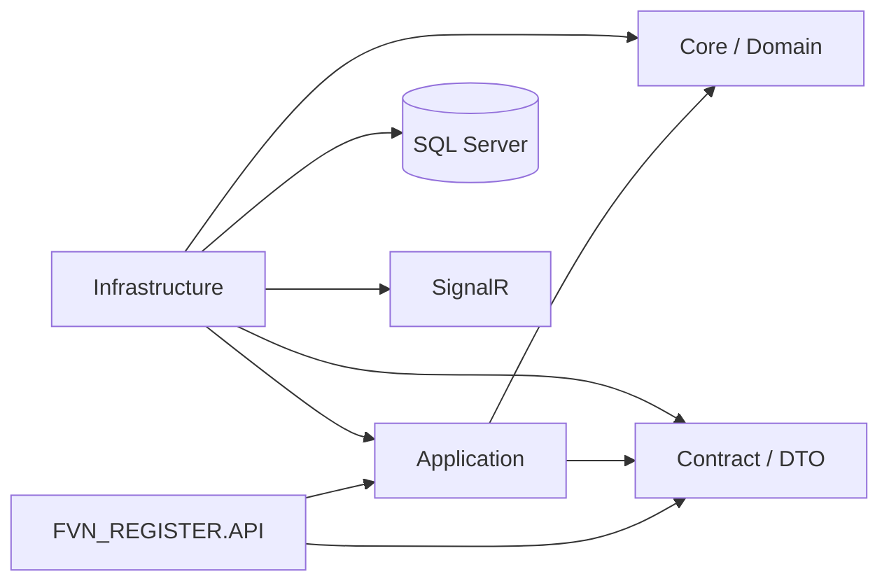
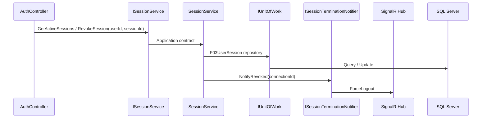
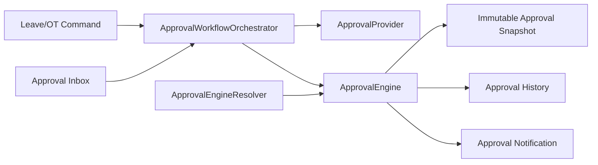
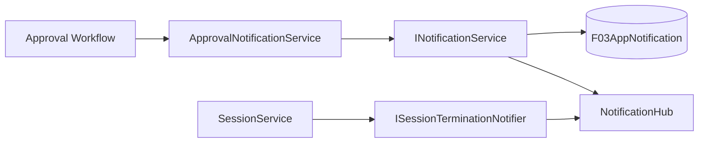
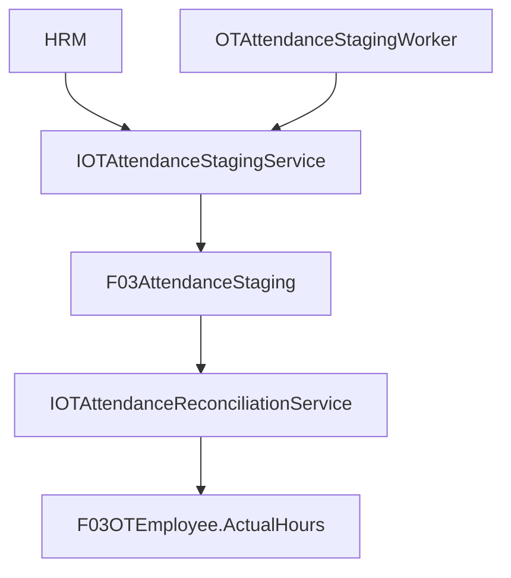

# 07 — Implementation Audit / Completion

> Đối chiếu implementation thực tế với bộ tài liệu `00_INDEX.md` → `06_NOTIFICATION_DIAGRAMS.md`.
>
> **Trạng thái:** kiến trúc API/Application/Infrastructure đã được refactor theo contract hiện tại. Chưa claim build/runtime thành công vì môi trường hiện tại không chạy solution trực tiếp.

## 1. Kiến trúc mục tiêu



## 2. Completed boundaries

### API controllers

Các controller chính đã chuyển khỏi legacy `Contract.Interfaces.*`, EF trực tiếp và Infrastructure implementation:

- `AuthController` → `IAuthService` + `ISessionService`.
- `ApprovalListController` → `IApprovalInboxService`.
- `ApproverController` → `IApproverManagementService`.
- `CommonController` → `IDepartmentLookupService`.
- `DepartmentManagementController` → `IDepartmentManagementService`.
- `DepartmentStatusController` → `IDepartmentStatusService`.
- `NotificationController` → `INotificationService`.
- `EmailQueueController` → `IEmailService`.
- `EmailTemplateController` → `IEmailTemplateService`.
- `EmployeeManagementController` → `IEmployeeManagementService`.
- `HistoryController` → `IHistoryDispatcher`.
- `LeaveCalendarController` → `ILeaveQueryService`.
- `LeaveDaysController` → `ILeaveService` + `ILeaveQueryService` + Leave workflow.
- `LeaveTypeManagementController` → `ILeaveTypeManagementService`.
- `OTController` → `IOTService` + `IOTQueryService` + OT workflow.
- `OTSyncController` → `IOTAttendanceStagingService` + `IOTAttendanceReconciliationService` + worker status.
- `ReportController` → `IReportService` ports.
- `UserManagementController` → `IUserManagementService`.
- `DashboardController` → `IDashboardService`.

### Auth/session boundary



`AuthController` không còn nhận `FVNWEBAPPContext`, `IHubContext` hoặc query `UserSessions` trực tiếp. Remote revoke dùng `userId + sessionId`, không truyền token hash như raw refresh token.

### Approval workflow



Đã bổ sung implementation/DI cho `ApprovalWorkflowOrchestrator<TSubject>`, `ApprovalEngineResolver`, Leave/OT providers, engines, grouping policy, `IEmployeeUserResolver` và `IApprovalNotificationService`.

### Notification boundary



Application contracts không expose SignalR `Hub`, `IHubContext` hoặc Infrastructure model.

### OT attendance



`OTSyncController` sử dụng staging/reconciliation ports thay cho service legacy.

### Email queue

`EmailQueueController` không truy cập EF. Queue administration đi qua `IEmailService` và `EmailQueueDto`. Application email contract không expose `F03LeaveDay`; approval email dùng `LeaveApprovalEmailDto`.

## 3. Composition root

`FVN_REGISTER.API/Program.cs` là composition root duy nhất cho API.

```text
Application ports
    ↓
Infrastructure adapters

IUnitOfWork              -> UnitOfWork
DbContext                -> FVNWEBAPPContext
IAuthService             -> AuthService
ISessionService          -> SessionService
IEmployeeUserResolver    -> EmployeeUserResolver
ILeaveService            -> LeaveService
ILeaveQueryService       -> LeaveQueryService
IOTService               -> OTService
IOTQueryService          -> OTQueryService
IApprovalProvider<Leave> -> LeaveApprovalProvider
IApprovalProvider<OT>    -> OTApprovalProvider
IApprovalEngine<Leave>   -> ApprovalEngine<Leave>
IApprovalEngine<OT>      -> ApprovalEngine<OT>
IApprovalWorkflow<Leave> -> ApprovalWorkflowOrchestrator<Leave>
IApprovalWorkflow<OT>    -> ApprovalWorkflowOrchestrator<OT>
IApprovalEngineResolver  -> ApprovalEngineResolver
INotificationService     -> NotificationService
IApprovalNotification    -> ApprovalNotificationService
```

## 4. Architecture rules — final

1. Controller không chứa EF query.
2. Controller không tham chiếu Infrastructure implementation.
3. Application không tham chiếu Infrastructure.
4. Application interface không expose `DbContext`, `IQueryable<Entity>`, SignalR `Hub`, hoặc Infrastructure model.
5. Infrastructure implement Application ports.
6. Background Worker nằm ở Infrastructure nhưng gọi Application ports.
7. Dashboard aggregate qua Application service/provider.
8. Approval snapshot được ghi khi khởi tạo workflow và dùng làm nguồn bất biến cho các bước duyệt.
9. Notification factory/policy không thực hiện I/O.
10. Module mới plug-in qua provider/interface, không sửa engine dùng chung.
11. Query service chỉ query/read; command service thực hiện mutation.
12. Controller không tự resolve UserId của người khác; dùng `IEmployeeUserResolver`.
13. SignalR chỉ xuất hiện ở Infrastructure.

## 5. Remaining verification — không phải architecture TODO

Cần kiểm tra bằng môi trường build/runtime của solution:

- `dotnet restore`.
- `dotnet build` toàn solution.
- DI validation khi startup.
- Integration test Login/Refresh/Logout/Remote revoke.
- Integration test Leave/OT approval multi-level.
- SignalR ForceLogout.
- HRM attendance staging/reconciliation với database thật.
- Contract compatibility với FE hiện tại.

Nếu build phát hiện lỗi type/namespace do source legacy còn sót, sửa theo nguyên tắc **Application contract trước → Infrastructure adapter sau → API cuối**, không đưa Infrastructure trở lại Controller.

## 6. Status

| Khu vực | Trạng thái |
|---|---|
| Project dependency direction | Hoàn tất về mặt kiến trúc |
| API composition root | Hoàn tất về mặt cấu trúc |
| Base/Dashboard/Approval controllers | Hoàn tất |
| Auth/session boundary | Hoàn tất về boundary |
| Leave controllers | Hoàn tất về boundary |
| OT controllers | Hoàn tất về boundary |
| OT staging/reconciliation boundary | Hoàn tất |
| Notification boundary | Hoàn tất về boundary |
| Email queue boundary | Hoàn tất về boundary |
| Employee/user management | Hoàn tất về boundary |
| Report/history boundary | Hoàn tất về boundary |
| Approval workflow implementation | Hoàn tất về cấu trúc |
| Cross-module approval resolver | Hoàn tất |
| EmployeeCode → UserId resolver | Hoàn tất |
| SignalR implementation location | Hoàn tất |
| HRM Sync runtime audit | Cần verification với database thật |
| Full solution build | Chưa xác nhận trong môi trường hiện tại |
