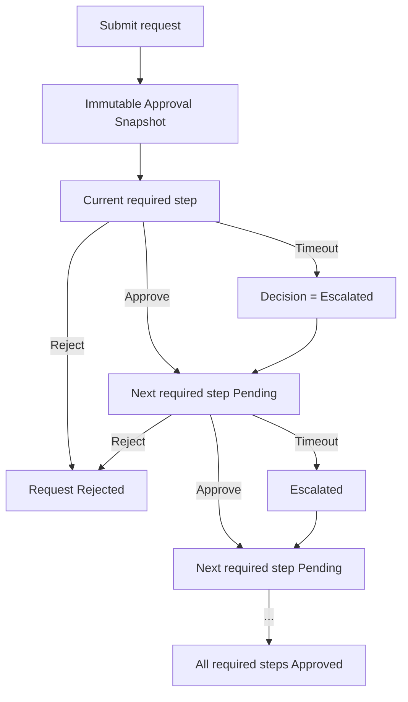
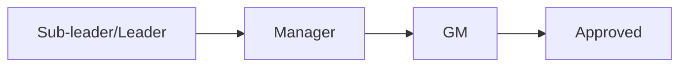
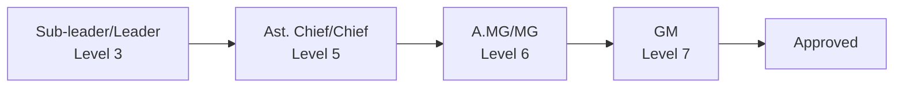
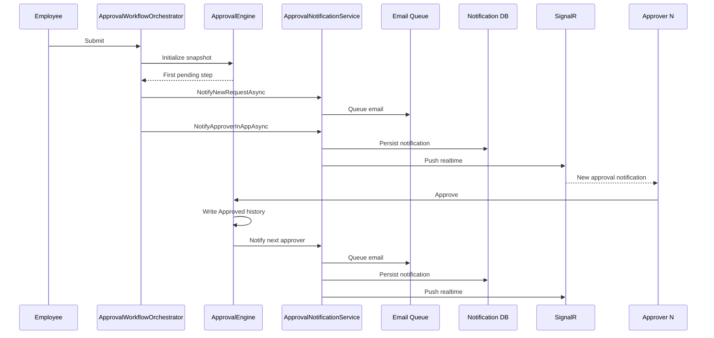
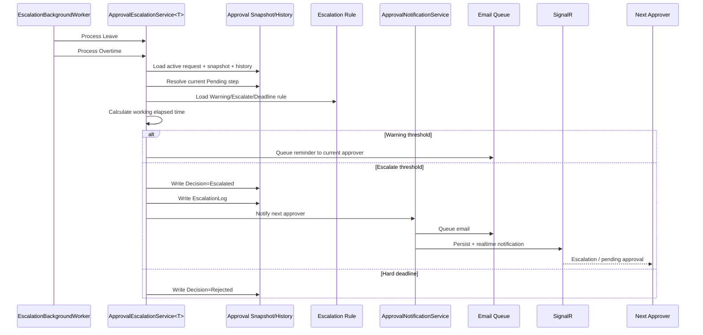
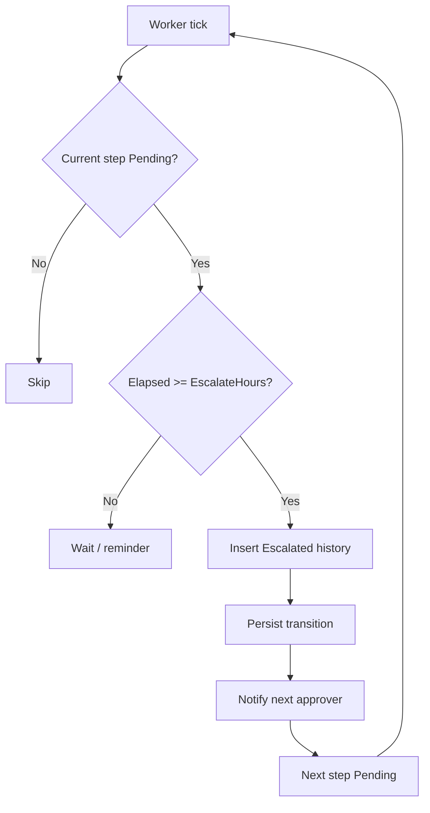
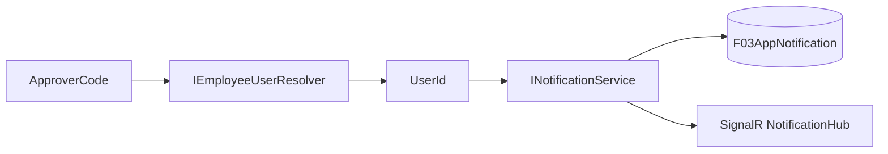

# 08 — Approval Level, Notification & Auto-Escalation

> Thiết kế chuẩn cho Leave và Overtime. Hai module dùng chung approval engine/escalation pipeline; chỉ khác hierarchy của từng module.

## 1. Business invariants

1. `ApprovalSnapshot` được chụp một lần khi Submit và là nguồn bất biến của hierarchy.
2. Mỗi thời điểm chỉ có **một required step Pending** là step hiện hành.
3. Approve thủ công:
   - ghi `Approved` vào history của step hiện tại;
   - kích hoạt step required Pending kế tiếp;
   - gửi **email + in-app/SignalR** cho approver mới.
4. Reject thủ công:
   - ghi `Rejected`;
   - kết thúc request với `Rejected`;
   - gửi kết quả cho người tạo đơn.
5. Timeout để leo cấp:
   - ghi `Escalated`, **không ghi `Rejected`**;
   - request tiếp tục workflow;
   - step kế tiếp trở thành Pending;
   - gửi **email + in-app/SignalR** cho approver mới.
6. `Escalated` là system decision và không làm request thành `Rejected`.
7. Worker phải chạy cho **cả Leave và Overtime**.
8. Worker chạy lặp phải idempotent: sau khi step đã có history `Escalated/Approved/Rejected`, step đó không còn là current Pending nên không được escalation lần nữa.

## 2. Approval hierarchy

Hierarchy thực tế được snapshot từ `IApprovalProvider`.

### Leave

`LeaveApprovalProvider` quyết định step nào là required theo position/rule.

### Overtime

> Level là business identifier, không phải index liên tiếp. Vì vậy không được tính previous step bằng `current.Level - 1`; phải tìm required level nhỏ nhất tiếp theo/level required ngay trước đó trong snapshot. Điều này đặc biệt quan trọng với OT `3 → 5 → 6 → 7`.

## 3. Notification lifecycle

## 4. Auto-escalation lifecycle

## 5. Decision semantics

| Decision | Ai tạo | Ý nghĩa | Request có kết thúc? |
|---|---|---|---|
| `Pending` | Calculator | Step đang chờ | Không |
| `Approved` | Approver/Admin | Duyệt step | Chỉ khi toàn bộ required step Approved |
| `Rejected` | Approver/Admin/System hard deadline | Từ chối thật sự hoặc hard deadline | Có |
| `Returned` | Workflow hỗ trợ sửa | Trả lại theo rule | Tùy workflow |
| `Escalated` | Background worker | Hết thời gian chờ, chuyển cấp | Không |

**Invariant quan trọng:** `Escalated` không được map sang `Rejected`.

## 6. Timeout clock

- Level đầu tiên tính từ `CreatedAt/RegisterDate` theo rule hiện hành.
- Level sau tính từ `ActionAt` của required step ngay trước đó.
- Không dùng `Level - 1` vì level business có thể không liên tục.
- `WarningHours` chỉ tạo reminder và có `F03ApprovalReminderLog` chống gửi trùng trong cùng ngày.
- `EscalateHours` tạo system history `Escalated` và `F03EscalationLog`.
- Hard deadline `DeadlineHour` vẫn là rule riêng; nếu business muốn không auto-reject ở deadline thì cần đổi rule, không được dùng `Rejected` để biểu diễn timeout escalation.

## 7. Idempotency

Sau khi `Escalated` được persist, mapper không còn coi step cũ là current Pending. Vì vậy các worker tick sau không tạo escalation history lần hai cho cùng step.

## 8. Identity mapping cho in-app

Không resolve `UserId` ở Shared/UI. Backend chịu trách nhiệm `EmployeeCode → UserId`.

## 9. Code ownership

| Concern | Implementation |
|---|---|
| Hierarchy | `LeaveApprovalProvider`, `OTApprovalProvider` |
| Snapshot/history state | `ApprovalEngine<TSubject>` + `ApprovalStepMapper` |
| Manual approve/reject | `ApprovalEngine<TSubject>` |
| First approver notification | `ApprovalWorkflowOrchestrator<TSubject>` |
| Next approver notification | `ApprovalEngine<TSubject>` |
| Timeout/escalation | `ApprovalEscalationService<TSubject>` |
| Leave escalation adapter | `LeaveEscalationService` |
| OT escalation adapter | `OTEscalationService` |
| Scheduling | `EscalationBackgroundWorker` |
| Email + in-app/SignalR | `ApprovalNotificationService` |
| EmployeeCode → UserId | `IEmployeeUserResolver` |

## 10. Verification checklist

- [x] Submit → first approver receives email + in-app notification.
- [x] Manual approve → next approver receives email + in-app notification.
- [x] Manual reject → request is Rejected and creator is notified.
- [x] Timeout escalation → history is `Escalated`, not `Rejected`.
- [x] Timeout escalation → next approver receives email + in-app/SignalR.
- [x] OT non-contiguous levels use previous required step, not `Level - 1`.
- [x] Worker processes Leave and OT.
- [x] Worker interval is 15 minutes, reducing post-threshold delay compared with a 4-hour polling cycle.
- [x] Current-step history prevents duplicate escalation on later worker ticks.
- [ ] Full solution build and runtime/integration test must still be executed in the project environment.
