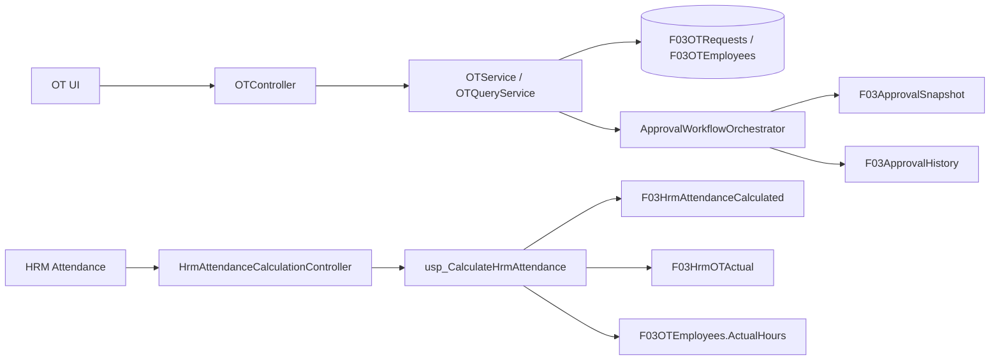

# 08 — ĐĂNG KÝ OT

## 1. Phạm vi
OT là request domain. UI/API của OT chỉ chịu trách nhiệm:
- đăng ký / lưu nháp;
- chỉnh sửa trước khi chốt;
- danh sách / chi tiết;
- gửi duyệt;
- duyệt/từ chối theo approval infrastructure dùng chung;
- theo dõi tiến trình và lịch sử.

OT **không sở hữu pipeline đồng bộ chấm công riêng**.

## 2. Kiến trúc


## 3. Approval
OT dùng `ApprovalBuildContext.ForOT(...)` và `ApprovalProvider<OTRequestSubject>` chung với approval engine.

Khi tạo request thật:
- `requestId = entity.Id`;
- context chứa employee, department, position, total OT hours và OT type;
- approval selections được lưu;
- workflow tạo immutable approval snapshot.

Preview nếu cần chỉ là capability của registration flow; không tạo `OTPreviewController` riêng.

## 4. HRM attendance calculation
Entry point duy nhất:

```text
HrmAttendanceCalculationController
        ↓
IHrmAttendanceCalculationService
        ↓
HrmAttendanceCalculationService
        ↓
dbo.usp_CalculateHrmAttendance
```

Procedure tạo `CalculationBatchId`, lưu:
- `F03HrmAttendanceCalculated`;
- `F03HrmOTActual`.

Trong cùng calculation run, các dòng `F03OTEmployees` thuộc request OT đã Approved được cập nhật:
- `ActualStartTime`;
- `ActualEndTime`;
- `ActualHours`;
- `ValidationStatus`;
- `ValidationMessage`.

Do đó không còn bước `OTSyncController` / `OTAttendanceReconciliationService` riêng.

## 5. Background calculation
Background worker chỉ gọi `IHrmAttendanceCalculationService.CalculateAsync()` cho ngày cần tính.

Worker không:
- tạo approval;
- duyệt OT;
- gọi controller;
- chạy reconciliation command riêng;
- ghi ngược vào HRM.

## 6. API canonical
| Method | Endpoint | Mục đích |
|---|---|---|
| GET | `/api/OT/list` | Danh sách OT |
| GET | `/api/OT/history` | Lịch sử OT |
| GET | `/api/OT/detail/{id}` | Chi tiết |
| POST | `/api/OT/create` | Tạo đăng ký |
| POST | `/api/OT/approve` | Duyệt |
| POST | `/api/OT/reject` | Từ chối |
| POST | `/api/OT/cancel/{id}` | Hủy |
| GET | `/api/OT/pending` | Danh sách chờ duyệt |

Các endpoint attendance thuộc `/api/hrm-attendance-calculation/*`.

## 7. Không còn
Các thành phần sau đã loại khỏi kiến trúc canonical:
- `OTPreviewController`;
- `OTSyncController`;
- `OTSyncPage`;
- `IOTSyncClientService`;
- `OTSyncClientService`;
- `IOTAttendanceStagingService`;
- `OTAttendanceReconciliationService`;
- `OTSyncResponseDto`;
- `OTReconciliationResultDto`;
- OT worker-status/test-run API.

Các bảng/read-model attendance staging cũ chỉ được giữ nếu còn phục vụ projection/report khác; chúng không còn là nguồn đồng bộ OT.

## 8. Nguyên tắc
> **OT đăng ký và theo dõi request. HRM Attendance Calculation tính dữ liệu thực tế. Approval infrastructure xử lý phê duyệt.**

Không tạo thêm controller/service đồng bộ riêng cho OT trong tương lai.

## 9. Boundary với HRM

```text
HRM database
  ├── tblNhanVien / tblCa / CC_LichTrinhCa / RecordDataNew / đăng ký HRM
  │             ↓ READ ONLY
  │     dbo.usp_CalculateHrmAttendance
  │             ↓
FVN_REGISTER
  ├── F03HrmAttendanceCalculated
  └── F03HrmOTActual
```

FVN không mở HRM UI và không ghi ngược vào `HRM.dbo.tblBaoCao` hoặc `HRM.dbo.tblBaoCaoK`. `usp_CalculateHrmAttendance` là orchestration của FVN; phần tính Work/OT phải bám theo logic HRM đã được xác định trong `sphrmvn_TimeKeepingForStaff_K`, với context kết quả cô lập tại FVN. `CalculationBatchId` là khóa truy vết của một lần **Tính giờ**.
