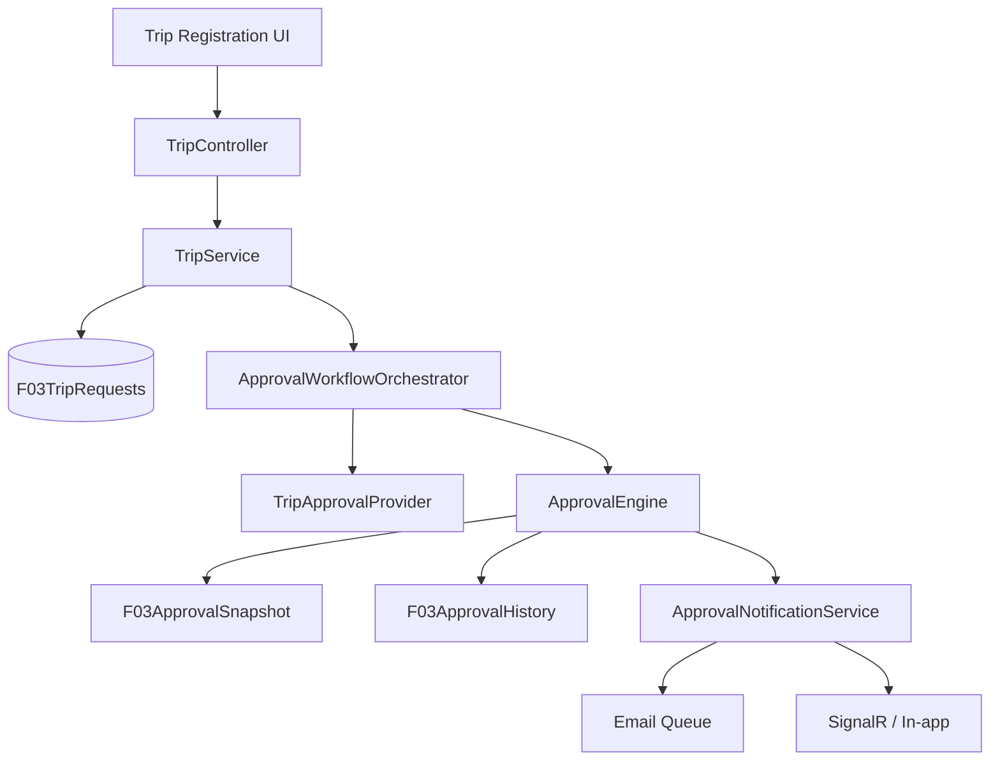
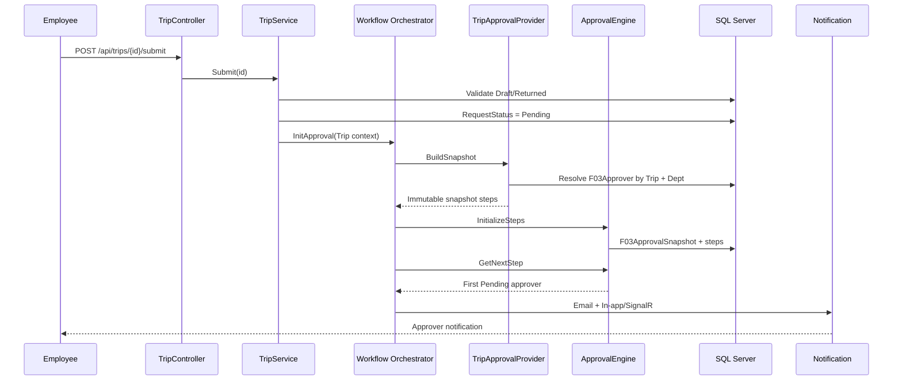
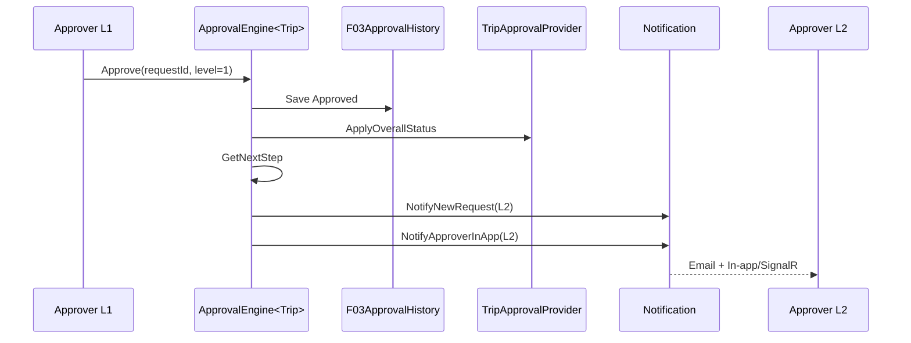
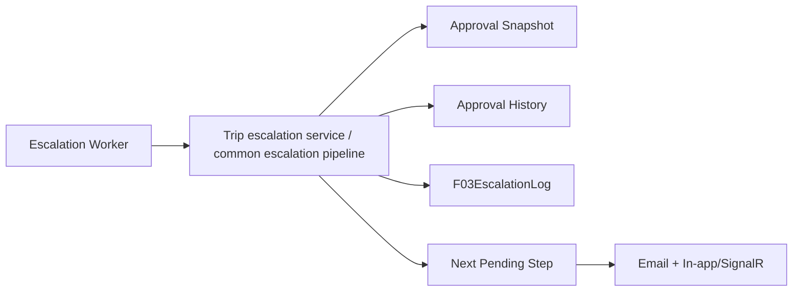
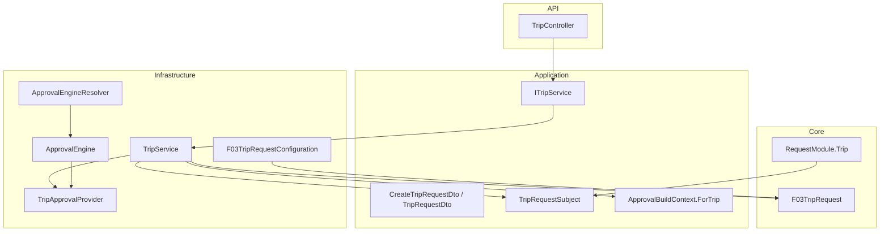
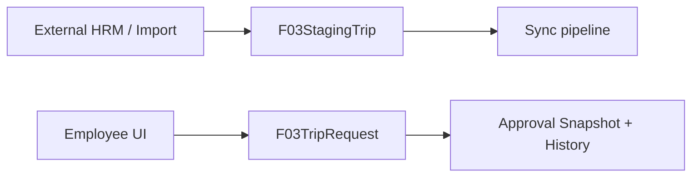

# 09 — ĐĂNG KÝ CÔNG TÁC (TRIP)

> Module `RequestModule.Trip` cho đăng ký công tác và đưa request vào approval engine dùng chung.

## 1. Phạm vi

Trip là một request domain độc lập, không copy approval engine của Leave/OT.



## 2. Trạng thái nghiệp vụ

```text
Draft
  │
  └── Submit
        │
        ▼
      Pending ── Approve ──► InProgress ── Approve ──► Approved
        │
        └── Reject ───────────────────────────────► Rejected
```

`Escalated` là **DecisionType của step**, không phải `ApprovalStatus.Rejected`. Timeout escalation dùng approval infrastructure hiện có.

## 3. Dữ liệu đăng ký

`F03TripRequest` kế thừa `BaseRequestEntity`, do đó dùng chung:

- `EmployeeCode`
- `DeptCode`
- `RequestStatus`
- audit fields

Trip-specific:

| Field | Ý nghĩa |
|---|---|
| `TripCode` | Mã đăng ký công tác |
| `StartDate` / `EndDate` | Thời gian công tác |
| `Destination` | Địa điểm |
| `Purpose` | Mục đích |
| `CustomerOrPartner` | Khách hàng/đối tác |
| `TransportMethod` | Phương tiện |
| `CompanionEmployeeCodes` | Nhân viên đi cùng |
| `EstimatedCost` | Chi phí dự kiến |
| `Accommodation` | Thông tin lưu trú |
| `Note` | Ghi chú |

## 4. Submit → snapshot



## 5. Approval hierarchy

Trip dùng các level chuẩn `1 → 2 → 3` và resolve approver từ `F03Approver` theo:

1. `RequestType = Trip`
2. `Level`
3. `ApproveForDeptCode = DeptCode`
4. fallback `ApproveForDeptCode = ALL`

Điểm quan trọng: provider **không hard-code người duyệt**. Thay đổi người duyệt được thực hiện qua dữ liệu `F03Approver`.

Hiện tại mapping mặc định của provider:

| Level | Role |
|---:|---|
| 1 | Sub-leader/Leader |
| 2 | Manager |
| 3 | GM |

Nếu doanh nghiệp yêu cầu ma trận Trip khác Leave/OT, chỉ thay đổi `TripApprovalProvider`/configuration; không thay đổi `ApprovalEngine`.

## 6. Manual approval → level tiếp theo



## 7. Timeout escalation

Trip được thiết kế để đi qua cùng approval infrastructure với Leave/OT:



Quy tắc bất biến:

- timeout escalation ghi `DecisionType.Escalated`;
- không ghi `Rejected` để biểu diễn escalation;
- hard deadline/auto-reject, nếu được bật theo policy, là một decision khác;
- notification phải idempotent.

## 8. API

| Method | Endpoint | Mục đích |
|---|---|---|
| POST | `/api/trips` | Tạo Draft |
| POST | `/api/trips/{id}/submit` | Gửi duyệt |
| GET | `/api/trips/{id}` | Xem request |
| GET | `/api/trips/mine` | Danh sách của user |

Approval action không tạo endpoint riêng cho Trip; `ApprovalEngineResolver` định tuyến `RequestModule.Trip` vào `ApprovalEngine<TripRequestSubject>`.

## 9. Component ownership



## 10. Database

Repository chưa sử dụng EF migration folder cho module này. SQL triển khai được đặt tại:

`Database/Trips/001_Create_F03TripRequests.sql`

Sau khi table được triển khai, EF Core tự map thông qua `F03TripRequestConfiguration`.

## 11. Notification templates

Trip sử dụng các template code:

- `TRIP_APPROVED`
- `TRIP_REJECTED`
- notification approver dùng common `NotifyNewRequestAsync`;
- in-app/SignalR dùng common `NotifyApproverInAppAsync`.

Nếu email template chưa tồn tại trong DB, cần seed template trước khi bật production notification.

## 12. Không trộn staging với request domain

Repository hiện có `F03StagingTrip`. Đây là dữ liệu staging/import và không thay thế `F03TripRequest`.



## 13. Checklist triển khai

- [x] `RequestModule.Trip` đã tồn tại.
- [x] Trip request entity.
- [x] EF configuration + DbSet.
- [x] Create Draft / Submit / Get / Mine API.
- [x] Trip approval subject/provider.
- [x] Trip được route vào common approval engine.
- [x] Submit kích hoạt notification approver đầu tiên.
- [x] Manual approval kích hoạt notification level kế tiếp qua common engine.
- [ ] Seed email templates `TRIP_APPROVED` / `TRIP_REJECTED`.
- [ ] Chốt UI đăng ký công tác ở client.
- [ ] Chốt business matrix Trip chính thức với HR/Management nếu khác `1 → 2 → 3`.
- [ ] Chạy EF/database deployment và integration test trên database thật.

## 14. Nguyên tắc kiến trúc

Trip không được tạo một `TripApprovalEngine` riêng. Domain-specific code chỉ nằm ở:

- entity;
- DTO;
- service;
- approval subject/provider;
- query/dashboard sau này.

Approval snapshot, history, decision processing và notification activation tiếp tục dùng infrastructure chung. Điều này giữ cho Leave / OT / Trip cùng một workflow contract và tránh nhân bản logic.
