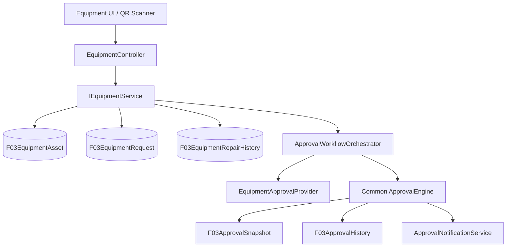
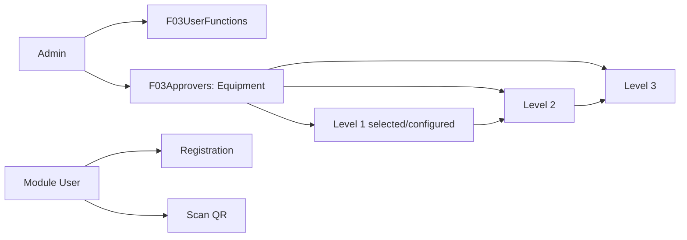
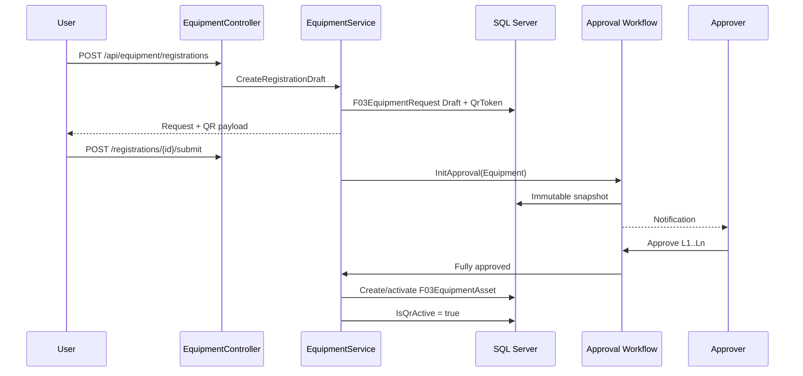
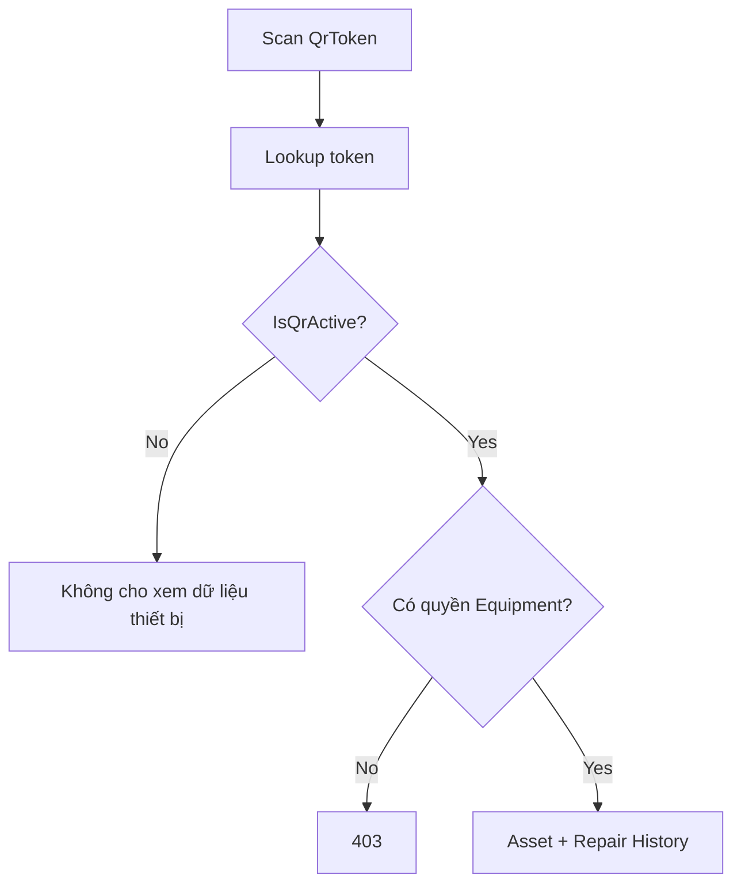
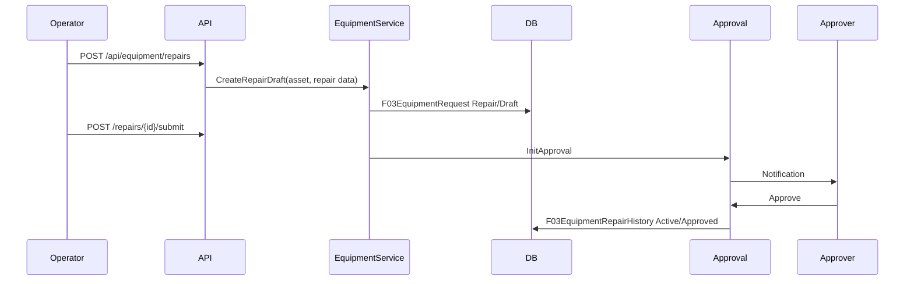
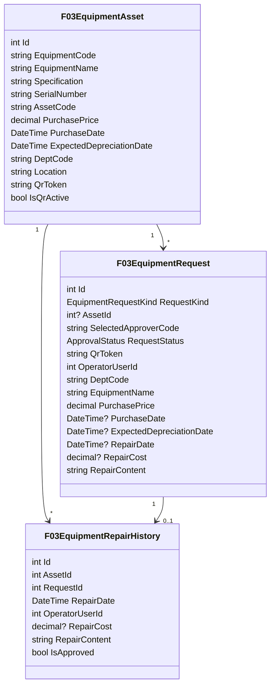
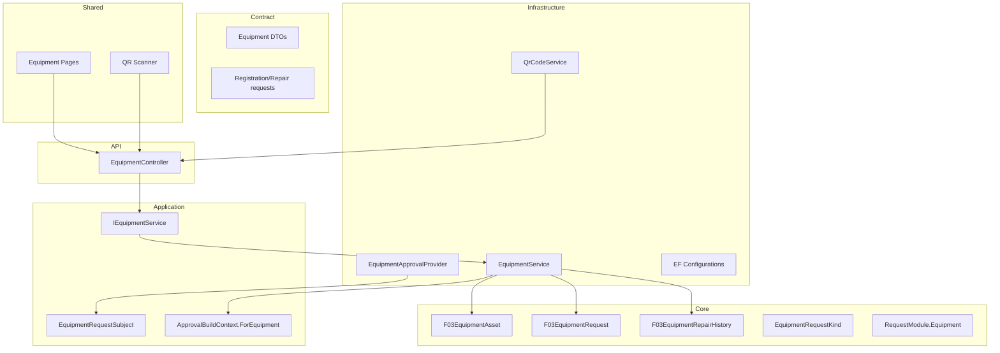

# 10 — SỔ QUẢN LÝ THIẾT BỊ

> Module `RequestModule.Equipment` quản lý vòng đời thiết bị, QR định danh và lịch sử sửa chữa. Module dùng chung approval engine; không tạo approval engine riêng.

## 1. Phạm vi

Module có hai loại workflow request:

- `Registration`: đăng ký thiết bị mới.
- `Repair`: bổ sung một lần sửa chữa/bảo trì cho thiết bị đã có hiệu lực.



## 2. Quyền sử dụng module

Quyền Equipment được tách theo capability server-side:

- Equipment.View = 2301: nhìn thấy module, tra cứu/scan QR.
- Equipment.Create = 2302: tạo đăng ký thiết bị.
- Equipment.Edit = 2303: chỉnh sửa/gửi đăng ký.
- Equipment.Repair = 2304: tạo/gửi yêu cầu sửa chữa.
- Equipment.Approve = 2305: quyền approval theo workflow.
- Equipment.Import = 2306: import Excel theo schema phòng ban.
- Equipment.Export = 2307: xuất dữ liệu.
- Equipment.Cancel = 2308: hủy request.

Admin có thể cấp trực tiếp capability cho từng user trong màn hình quản lý tài khoản. Đặc biệt Equipment.Import được tách riêng: user có quyền sử dụng Equipment không mặc nhiên có quyền import Excel.

900 / EquipmentModule được giữ như legacy marker để tương thích dữ liệu cũ; API Equipment hiện hành kiểm tra các capability 2301..2308 qua IAuthorizationService.

## 3. Import Excel đa định dạng và đa schema

Equipment Workspace hỗ trợ .xls, .xlsx, .xlsm và .xlsb khi parser hiện hành đọc được. File được xử lý qua NPOI/WorkbookFactory, stage thành F03EquipmentImportBatch + F03EquipmentImportRow, validate theo F03EquipmentFieldDefinitions của DeptCode, hiển thị lỗi theo từng dòng rồi mới cho Commit.

Mỗi phòng ban có thể có số lượng cột, tên cột và field riêng khác nhau. Core fields dùng chung; field riêng lưu trong CustomDataJson.

Luồng:
Upload -> Detect Excel format -> Stage -> Header/Field mapping -> Validate -> Review errors -> Commit -> F03EquipmentAssets

Import không ghi thẳng vào Asset khi upload. Batch có lỗi không được Commit.

## 5. Approval matrix theo bộ phận

`F03Approvers` là master duyệt dùng chung. Admin cấu hình:

- `RequestType = Equipment`;
- `ApproveForDeptCode`;
- `Level`;
- `ApproverCode` / `UserId`;
- `RoleName`.

Đăng ký có thể chọn một approver hợp lệ ở Level 1. Provider kiểm tra người được chọn thuộc danh sách approver của `Equipment + DeptCode`; Level 2/3 tiếp tục theo matrix bộ phận/`ALL`.



## 6. Đăng ký thiết bị mới

Thông tin tối thiểu:

| Field | Ý nghĩa |
|---|---|
| `EquipmentCode` | Mã thiết bị nghiệp vụ, sinh khi submit/approval |
| `EquipmentName` | Tên thiết bị |
| `Specification` | Model/thông số |
| `SerialNumber` | Serial number |
| `AssetCode` | Mã tài sản kế toán |
| `PurchasePrice` | Giá thành |
| `PurchaseDate` | Ngày mua |
| `ExpectedDepreciationDate` | Ngày dự kiến bắt đầu/đến hạn khấu hao theo nghiệp vụ |
| `DeptCode` | Bộ phận quản lý |
| `Location` | Vị trí đặt thiết bị |
| `Note` | Ghi chú |

Khi tạo Draft, server sinh `QrToken` duy nhất. QR có thể được in/dán ngay, nhưng `IsQrActive = false` cho tới khi request được approve hoàn tất.



## 5. QR contract và hiệu lực

QR chỉ chứa một payload không nhạy cảm, ví dụ URL/module route chứa `QrToken`. Không đưa giá mua, thông tin nhân sự hay dữ liệu nội bộ vào QR.

Quy tắc bắt buộc:

1. `QrToken` unique và không đổi trong vòng đời thiết bị.
2. Draft/Pending/Rejected request không làm QR có hiệu lực.
3. Chỉ `Approved` mới tạo `F03EquipmentAsset.IsQrActive = true`.
4. Scan token inactive phải trả trạng thái rõ ràng (`NotActive`) và không trả lịch sử.
5. QR lookup không được bypass authorization.



## 6. Sửa chữa / bảo trì

User có quyền module scan QR thiết bị đang active → chọn `Thêm lịch sử sửa chữa` → nhập:

- ngày sửa chữa;
- nội dung/sự cố;
- nhà cung cấp/đơn vị sửa chữa;
- chi phí sửa chữa;
- người thao tác;
- kết quả;
- ghi chú;
- người phê duyệt.

`OperatorUserId` lấy từ user đăng nhập, không cho client tự giả mạo người thao tác.

Repair request **không ghi trực tiếp vào lịch sử có giá trị**. Nó đi qua approval trước.



Nếu bị Reject, repair request được giữ để audit nhưng không xuất hiện trong lịch sử sửa chữa chính thức. Nếu cần chỉnh sửa, tạo `NeedsRevision` theo cơ chế approval hiện có.

## 7. Xem thiết bị theo bộ phận

User quản lý của bộ phận khi scan QR được xem:

- thông tin thiết bị;
- mã tài sản;
- giá thành và ngày mua theo quyền dữ liệu;
- ngày khấu hao dự kiến;
- bộ phận/vị trí;
- trạng thái;
- toàn bộ repair history đã Approved.

Không hiển thị repair Draft/Pending như lịch sử có giá trị; có thể hiển thị riêng trạng thái request cho người có quyền quản lý.

## 8. Domain model



## 9. API

| Method | Endpoint | Mục đích |
|---|---|---|
| GET | `/api/equipment/access` | Kiểm tra user có quyền module |
| GET | `/api/equipment/approvers` | Approver hợp lệ theo bộ phận |
| POST | `/api/equipment/registrations` | Tạo Draft đăng ký |
| POST | `/api/equipment/registrations/{id}/submit` | Gửi duyệt |
| GET | `/api/equipment/registrations/mine` | Request của user |
| POST | `/api/equipment/repairs` | Tạo Draft sửa chữa |
| POST | `/api/equipment/repairs/{id}/submit` | Gửi duyệt sửa chữa |
| GET | `/api/equipment/scan/{qrToken}` | Scan QR và lấy thiết bị + lịch sử |
| GET | `/api/equipment/assets/{id}` | Chi tiết thiết bị |
| GET | `/api/equipment/assets/{id}/history` | Lịch sử Approved |
| GET | `/api/equipment/qr/{qrToken}/image` | Render QR PNG |

Approval action tiếp tục dùng `IApprovalEngineResolver` với `RequestModule.Equipment`.

## 10. Persistence

```text
Database/Equipment/
  001_Create_F03EquipmentAssets.sql
  002_Create_F03EquipmentRequests.sql
  003_Create_F03EquipmentRepairHistory.sql
  004_Seed_EquipmentFunction.sql
```

Không dùng EF migration riêng cho module; configuration được tự động load bằng `ApplyConfigurationsFromAssembly` giống Trip.

## 11. Component ownership



## 12. Security invariants

- Function permission được kiểm tra ở server; ẩn menu chỉ là UX.
- Operator luôn lấy từ authenticated identity.
- Asset detail/history chỉ trả cho user có quyền Equipment và phạm vi dữ liệu hợp lệ.
- Chỉ history có `IsApproved = true` mới là dữ liệu chính thức.
- Chỉ asset có `IsQrActive = true` mới có thể lookup bằng QR.
- Selected approver phải thuộc `F03Approvers` của module/bộ phận; không nhận email/user tùy ý từ client.
- Approval snapshot immutable sau khi workflow khởi tạo.

## 13. Checklist

- [ ] Core entities + enum.
- [ ] Contract DTOs.
- [ ] Application service + subject + approval context.
- [ ] Infrastructure service + provider + EF configurations.
- [ ] Common approval resolver registration.
- [ ] QR PNG service.
- [ ] API controller.
- [ ] Database scripts.
- [ ] Equipment function seed.
- [ ] Dashboard module tile.
- [ ] Blazor registration page.
- [ ] Blazor QR scan/detail/repair pages.
- [ ] Integration tests: permission, QR inactive/active, registration approval, repair approval, department isolation.

## 14. Nguyên tắc kiến trúc

Equipment là module domain mới nhưng dùng lại toàn bộ approval infrastructure hiện có. Domain-specific code chỉ nằm ở entity, DTO, service, subject/provider, query và QR adapter. Không copy `ApprovalEngine`, không query EF từ Controller và không để QR scanner tự quyết định quyền truy cập.
