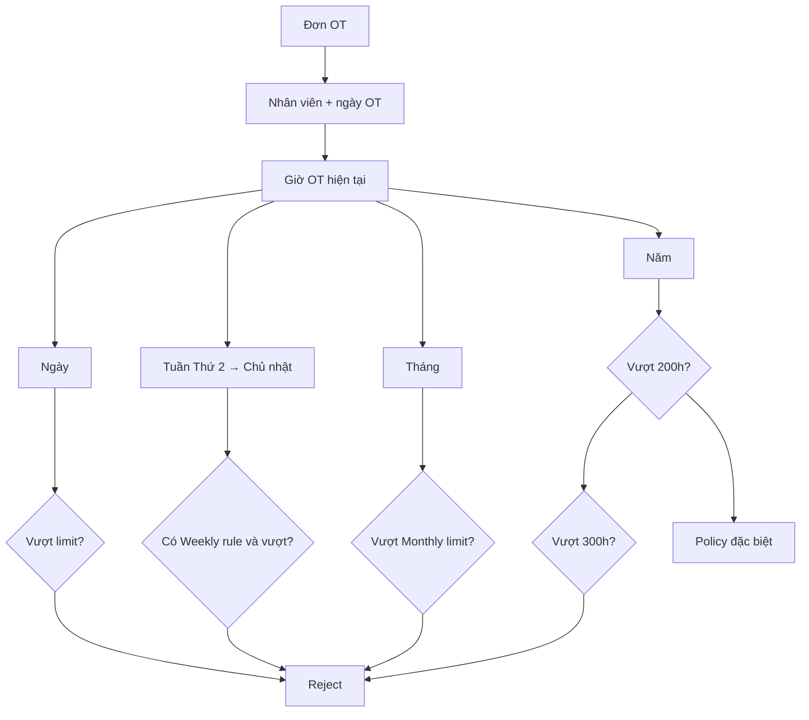
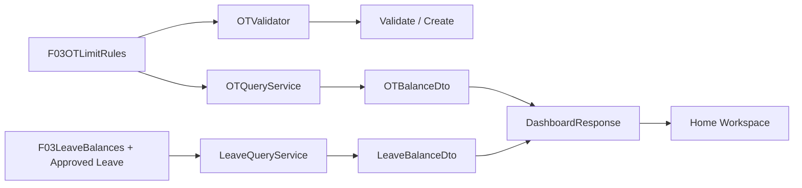

# 17 — QUY ĐỊNH OT & THÔNG TIN NGHỈ PHÉP TRÊN WORKSPACE

## 1. Mục tiêu

FVN_REGISTER phải tính và hiển thị hạn mức OT nhất quán ở ba tầng:

- **Ngày**: kiểm tra giờ OT của ngày đăng ký.
- **Tuần**: tính từ **Thứ 2 → Chủ nhật**; chỉ chặn khi doanh nghiệp đã cấu hình OTLimitType.Weekly.
- **Tháng**: mặc định nghiệp vụ hiện tại là **40 giờ/tháng** nếu chưa có rule cấu hình.
- **Năm**: mặc định nghiệp vụ hiện tại là **200 giờ/năm**; ngưỡng đặc biệt **300 giờ/năm** là ngưỡng tối đa đang được dùng trong validator hiện tại.

> Giá trị tuần không được tự suy đoán hoặc hard-code. Nếu quy định nội bộ có hạn mức tuần, phải tạo F03OTLimitRules với LimitType = Weekly và LimitHours tương ứng.

## 2. Nguyên tắc tính

## 3. Dữ liệu dùng để kiểm tra

Các đơn Rejected và Cancelled không được cộng vào hạn mức.

Khi dữ liệu OT thực tế đã được đối chiếu, validator ưu tiên ActualHours; nếu chưa có actual thì dùng OTHours đăng ký.

Dashboard cá nhân lấy OT Approved để hiển thị số giờ đã sử dụng. Vì vậy:

- **Giờ đã sử dụng** trên Dashboard = OT đã Approved.
- **Giờ dùng để chặn đăng ký** = request còn hiệu lực theo validator; request Pending vẫn chiếm hạn mức để tránh đăng ký chồng vượt giới hạn.

## 4. Hạn mức

| Chu kỳ | Rule | Giá trị mặc định hiện tại | Cách xử lý |
|---|---|---:|---|
| Ngày | Daily | 4h cho loại ngày thường; 12h cho loại ngày ngoài ngày thường nếu chưa có rule | Vượt → lỗi |
| Tuần | Weekly | Không tự đặt | Có rule thì vượt → lỗi |
| Tháng | Monthly | 40h | Vượt → lỗi |
| Năm | Yearly | 200h | Vượt 200h → policy đặc biệt |
| Năm tối đa | Special | 300h | Vượt → lỗi |

LimitHours là giá trị ưu tiên để tính hạn mức. LimitValue được giữ làm compatibility fallback.

## 5. Cảnh báo

Dashboard hiển thị:

- OT tuần: đã dùng / hạn mức nếu Weekly đã cấu hình.
- OT tháng: đã dùng / hạn mức.
- OT năm: đã dùng / hạn mức.
- Cảnh báo khi số dư còn lại gần ngưỡng.

Cảnh báo không thay thế authorization/validation ở server.

## 6. Nghỉ phép trên Workspace

Dashboard cá nhân hiển thị:

- Tổng ngày phép được hưởng.
- Ngày phép đã nghỉ.
- Ngày phép còn lại.
- Ngày nghỉ đã duyệt sắp tới.
- Ngày bắt đầu đợt nghỉ kế tiếp.
- Tổng số ngày của các đợt nghỉ đã duyệt sắp tới.

Chỉ request nghỉ Approved được đưa vào phần “sắp nghỉ”; Pending không được coi là lịch nghỉ chắc chắn.

## 7. Database → Code → UI

## 8. Kiểm tra triển khai

- OTLimitType phải có Daily, Weekly, Monthly, Yearly, Special.
- Validator không được dùng Weekly thay cho Monthly.
- Weekly phải tính đúng từ Thứ 2 đến Chủ nhật.
- Rule phải resolve theo độ ưu tiên Dept + Position > Dept > Position > toàn công ty.
- Dashboard và validator phải dùng cùng nguồn rule.
- Không hiển thị hạn mức tuần giả nếu doanh nghiệp chưa cấu hình.
- Help phải mô tả đúng cách tính và cảnh báo.

## Work Calendar integration

The OT and Leave registration screens use the shared Work Calendar. Company holidays are displayed as calendar information; OT and Leave quota validation remains the responsibility of their respective validators. Trip uses the same calendar projection and is not subject to OT/Leave quota rules.

## 9. Shared Work Calendar + Action
OT/Leave provider đóng góp marker/summary vào Shared Work Calendar. Nếu trạng thái cần người dùng xác nhận hoặc xử lý thì `RequiresAction = true` và tạo `ActionItem`, ví dụ `OT.ATTENDANCE_CONFIRMATION`. Quota validation vẫn thuộc OT/Leave validator; Calendar và Action không thay thế validation.
