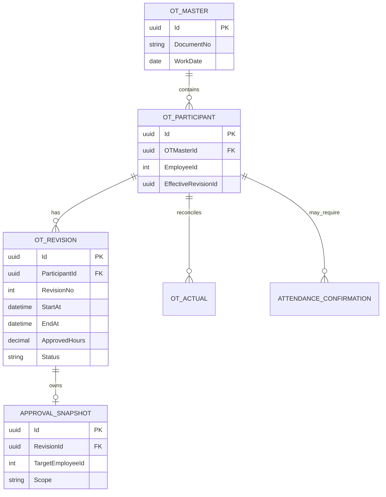
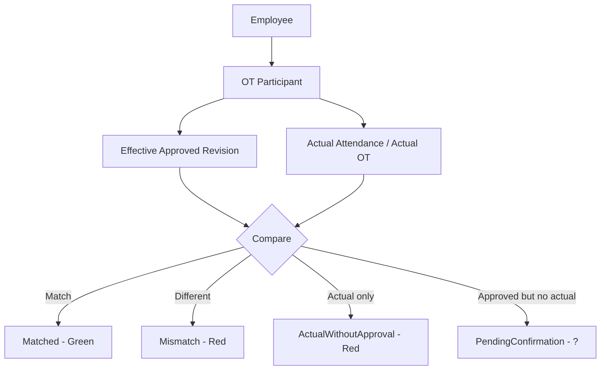

# 18 — OT Employee Revision, Attendance Confirmation & Personal Calendar

## 1. Mục tiêu

Chuẩn hóa nghiệp vụ OT nhiều người, điều chỉnh OT theo từng nhân viên, đối chiếu OT thực tế và xử lý trường hợp đã được duyệt OT nhưng không có dữ liệu chấm công.

Nguyên tắc trung tâm: một lần đăng ký OT nhiều người chỉ có một OT Master duy nhất. Revision và approval có thể khác nhau theo từng Employee/Participant.

## 2. Mô hình dữ liệu nghiệp vụ



Tên bảng thực tế phải map vào schema hiện hữu; không tạo bảng song song chỉ để phục vụ calendar nếu source hiện tại có thể mở rộng.

## 3. Revision rule

Ví dụ OT Master có A/B/C:

```text
OT-001
A = R1 Approved 17:00-20:00
B = R1 Approved 17:00-20:00
C = R1 Approved 17:00-20:00
```

A sửa:

```text
OT-001 vẫn giữ nguyên
A = R1 Approved 17:00-20:00
A = R2 Pending 17:00-21:00
B = R1 Approved 17:00-20:00
C = R1 Approved 17:00-20:00
```

Không tạo OT Master thứ hai.

Nếu R2 được approve: A Effective = R2; B Effective = R1; C Effective = R1. Chỉ A được recalculation.

Nếu R2 bị reject: A Effective = R1; B Effective = R1; C Effective = R1. R2 vẫn được lưu lịch sử nhưng không có hiệu lực tính OT.

## 4. Approval scope

Approval snapshot của revision điều chỉnh bắt buộc có OTMasterId, RevisionId, TargetParticipantId, TargetEmployeeId và Scope = EmployeeOnly.

Approver có thể nhìn thấy OT Master đầy đủ để hiểu bối cảnh, nhưng participant không thuộc scope phải read-only/mờ. UI không được tự gửi danh sách employee cần approve; server dựng approval subject từ revision/participant đã xác thực.

## 5. Effective OT

Mọi query tính OT/payroll/calendar phải resolve Employee → OT Participant → EffectiveRevision → Approved OT.

Không được lấy giờ chung của OT Master để áp cho tất cả employee vì sau revision mỗi employee có thể có giờ khác nhau.

## 6. Attendance reconciliation



Ngày đỏ phải click để lazy-load detail: ca, check-in/check-out, giờ công, approved OT, actual OT, chênh lệch, revision hiện hành, revision trước, approval history và ghi chú.

## 7. Approved OT nhưng không có attendance

Không tự động kết luận NotWorked ngay khi reconciliation không thấy dữ liệu. Chuyển PendingConfirmation và calendar hiển thị ?.

Click ? mở form: Tôi có đi làm hoặc Tôi không đi làm.

Nếu Tôi có đi làm: bắt buộc evidence → submit → HC/HR review → confirmed/rejected. Evidence phải audit cùng participant và work date.

Nếu Tôi không đi làm: chuyển ConfirmedNotWorked; effective OT của ngày đó = 0.

## 8. Deadline kỳ công

Kỳ công chuẩn là 21 tháng trước → 20 tháng hiện tại. Deadline confirmation là ngày 20 của work period, không phải ngày cuối tháng dương lịch.

Nếu đến deadline vẫn PendingConfirmation thì worker chuyển AutoConfirmedNotWorked: effective OT = 0; calendar cá nhân bỏ hiệu lực OT; payroll projection không cộng OT; approval history và evidence/history không bị xóa.

## 9. Calendar projection

API đề xuất:

```http
GET /api/attendance/me/calendar?period=YYYY-MM
GET /api/attendance/me/calendar/{workDate}
POST /api/attendance/me/calendar/{workDate}/confirmation
POST /api/attendance/me/calendar/{workDate}/confirmation/evidence
```

Endpoint /me luôn lấy EmployeeId từ authenticated identity. Calendar summary không preload toàn bộ evidence/detail; detail được load khi click.

## 10. Trạng thái

OT status: None, Approved, Matched, Mismatch, ActualWithoutApproval, ApprovedWithoutActual, CancelledByNoAttendance.

Attendance confirmation: None, PendingConfirmation, WorkedWithEvidence, ConfirmedNotWorked, AutoConfirmedNotWorked.

Revision: Draft, PendingApproval, Approved, Rejected, Superseded.

Rejected không được thay thế EffectiveRevision cũ.

## 11. Idempotency

- một OT Master không được nhân bản khi re-approval;
- ParticipantId + RevisionNo unique;
- chỉ một EffectiveRevision cho một participant;
- một revision chỉ có một approval workflow active;
- auto-close ngày 20 chạy idempotent;
- recalculation phải giới hạn ParticipantId/EmployeeId;
- notification re-approval không được gửi trùng;
- evidence confirmation không được tạo duplicate cho cùng participant/work date/active confirmation.

## 12. Audit

Không delete lịch sử để đạt trạng thái cuối.

```text
R1 Approved
  ↓
R2 Pending
  ↓
R2 Rejected
  ↓
R1 vẫn Effective
```

Hoặc:

```text
Approved OT
  ↓
No Attendance
  ↓
PendingConfirmation
  ↓
AutoConfirmedNotWorked
```

Audit phải trả lời được: ai đăng ký; ai approve; ai xin sửa; revision cũ/mới; ai approve/reject revision; actual attendance; employee xác nhận gì; evidence nào; HC xác nhận khi nào; system auto-close lúc nào.

## 13. Không ảnh hưởng participant khác

Mọi command thay đổi hiệu lực OT phải có ParticipantId/EmployeeId + RevisionId.

Không dùng OTMasterId đơn độc để update ActualHours, EffectiveRevision, recalculate OT, cập nhật calendar hoặc payroll projection.
