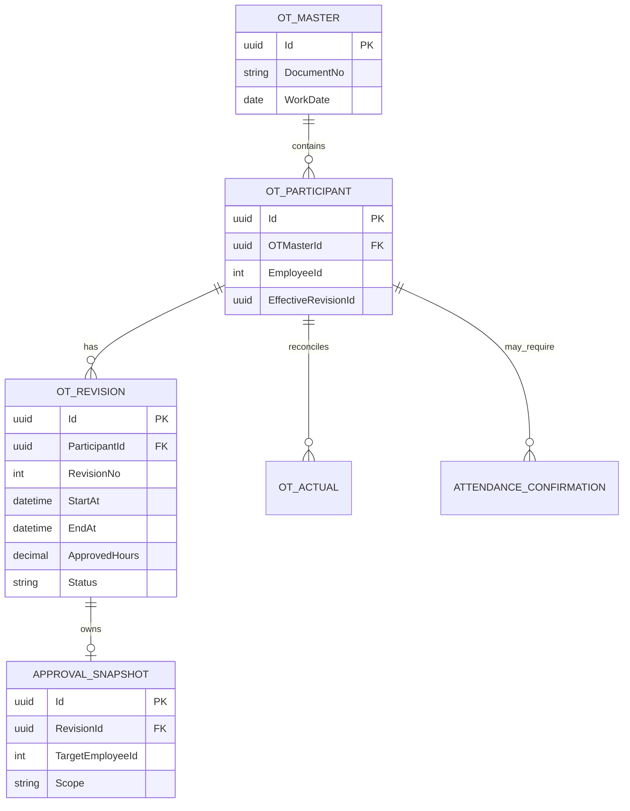
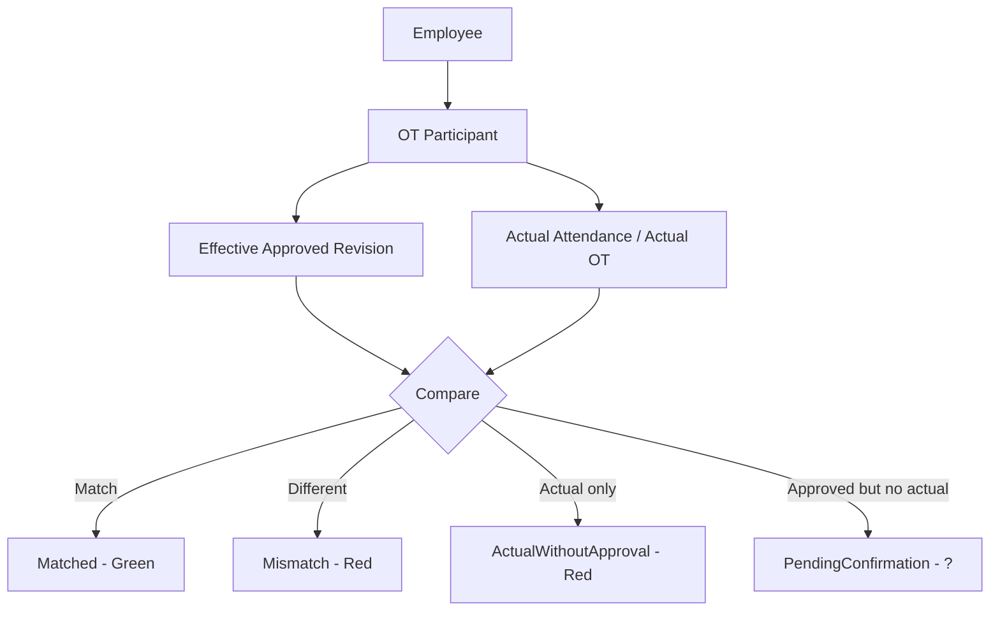

# 18 — OT Employee Revision, Attendance Confirmation & Personal Calendar

## 1. Mục tiêu

Chuẩn hóa nghiệp vụ OT nhiều người, điều chỉnh OT theo từng nhân viên, đối chiếu OT thực tế và xử lý trường hợp đã được duyệt OT nhưng không có dữ liệu chấm công.

Nguyên tắc trung tâm: một lần đăng ký OT nhiều người chỉ có một OT Master duy nhất. Revision và approval có thể khác nhau theo từng Employee/Participant.

## 2. Mô hình dữ liệu nghiệp vụ



Tên bảng thực tế phải map vào schema hiện hữu; không tạo bảng song song chỉ để phục vụ calendar nếu source hiện tại có thể mở rộng.

## 3. Revision rule

Ví dụ OT Master có A/B/C:

```text
OT-001
A = R1 Approved 17:00-20:00
B = R1 Approved 17:00-20:00
C = R1 Approved 17:00-20:00
```

A sửa:

```text
OT-001 vẫn giữ nguyên
A = R1 Approved 17:00-20:00
A = R2 Pending 17:00-21:00
B = R1 Approved 17:00-20:00
C = R1 Approved 17:00-20:00
```

Không tạo OT Master thứ hai.

Nếu R2 được approve: A Effective = R2; B Effective = R1; C Effective = R1. Chỉ A được recalculation.

Nếu R2 bị reject: A Effective = R1; B Effective = R1; C Effective = R1. R2 vẫn được lưu lịch sử nhưng không có hiệu lực tính OT.

## 4. Approval scope

Approval snapshot của revision điều chỉnh bắt buộc có OTMasterId, RevisionId, TargetParticipantId, TargetEmployeeId và Scope = EmployeeOnly.

Approver có thể nhìn thấy OT Master đầy đủ để hiểu bối cảnh, nhưng participant không thuộc scope phải read-only/mờ. UI không được tự gửi danh sách employee cần approve; server dựng approval subject từ revision/participant đã xác thực.

## 5. Effective OT

Mọi query tính OT/payroll/calendar phải resolve Employee → OT Participant → EffectiveRevision → Approved OT.

Không được lấy giờ chung của OT Master để áp cho tất cả employee vì sau revision mỗi employee có thể có giờ khác nhau.

## 6. Attendance reconciliation



Ngày đỏ phải click để lazy-load detail: ca, check-in/check-out, giờ công, approved OT, actual OT, chênh lệch, revision hiện hành, revision trước, approval history và ghi chú.

## 7. Approved OT nhưng không có attendance

Không tự động kết luận NotWorked ngay khi reconciliation không thấy dữ liệu. Chuyển PendingConfirmation và calendar hiển thị ?.

Click ? mở form: Tôi có đi làm hoặc Tôi không đi làm.

Nếu Tôi có đi làm: bắt buộc evidence → submit → HC/HR review → confirmed/rejected. Evidence phải audit cùng participant và work date.

Nếu Tôi không đi làm: chuyển ConfirmedNotWorked; effective OT của ngày đó = 0.

## 8. Deadline kỳ công

Kỳ công chuẩn là 21 tháng trước → 20 tháng hiện tại. Deadline confirmation là ngày 20 của work period, không phải ngày cuối tháng dương lịch.

Nếu đến deadline vẫn PendingConfirmation thì worker chuyển AutoConfirmedNotWorked: effective OT = 0; calendar cá nhân bỏ hiệu lực OT; payroll projection không cộng OT; approval history và evidence/history không bị xóa.

## 9. Calendar projection

API đề xuất:

```http
GET /api/attendance/me/calendar?period=YYYY-MM
GET /api/attendance/me/calendar/{workDate}
POST /api/attendance/me/calendar/{workDate}/confirmation
POST /api/attendance/me/calendar/{workDate}/confirmation/evidence
```

Endpoint /me luôn lấy EmployeeId từ authenticated identity. Calendar summary không preload toàn bộ evidence/detail; detail được load khi click.

## 10. Trạng thái

OT status: None, Approved, Matched, Mismatch, ActualWithoutApproval, ApprovedWithoutActual, CancelledByNoAttendance.

Attendance confirmation: None, PendingConfirmation, WorkedWithEvidence, ConfirmedNotWorked, AutoConfirmedNotWorked.

Revision: Draft, PendingApproval, Approved, Rejected, Superseded.

Rejected không được thay thế EffectiveRevision cũ.

## 11. Idempotency

- một OT Master không được nhân bản khi re-approval;
- ParticipantId + RevisionNo unique;
- chỉ một EffectiveRevision cho một participant;
- một revision chỉ có một approval workflow active;
- auto-close ngày 20 chạy idempotent;
- recalculation phải giới hạn ParticipantId/EmployeeId;
- notification re-approval không được gửi trùng;
- evidence confirmation không được tạo duplicate cho cùng participant/work date/active confirmation.

## 12. Audit

Không delete lịch sử để đạt trạng thái cuối.

```text
R1 Approved
  ↓
R2 Pending
  ↓
R2 Rejected
  ↓
R1 vẫn Effective
```

Hoặc:

```text
Approved OT
  ↓
No Attendance
  ↓
PendingConfirmation
  ↓
AutoConfirmedNotWorked
```

Audit phải trả lời được: ai đăng ký; ai approve; ai xin sửa; revision cũ/mới; ai approve/reject revision; actual attendance; employee xác nhận gì; evidence nào; HC xác nhận khi nào; system auto-close lúc nào.

## 13. Không ảnh hưởng participant khác

Mọi command thay đổi hiệu lực OT phải có ParticipantId/EmployeeId + RevisionId.

Không dùng OTMasterId đơn độc để update ActualHours, EffectiveRevision, recalculate OT, cập nhật calendar hoặc payroll projection.


## 14. Shared Work Calendar Policy — áp dụng chung cho OT / Leave / Trip và module mới

Logic hiển thị lịch không thuộc riêng OT. Đây là capability dùng chung ở tầng Work Calendar. OT, Leave, Trip và module nghiệp vụ khác có thể đăng ký tham gia calendar; Admin quyết định module nào được bật và cách xử lý.

### 14.1 Module registration + Admin policy

Mỗi module đăng ký metadata với Calendar Registry:

    CalendarModuleDefinition
        ModuleCode
        ModuleName
        Version
        SupportsCalendar = true/false
        DefaultEnabled = false

Admin cấu hình policy thay vì sửa code:

    CalendarModulePolicy
        ModuleCode
        IsEnabled
        DisplayMode
        SummaryTemplate
        DetailTemplate
        NoteMode
        ConfirmationMode
        ReconciliationMode
        Priority

| Module | IsEnabled | Calendar effect | Confirmation | Reconciliation |
|---|---:|---|---|---|
| OT | Yes | marker + summary + note | Pending → Employee/HR | Approved vs Actual |
| Leave | Yes | marker + summary + note | theo policy Leave | Approved/Actual nếu có |
| Trip | Yes | marker + summary + note | theo policy Trip | Approved vs execution nếu doanh nghiệp bật |
| Module mới | Admin quyết định | theo policy | theo policy | theo policy |

Module mới không cần sửa WorkCalendarOrchestrator để được hỗ trợ. Module chỉ cần implement contract/provider và đăng ký CalendarModuleDefinition. Admin sau đó bật/tắt và chọn policy.

Nếu module không hỗ trợ calendar thì không xuất hiện trong cấu hình.

### 14.2 Contract dùng chung

    public interface ICalendarModuleProvider
    {
        string ModuleCode { get; }
        Task<IReadOnlyList<CalendarItemDto>> GetItemsAsync(
            CalendarContext context,
            CancellationToken cancellationToken);
    }

    public sealed record CalendarModuleDefinition(
        string ModuleCode,
        string ModuleName,
        bool SupportsCalendar);

    public sealed class CalendarModulePolicy
    {
        public string ModuleCode { get; init; } = null!;
        public bool IsEnabled { get; set; }
        public CalendarDisplayMode DisplayMode { get; set; }
        public CalendarNoteMode NoteMode { get; set; }
        public CalendarConfirmationMode ConfirmationMode { get; set; }
        public CalendarReconciliationMode ReconciliationMode { get; set; }
        public int Priority { get; set; }
        public string? SummaryTemplate { get; set; }
        public string? DetailTemplate { get; set; }
    }

Pipeline dùng chung:

    Module Provider
        ↓
    Calendar Registry
        ↓
    Admin CalendarModulePolicy
        ↓
    Calendar Policy Engine
        ↓
    Calendar Aggregator
        ↓
    Compact Calendar Projection + Notes + Confirmation Inbox

### 14.3 Không nhồi thông tin vào ô lịch

Calendar là read projection, không phải màn hình chi tiết nghiệp vụ.

Mỗi ô ngày chỉ nên có: ngày, trạng thái tổng quan, marker/icon theo module đã bật và short summary tối đa vài từ.

Không render trực tiếp trong ô: approval history, evidence, revision cũ/mới, danh sách participant, actual in/out đầy đủ, ghi chú dài, workflow step, toàn bộ chênh lệch OT.

Các dữ liệu này chỉ xuất hiện khi click hoặc ở vùng thông tin dưới lịch.

### 14.4 Hai lớp hiển thị

    Work Calendar
    ├─ 21 22 23 24 25 ...
    ├─ 🟢 🟢 🔴 ? 🟦 ...
    └─ Ghi chú / Cần xác nhận
       ├─ 🔴 23/08 — OT lệch giờ thực tế; click để xem chi tiết
       ├─ ? 24/08 — Có OT đã duyệt nhưng thiếu dữ liệu chấm công
       └─ 🟦 25/08 — Công tác đã duyệt

Lịch = tổng quan. Bảng dưới lịch = thông tin cần hành động.

    public sealed class CalendarAlertItemDto
    {
        public DateOnly WorkDate { get; init; }
        public string ModuleCode { get; init; } = null!;
        public string Severity { get; init; } = "Info";
        public string Summary { get; init; } = null!;
        public bool RequiresAction { get; init; }
        public string? DetailRoute { get; init; }
    }

Bảng dưới lịch được sắp theo RequiresAction → Severity → WorkDate, không làm thay đổi thứ tự ngày trong calendar.

### 14.5 Tổng hợp nhiều module trong cùng một ngày

Một ngày có thể đồng thời có OT → 🔴, Leave → 🟦, Trip → 🟪. Không biến một ngày thành chuỗi text dài.

Calendar Aggregator tạo CalendarDaySummary và CalendarAlertItem. Marker của từng module độc lập; summary chỉ chọn thông tin ưu tiên cao nhất hoặc số lượng (+2) nếu quá nhiều; detail/alert giữ đầy đủ dữ liệu; click ngày mở panel tổng hợp, click từng alert mở detail module tương ứng.

### 14.6 Confirmation dùng chung

Confirmation không hard-code riêng cho OT.

    public enum CalendarConfirmationMode
    {
        None = 0,
        Employee = 1,
        EmployeeThenHr = 2,
        Admin = 3
    }

Mỗi module định nghĩa condition cần confirmation. Ví dụ OT: Approved OT + no attendance → PendingConfirmation → ? trên calendar → CalendarAlertItem RequiresAction=true.

Leave/Trip có thể dùng cùng engine nhưng condition khác. Framework dùng chung; business condition thuộc provider/module policy.

### 14.7 Reconciliation dùng chung nhưng không ép mọi module

    public enum CalendarReconciliationMode
    {
        None = 0,
        PlannedVsActual = 1,
        ApprovedVsExecution = 2,
        Custom = 9
    }

OT có thể dùng PlannedVsActual; Leave có thể chỉ dùng Approved/Used; Trip có thể dùng Approved/Execution nếu doanh nghiệp yêu cầu. Không ép mọi module phải có Actual/Reconciliation giống OT.

### 14.8 Luồng Admin

    Admin
      ↓
    Calendar Registry
      ↓
    Module definitions
      ↓
    Calendar Policy Configuration
      ↓
    Enabled modules + Display/Note/Confirmation/Reconciliation
      ↓
    Calendar Aggregator
      ↓
    Personal Work Calendar

Admin có thể bật/tắt module, chọn mức hiển thị, note, confirmation mode, reconciliation mode trong các mode module hỗ trợ, priority và template summary/detail.

Admin không được dùng policy UI để bypass authorization. Policy chỉ quyết định projection; quyền xem/sửa/xác nhận vẫn do module authorization/service xử lý.

### 14.9 Open/Closed rule

    Module mới
       ↓
    Implement ICalendarModuleProvider
       ↓
    Register CalendarModuleDefinition
       ↓
    Admin thấy module trong Calendar Settings
       ↓
    Admin Enable + chọn policy
       ↓
    Calendar Aggregator tự áp dụng

Không sửa các module OT/Leave/Trip khác chỉ để thêm module mới vào lịch.

### 14.10 API boundary

    GET  /api/calendar/me?period=YYYY-MM
    GET  /api/calendar/me/{workDate}
    GET  /api/calendar/me/alerts
    POST /api/calendar/me/{workDate}/confirmations

GET /api/calendar/me chỉ trả projection gọn. Alert/detail được lazy-load. API confirmation phải ủy quyền về module owner; Calendar chỉ điều phối, không tự quyết định nghiệp vụ của OT/Leave/Trip.
