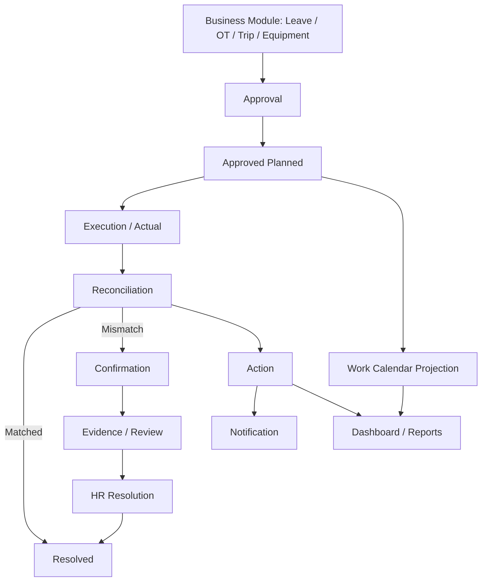

# FVN REGISTER — DOCUMENTATION HUB

> Bộ tài liệu người dùng, giới thiệu sản phẩm, vận hành và truyền thông. Đây là cổng vào duy nhất cho tài liệu trợ giúp.

## 1. Thứ tự đọc

1. [01 — Giới thiệu phần mềm](01_INTRODUCTION.md)
2. [02 — Tổng quan tính năng](02_FEATURES.md)
3. [04 — Hướng dẫn sử dụng](04_USER_GUIDE.md)
4. [05 — Quick Guide](05_QUICK_GUIDE.md)
5. [06 — FAQ](06_FAQ.md)
6. [03 — PR & Launch](03_PR_AND_LAUNCH.md)
7. [07 — Presentation](07_PRESENTATION.md)
8. [08 — Documentation Standard](08_DOCUMENTATION_STANDARD.md)
9. [09 — Business Case & Cost Reduction](09_BUSINESS_CASE_COST_REDUCTION.md)

## 2. Nguồn thiết kế

| Chủ đề | Tài liệu chuẩn |
|---|---|
| Kiến trúc + Work Calendar/Action | `../24_WORK_CALENDAR_AND_ACTION_IMPLEMENTATION.md` |
| Execution Reconciliation | `../18_OT_ATTENDANCE_RECONCILIATION.md` |
| Approval Route / Snapshot | `../20_APPROVAL_ROUTE_SELECTION.md` |
| Security / RBAC / Scope | `../12_SECURITY_RBAC.md` |
| Dashboard | `../13_DASHBOARD_CAPABILITIES.md` |
| Reports | `../19_REPORTS_STATISTICS.md` |
| Attendance | `../22_HRM_ATTENDANCE_CALCULATION.md` |
| Readiness / release gates | `../23_PRODUCT_READINESS_PLAN.md` |
| Leave / OT limits | `../17_OT_LEAVE_LIMITS.md` |\n| Leave / OT | `../08_OT.md`, `../17_OT_LEAVE_LIMITS.md` |\n| Trip | `../09_TRIP.md` |\n| Equipment | `../10_EQUIPMENT_REGISTER.md`, `../11_EQUIPMENT_COMPLETE.md`, `../12_EQUIPMENT_HELP.md`, `../14_EQUIPMENT_FLEXIBLE_SCHEMA.md` |\n| Feature operator security | `../SECURITY_FEATURE_OPERATOR_ASSIGNMENT.md` |\n| MFA / RBAC hardening | `../SECURITY_MFA_AND_RBAC_HARDENING.md` |

Các tài liệu trên định nghĩa rule. Documentation Hub chỉ diễn giải lại cho đúng ngữ cảnh người dùng; không tạo rule mới.

## 3. Mô hình thống nhất

## 4. Quy ước quan trọng

- **Business Module** là source of truth nghiệp vụ.
- **Approval Snapshot** cố định hierarchy tại thời điểm Submit.
- **Approved ≠ Actual**.
- **Calendar = projection/navigation**, không phải source of truth.
- **Action = work item**, không phải business result.
- **Notification ≠ Approval**.
- **Capability ≠ Data Scope**.
- Ngày tương lai không có attendance là bình thường; không tạo mismatch chỉ vì chưa có Actual.
- Registration và Confirmation là hai interaction khác nhau.

## 5. Work Calendar

Một ngày có thể hiển thị ca, attendance, Leave/OT/Trip, trạng thái request/approval, issue và action. Khi request đã tồn tại, người dùng xem **trạng thái nghiệp vụ hiện có**; khi ngày đủ điều kiện và chưa có request tương ứng, Calendar mở Registration Opportunity.

Trạng thái Pending/Approved/Rejected phải lấy từ source contract; không suy diễn từ màu Calendar.

## 6. Bộ tài liệu đã làm sạch\n\nCác tài liệu thiết kế/help trùng lặp, bản `.txt` cũ, audit chỉ phục vụ quá trình migration và các bản help nằm ngoài Documentation Hub đã được loại bỏ khỏi branch này. Không sử dụng lại các file đã xóa; nếu cần thay đổi rule, cập nhật đúng tài liệu nguồn ở mục 2.\n\nCác file còn lại dưới `MÔ HÌNH/` là tài liệu thiết kế/triển khai đang được giữ làm reference cho hệ thống hiện tại; các tài liệu người dùng nằm tập trung dưới `MÔ HÌNH/DOCUMENTATION/`.\n\n## 7. Quy tắc cập nhật

Khi rule thay đổi: cập nhật source-of-truth → implementation → User Guide → Quick Guide/FAQ → Presentation/README. Không tạo architecture document song song.

Chi tiết: [08_DOCUMENTATION_STANDARD.md](08_DOCUMENTATION_STANDARD.md).