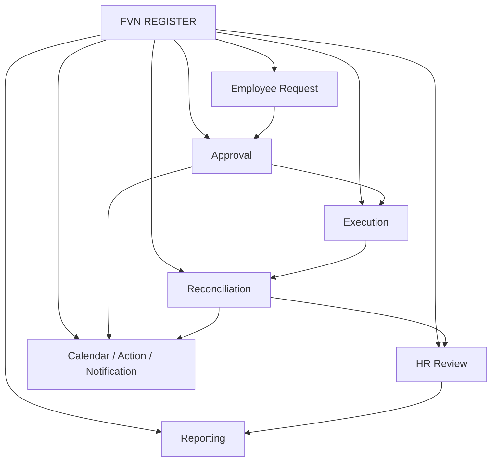
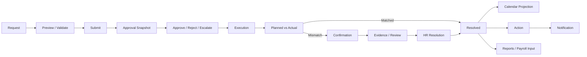

# FVN REGISTER — DOCUMENTATION HUB

> Bộ tài liệu giới thiệu, tính năng, PR, hướng dẫn sử dụng và FAQ cho người dùng FVN REGISTER.

## 1. Mục đích

Bộ tài liệu này dành cho **Employee, Approver, HR, Admin và người quản lý**. Nội dung được viết theo góc nhìn sử dụng phần mềm; các chi tiết kiến trúc sâu nằm trong thư mục `MÔ HÌNH` hiện hữu.

## 2. Bản đồ tài liệu

| Tài liệu | Đối tượng | Mục đích |
|---|---|---|
| 01 — Introduction | Tất cả | FVN REGISTER là gì, giải quyết vấn đề gì |
| 02 — Features | Tất cả | Toàn bộ nhóm tính năng |
| 03 — PR & Launch | Lãnh đạo/HR/Truyền thông | Giới thiệu và truyền thông triển khai |
| 04 — User Guide | Employee/Approver/HR/Admin | Hướng dẫn thao tác |
| 05 — Quick Guide | Người dùng thường xuyên | Tra cứu nhanh |
| 06 — FAQ | Tất cả | Câu hỏi và tình huống thường gặp |

## 3. Bản đồ nghiệp vụ

## 4. Vòng đời chuẩn

## 5. Nguyên tắc đọc tài liệu

- **Business Module** là nguồn dữ liệu nghiệp vụ.
- **Approval** quyết định phê duyệt.
- **Calendar** là projection/navigation.
- **Action** là công việc cần xử lý.
- **Notification** là kênh thông báo.
- **Dashboard/Report** là lớp tổng hợp, không thay thế business state.
- **HR Review** xử lý các case execution cần xác nhận/giải quyết.
- Quyền truy cập luôn do server quyết định bằng capability + data scope.

## 6. Tài liệu thiết kế nguồn

Bộ tài liệu người dùng này được biên soạn từ các chuẩn trong `MÔ HÌNH`, đặc biệt Approval, Security/RBAC, Trip, Equipment, OT/Leave limits, Execution Reconciliation, HR Resolution, Attendance Calculation, Reports và Work Calendar + Action.
