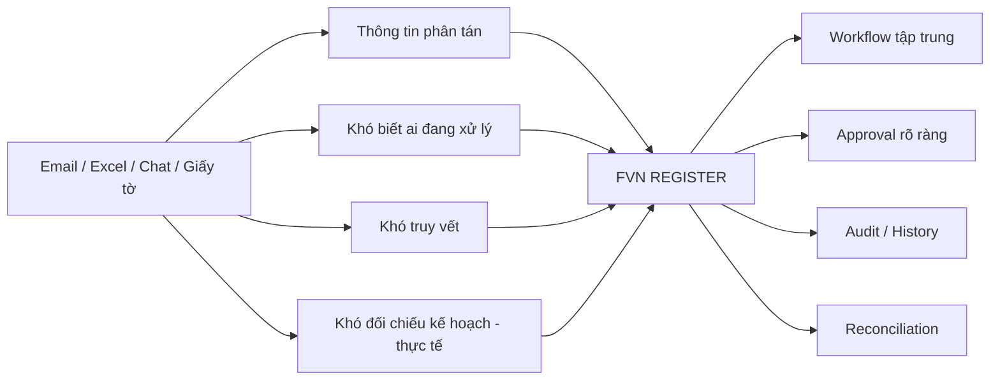
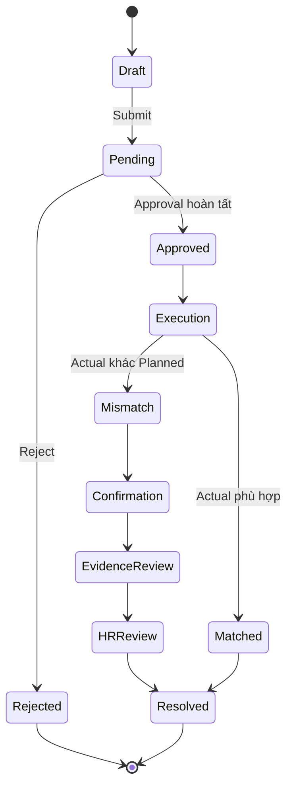
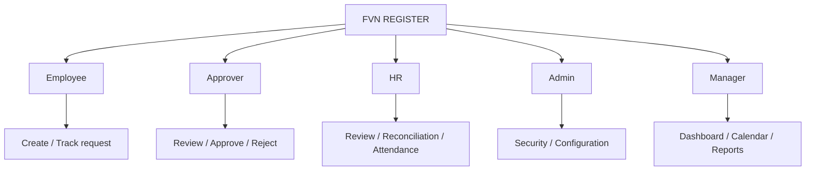

# FVN REGISTER — GIỚI THIỆU PHẦN MỀM

## 1. FVN REGISTER là gì?

**FVN REGISTER** là nền tảng quản lý nghiệp vụ nhân sự và phê duyệt điện tử, số hóa vòng đời:

**Đăng ký → Phê duyệt → Thực hiện → Đối soát → HR Review → Báo cáo/Payroll**

Hệ thống không chỉ là phần mềm đăng ký nghỉ phép. Các nghiệp vụ được quản lý trên cùng một nền tảng gồm Nghỉ phép, OT, Công tác, Thiết bị, Attendance/Execution, Work Calendar, Action, Notification, Dashboard và Reports.

## 2. Vấn đề phần mềm giải quyết

## 3. Vòng đời nghiệp vụ

## 4. Các module

### Leave
Đăng ký nghỉ, approval, số dư phép, lịch nghỉ và báo cáo.

### Overtime
Đăng ký OT, kiểm tra hạn mức, approval, actual OT, reconciliation và dữ liệu phục vụ payroll.

### Trip
Đăng ký công tác, approval, execution/actual và reconciliation.

### Equipment
Đăng ký thiết bị, QR, approval, asset và lịch sử sửa chữa. QR chỉ có hiệu lực nghiệp vụ sau khi request được duyệt hoàn tất.

### Attendance / HRM Calculation
FVN cung cấp UI và snapshot kết quả tính tương thích HRM. HRM là nguồn dữ liệu và luật tính chấm công; FVN không ghi ngược vào HRM.

### Work Calendar
Hiển thị các projection nghiệp vụ theo ngày, giúp người dùng xem kế hoạch và trạng thái.

### Action Center
Tập trung các việc người dùng cần xử lý.

### Notification
Thông báo in-app/realtime và email theo workflow/event.

### Dashboard
Tổng hợp pending approvals và đóng góp của từng module.

### Reports
Báo cáo Leave, OT, Trip, Equipment, Attendance; capability View và Export được kiểm soát riêng.

### HR Review
Tiếp nhận execution mismatch, confirmation, evidence và quyết định OK/NG.

### Payroll Input
Tạo snapshot dữ liệu payroll theo kỳ sau khi các điều kiện readiness được đáp ứng.

## 5. Ai sử dụng hệ thống?

## 6. Điểm nổi bật

1. Một approval engine dùng chung cho nhiều module.
2. Approval Snapshot bảo toàn hierarchy tại thời điểm Submit.
3. Action, Calendar và Notification dùng chung ngữ cảnh xử lý nhưng không thay thế business state.
4. Planned và Actual được đối soát ở cấp employee/participant và work date.
5. Evidence có lifecycle riêng.
6. HR Resolution có audit và idempotency.
7. Capability và Data Scope được kiểm soát độc lập.
8. Reporting View và Export là hai capability khác nhau.
9. Payroll chỉ sử dụng snapshot đã được kiểm tra readiness.
10. Thiết kế mở rộng theo provider/policy/mapping thay vì copy workflow riêng.

## 7. Thông điệp

> **FVN REGISTER — từ yêu cầu đến phê duyệt, từ thực tế đến đối soát.**
