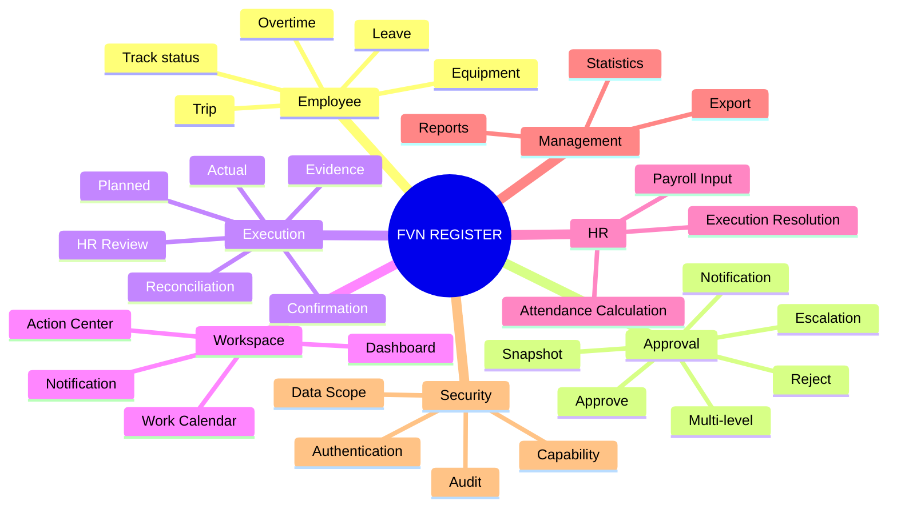
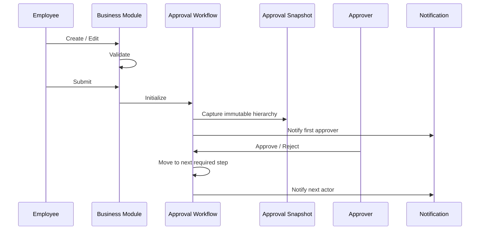
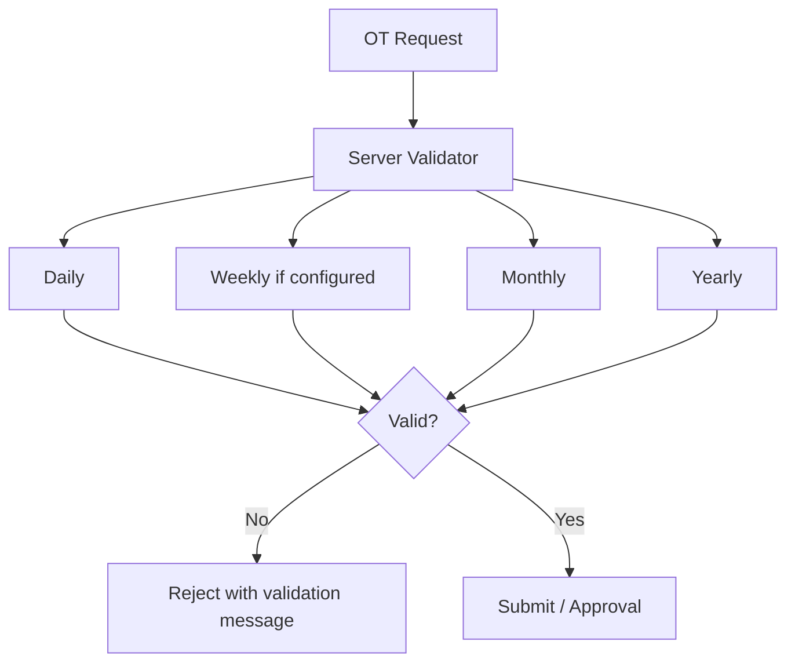
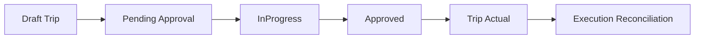
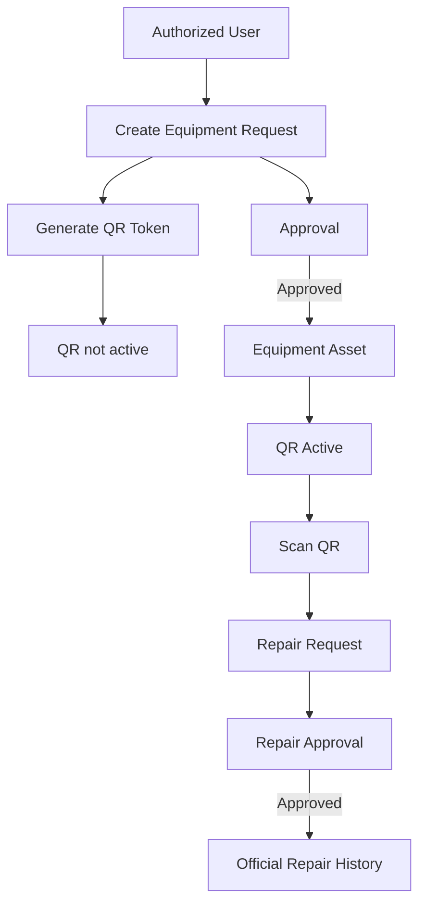
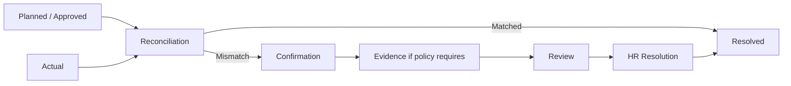
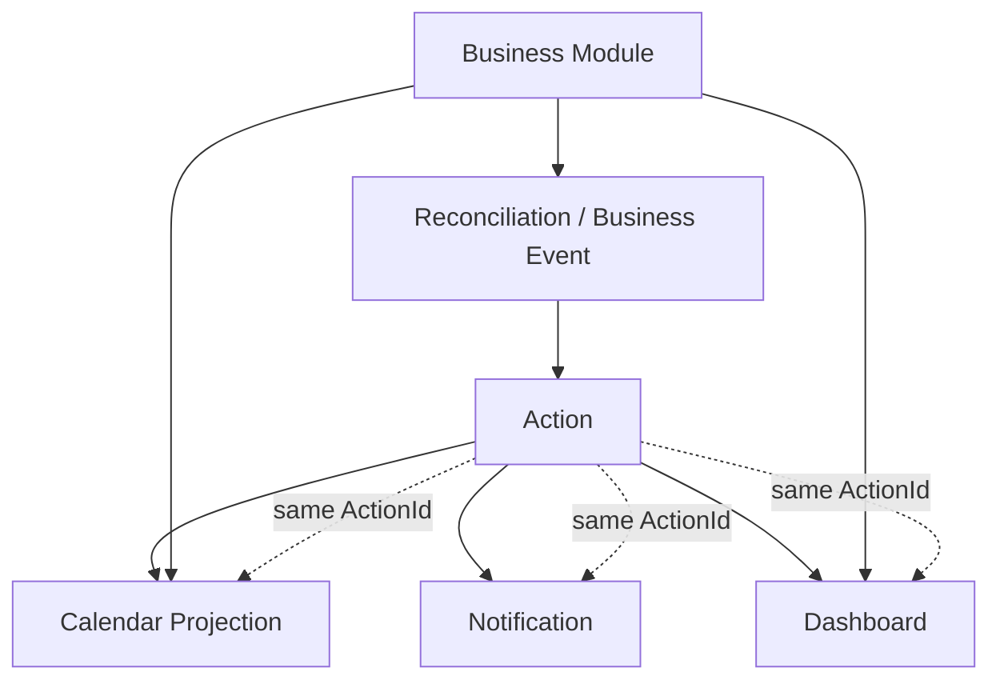
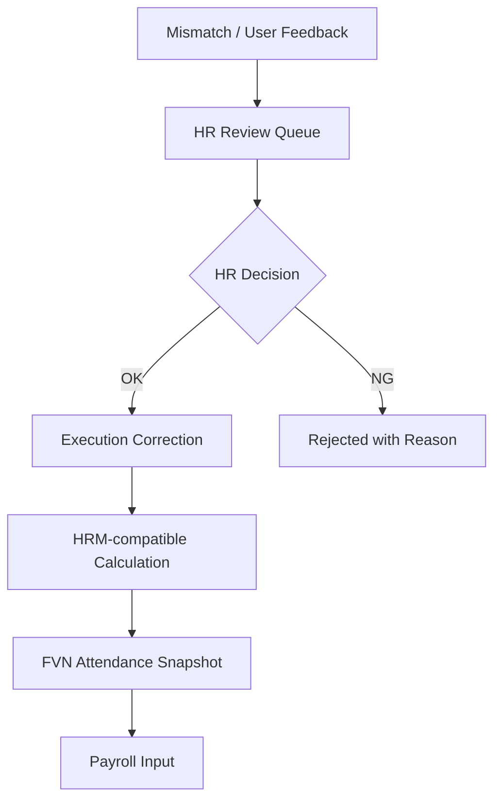
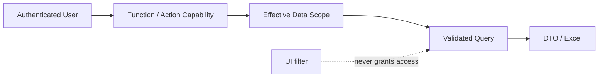

# FVN REGISTER — TỔNG QUAN TÍNH NĂNG

## 1. Bản đồ tính năng

## 2. Request & Approval

Approval timeout escalation là system decision `Escalated`, không đồng nghĩa `Rejected`.

## 3. Leave

- Request và approval.
- Balance.
- Lịch nghỉ đã duyệt.
- Calendar.
- Reports.

## 4. OT

Hạn mức hiện hành theo thiết kế: ngày thường 4h, ngày ngoài ngày thường 12h; tháng 40h; năm 200h; ngưỡng tối đa 300h; Weekly chỉ áp dụng khi có rule cấu hình.

## 5. Trip

Trip sử dụng approval engine chung; hierarchy mặc định theo thiết kế là Level 1 → Level 2 → Level 3.

## 6. Equipment + QR

Module access và approval authority là hai lớp khác nhau: được cấp function EquipmentModule không tự động có quyền approve.

## 7. Execution Reconciliation

Reconciliation là framework dùng chung cho OT, Leave, Trip và module tương lai.

## 8. Action / Calendar / Notification

- Action = công việc.
- Calendar = projection/navigation.
- Notification = delivery/read state.
- Dashboard = aggregation.
- Business module = source of truth.

## 9. HR Review & Attendance

HR không sửa trực tiếp kết quả attendance snapshot. Correction phải đi qua calculation pipeline.

## 10. Reports

Danh mục chính:

- Leave: balance, department, employee, detail, approval status.
- OT: department, employee, detail, approval status, quota accumulation.
- Trip: department, employee, detail, approval status.
- Equipment: department, asset detail, repair.
- Attendance: summary và detail.

Export là capability riêng và luôn bị giới hạn bởi Data Scope.

## 11. Security

Scope chuẩn: Own, Employee, Department, All. Quyền Approve không tự động có Scope All.
