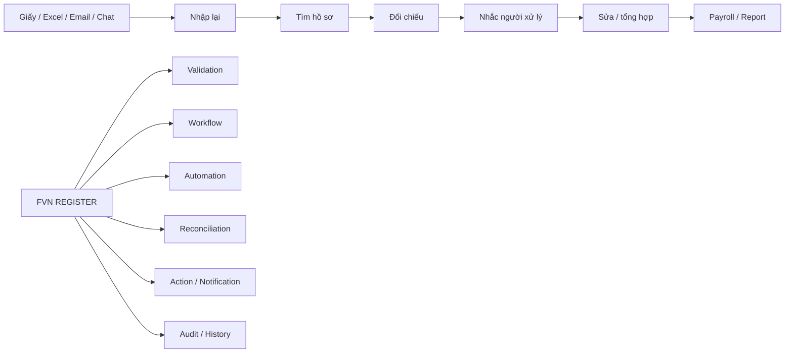
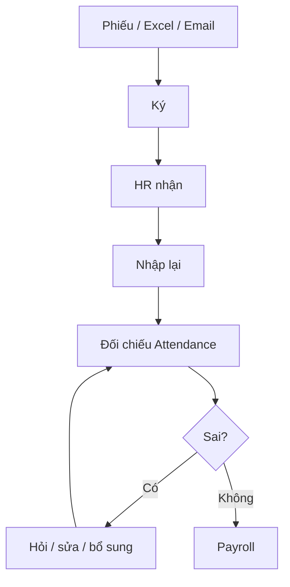
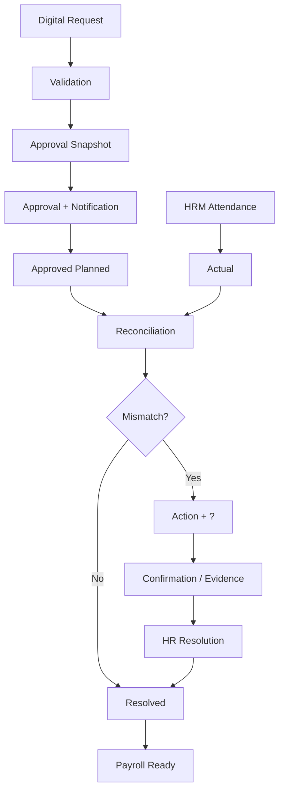
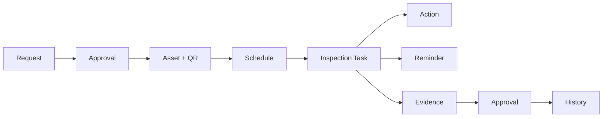
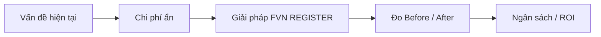
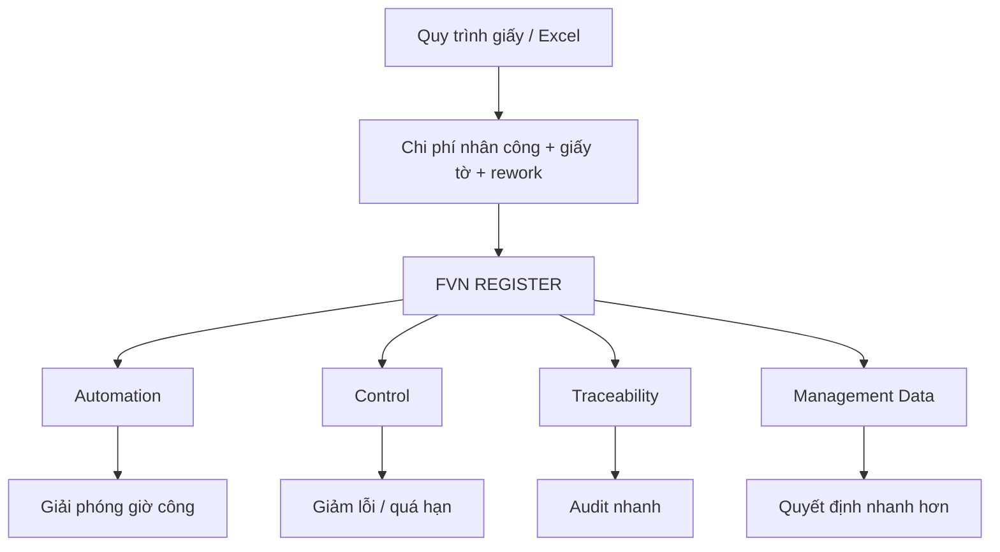
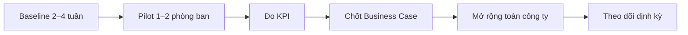

# FVN REGISTER — PR, GIỚI THIỆU VÀ BUSINESS CASE

## 1. Product statement

> **FVN REGISTER — Smart Employee Request, e-Approval & Operational Control Platform**

FVN REGISTER là nền tảng tập trung cho đăng ký nghiệp vụ, phê duyệt điện tử, theo dõi thực tế, đối soát, quản lý thiết bị, checklist, báo cáo và kiểm soát công việc.

Điểm khác biệt không nằm ở việc “đưa biểu mẫu giấy lên web”, mà ở việc nối toàn bộ vòng đời:

**Request → Approval → Planned → Actual → Reconciliation → Action → Resolution → Reporting / Payroll**

## 2. Executive PR message

### Từ “xử lý hồ sơ” sang “quản trị ngoại lệ”

Trong quy trình giấy/Excel/email, phần lớn thời gian của Employee, Approver và HR bị tiêu tốn cho:

- nhập lại;
- tìm hồ sơ;
- kiểm tra trạng thái;
- đối chiếu Planned vs Actual;
- gửi mail/điện thoại nhắc;
- sửa file;
- tổng hợp báo cáo;
- tìm lịch sử thiết bị/checklist.

FVN REGISTER biến phần việc lặp lại đó thành:

**Dữ liệu tập trung + Workflow + Validation + Automation + Reconciliation + Action + Audit**

### Thông điệp một câu

> **FVN REGISTER không chỉ số hóa biểu mẫu; hệ thống số hóa cả phần công việc phía sau biểu mẫu.**

## 3. Business value cho doanh nghiệp

| Giá trị | Tác động |
|---|---|
| **Giảm giờ công thủ công** | Ít nhập lại, ít tìm hồ sơ, ít tổng hợp Excel |
| **Giảm chi phí giấy tờ** | Giảm in, scan, lưu trữ và luân chuyển hồ sơ |
| **Giảm rework** | Validation + workflow + reconciliation phát hiện sai lệch sớm |
| **Giảm việc bị quên / quá hạn** | Notification, reminder, Action, escalation |
| **Tăng khả năng truy vết** | Snapshot, History, Evidence, Resolution |
| **Giảm thời gian báo cáo** | Dashboard / Reports / Export theo scope |
| **Quản lý tài sản tốt hơn** | QR + lịch sử sửa chữa + checklist + evidence |

## 4. Before / After — Attendance, Leave, OT, Trip

### BEFORE

### AFTER

### Kết quả kinh tế

- Giảm số lần HR phải nhập lại dữ liệu.
- Giảm thời gian tìm trạng thái request.
- Giảm đối chiếu bằng Excel.
- Phát hiện OT thực tế chưa có đơn.
- Phát hiện đơn OT đã duyệt nhưng không có Actual.
- Phát hiện ngày nghỉ/công tác nhưng có attendance.
- Tập trung issue thành queue/action thay vì theo dõi thủ công.

## 5. Before / After — Equipment & Checklist

### BEFORE

**Phiếu → Sổ → Tìm hồ sơ → Checklist giấy → Ký → Lưu → Có thể quên hạn / thất lạc lịch sử**

### AFTER

**Equipment Request → Approval → Asset + QR → Assignment → Scheduled Task → Reminder → Inspection → Evidence → Approval → History / Report**

### Giá trị

- Tìm thiết bị nhanh bằng QR.
- Lưu lịch sử tập trung.
- Import Excel có staging/validation.
- Schema riêng theo phòng ban.
- Checklist có version.
- Checklist có lịch định kỳ.
- Tự sinh task kiểm tra.
- Nhắc trước deadline.
- Evidence có ảnh.
- Action Center cho người phải xử lý.

## 6. Giá trị đối với từng nhóm

| Nhóm | Trước đây | FVN REGISTER |
|---|---|---|
| Employee | Điền giấy / gửi file / hỏi trạng thái | Tạo, theo dõi, nhận notification |
| Approver | Tìm hồ sơ, theo dõi mail | Approval Inbox + Action |
| HR | Nhập/tổng hợp/đối chiếu | Reconciliation + HR Review |
| Equipment owner | Sổ tài sản + checklist giấy | QR + Task + Evidence + History |
| Manager | Chờ tổng hợp | Dashboard / Calendar / Reports |
| Payroll | Nhận dữ liệu sau nhiều vòng kiểm tra | Payroll gate dựa trên readiness |
| Admin | Quản lý rời rạc | Capability + Data Scope + Audit |

## 7. Business case: cách lượng hóa lợi ích

### Giảm giờ công

HoursSaved = (Transactions × MinutesSavedPerTransaction + MonthlyReportingHoursSaved) / 60

LaborValue = HoursSaved × LoadedLaborCostPerHour

### Giảm chi phí giấy tờ

PaperSaving = Printing + Scan + Filing + Storage + InternalTransport

### Giảm chi phí rework

ReworkSaving = BaselineReworkCost - PostGoLiveReworkCost

### Tổng lợi ích

AnnualBenefit = LaborValue + PaperSaving + ReworkSaving + RiskAvoidance

### ROI

ROI = (AnnualBenefit - AnnualRunCost) / TotalInvestment

> Không trình “% tiết kiệm” như kết quả đạt được nếu chưa có baseline/pilot.

## 8. Cách trình Ban lãnh đạo

### Nên bắt đầu bằng

- bao nhiêu giờ công đang dành cho công việc lặp lại;
- bao nhiêu hồ sơ phải nhập lại;
- bao nhiêu lần HR phải đối chiếu;
- bao nhiêu checklist có nguy cơ trễ;
- bao nhiêu thời gian cần để lập báo cáo;
- chi phí của việc tìm lại lịch sử;
- số issue phát hiện trước payroll.

## 9. KPI đề xuất cho pilot

| KPI | Baseline | After |
|---|---:|---:|
| Minutes / request | Đo thực tế | So sánh |
| HR minutes / request | Đo thực tế | So sánh |
| Approver minutes / request | Đo thực tế | So sánh |
| Manual touches / request | Đo thực tế | So sánh |
| Report preparation hours | Đo thực tế | So sánh |
| Checklist on-time % | Đo thực tế | So sánh |
| Rework % | Đo thực tế | So sánh |
| Missing history | Đo thực tế | So sánh |
| Payroll exception rate | Đo thực tế | So sánh |
| Digital adoption rate | Đo thực tế | So sánh |

## 10. One-slide management story

> **Thông điệp:** đầu tư vào FVN REGISTER là đầu tư vào năng lực vận hành có thể đo lường, không chỉ vào phần mềm.

## 11. Adoption & rollout

**Measure first → Pilot → Prove → Scale**

## 12. Kết luận truyền thông

### FVN REGISTER

**Một nền tảng. Một quy trình. Một nơi để theo dõi.**

Không chỉ:

**“Không dùng giấy.”**

Mà là:

**“Giảm công việc lặp lại, giảm thời gian kiểm tra, giảm lỗi, giảm việc quên hạn, tăng khả năng truy vết và tạo dữ liệu quản trị.”**

**Request → Approval → Actual → Reconciliation → Action → Resolution → Management Insight**

## 13. Detailed business case

Phần công thức, sơ đồ Before/After, KPI và phương pháp đo chi tiết nằm tại:

**MÔ HÌNH/DOCUMENTATION/09_BUSINESS_CASE_COST_REDUCTION.md**
