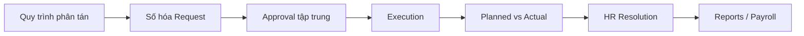
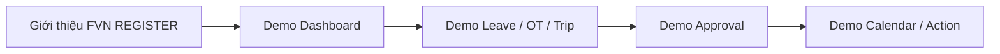
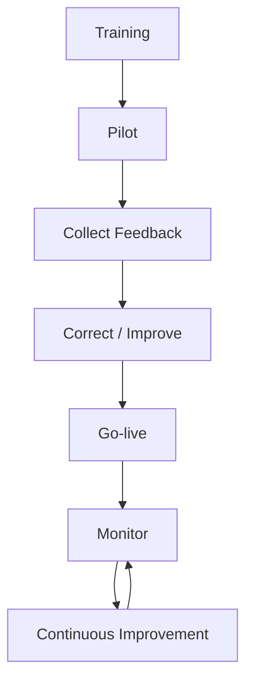

# FVN REGISTER — PR, GIỚI THIỆU VÀ KẾ HOẠCH TRUYỀN THÔNG

## 1. Product statement

> **FVN REGISTER — Smart Employee Request & e-Approval Platform**

Một nền tảng tập trung cho đăng ký nghiệp vụ nhân sự, phê duyệt điện tử, theo dõi thực tế, đối soát và quản trị dữ liệu.

## 2. PR message

### FVN REGISTER — TỪ REQUEST ĐẾN RESOLUTION

Trong quy trình truyền thống, một yêu cầu có thể bắt đầu từ email, Excel hoặc chat và kết thúc bằng nhiều bước kiểm tra thủ công.

FVN REGISTER đưa quy trình đó lên một nền tảng thống nhất:

**Request → Approval → Execution → Reconciliation → HR Review → Reporting**

Người dùng biết mình cần làm gì. Người phê duyệt biết request đang ở đâu. HR có dữ liệu đối soát. Quản lý có dashboard. Doanh nghiệp có lịch sử và khả năng truy vết.

## 3. Thông điệp theo đối tượng

| Đối tượng | Thông điệp |
|---|---|
| Employee | Đăng ký dễ dàng, theo dõi minh bạch |
| Approver | Tập trung việc cần duyệt |
| HR | Chuẩn hóa review, reconciliation và attendance |
| Manager | Dashboard, Calendar, Reports |
| Admin | Security, capability, scope, configuration |
| Leadership | Minh bạch, kiểm soát, truy vết, chuẩn hóa |

## 4. One-slide product story

## 5. Key benefits

### Đối với nhân viên
- Không phải theo dõi bằng nhiều kênh.
- Biết trạng thái request.
- Nhận notification.
- Có lịch sử.

### Đối với Approver
- Một nơi xử lý approval.
- Biết cấp hiện tại.
- Có lịch sử quyết định.
- Có Action Center.

### Đối với HR
- Có queue review.
- Có reconciliation.
- Có evidence.
- Có audit.
- Có pipeline correction.

### Đối với doanh nghiệp
- Quy trình chuẩn hóa.
- Quyền kiểm soát.
- Dữ liệu tập trung.
- Truy vết.
- Có nền tảng mở rộng.

## 6. Launch communication

### Phase 1 — Awareness

### Phase 2 — Training

- Employee training.
- Approver training.
- HR training.
- Admin training.

### Phase 3 — Go-live

### Phase 4 — Adoption

Theo dõi:
- Tỷ lệ request tạo trên hệ thống.
- Tỷ lệ approval xử lý trên hệ thống.
- Số request tồn.
- Thời gian xử lý.
- Số reconciliation chưa giải quyết.
- Mức sử dụng reports/dashboard.

## 7. Poster / Banner copy

**FVN REGISTER**

**Một nền tảng. Một quy trình. Một nơi để theo dõi.**

Nghỉ phép • OT • Công tác • Thiết bị • Approval • Calendar • Action • HR Review • Reports

**Request → Approval → Execution → Reconciliation → Resolution**

## 8. Email launch mẫu

**Tiêu đề:** FVN REGISTER — Chính thức triển khai nền tảng đăng ký và phê duyệt điện tử

FVN REGISTER được triển khai nhằm số hóa các nghiệp vụ đăng ký và phê duyệt nhân sự trên một nền tảng thống nhất.

Người dùng có thể đăng ký và theo dõi các nghiệp vụ như Nghỉ phép, OT, Công tác và Thiết bị. Người phê duyệt có thể tập trung các công việc cần xử lý trên Dashboard/Action Center. HR có thể theo dõi đối soát và xử lý các trường hợp cần review.

Trong quá trình sử dụng, vui lòng thực hiện request và approval trực tiếp trên FVN REGISTER theo hướng dẫn người dùng.

**FVN REGISTER — từ yêu cầu đến phê duyệt, từ thực tế đến đối soát.**
