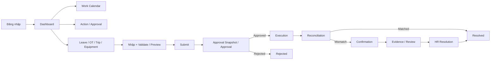
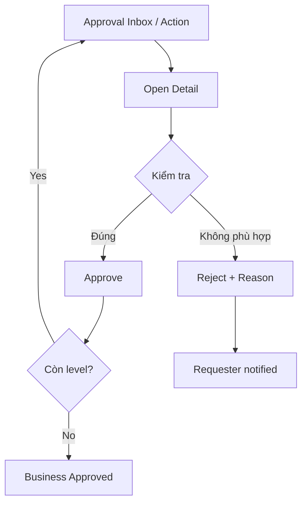
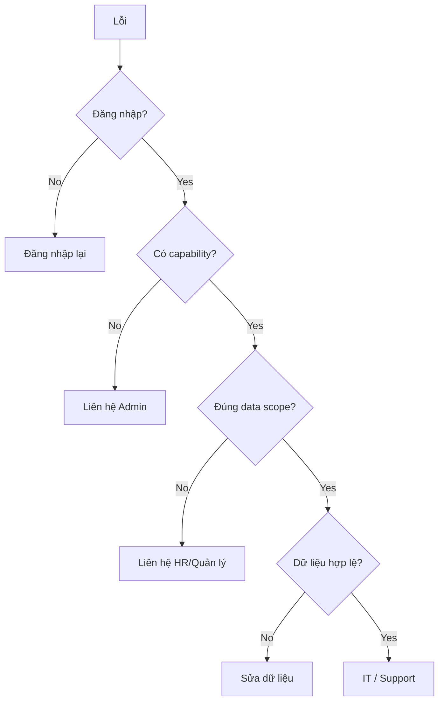

# FVN REGISTER — HƯỚNG DẪN SỬ DỤNG

## 1. Luồng sử dụng chung

## 2. Đăng nhập và Dashboard

1. Đăng nhập bằng tài khoản được cấp.
2. Kiểm tra Dashboard, Notification và Action.
3. Nếu không thấy module/chức năng, liên hệ Admin/HR để kiểm tra capability và data scope.
4. Không chia sẻ mật khẩu hoặc token.

Dashboard chỉ tổng hợp dữ liệu theo quyền; thao tác nghiệp vụ phải thực hiện ở module nguồn.

## 3. Tạo request

1. Mở Leave, OT, Trip hoặc Equipment.
2. Nhập dữ liệu.
3. Kiểm tra validation/hạn mức/file nếu có.
4. Preview.
5. Submit.
6. Theo dõi trạng thái trong module, Dashboard, Notification hoặc Calendar.

Sau Submit, Approval Snapshot giữ hierarchy tại thời điểm gửi. Thay đổi approver về sau không tự sửa lịch sử của request đã Submit.

## 4. Phê duyệt

**Escalated** do timeout không đồng nghĩa Rejected. Approver chỉ thao tác trên request thuộc required step và data scope của mình.

## 5. Leave

**Create → chọn loại phép → chọn ngày → kiểm tra balance → Preview → Submit → theo dõi Approval.**

Leave Approved mới là planned business state dùng cho reconciliation. Half-day được xử lý theo day value/loại buổi; không coi half-day là full-day conflict.

## 6. OT

**Create → chọn ngày/giờ → kiểm tra limit → Preview → Submit → Approval → Actual → Reconciliation.**

Hạn mức được kiểm tra server-side theo policy hiện hành. Approved OT là Planned; Actual lấy từ attendance/calculation chính thức.

## 7. Trip

**Create → nhập khoảng ngày/nội dung → Preview → Submit → Approval → Execution/Actual → Reconciliation.**

Trip dùng approval workflow chung và dữ liệu source riêng; Calendar chỉ hiển thị projection.

## 8. Equipment

**Create → tạo QR → Submit → Approval → Asset/QR Active → Scan → Repair Request → Repair Approval → Repair History.**

Được cấp quyền dùng Equipment không tự động có quyền approve. QR có thể được tạo trước nhưng chỉ có hiệu lực nghiệp vụ sau khi request được duyệt.

## 9. Work Calendar

Calendar là màn hình theo ngày, gồm Company Calendar, Shift, Attendance, Registration, Issues/Actions và Registration Opportunity.

### Click một ngày

- **Detail:** mở request/business detail.
- **Confirmation:** mở case mismatch/action để xử lý.
- **Registration:** mở form Leave/OT/Trip với ngày đã chọn.
- **Info:** chỉ xem thông tin.

### Ngày tương lai

Không có attendance thực tế ở ngày tương lai là bình thường. Calendar có thể hiển thị request đã đăng ký cùng trạng thái như Pending/Approved/Rejected theo dữ liệu source.

### Dấu `?`

`?` là marker của **Issue**, không phải request và không phải ActionId. Click marker để xem issue và các ActionOption.

## 10. Action / Confirmation / Notification

- **Action:** việc cần người dùng xử lý.
- **Confirmation:** bước xác nhận mismatch.
- **Notification:** thông báo/delivery.

Hoàn thành Action không tự thay đổi business result. Xử lý mismatch phải đi qua reconciliation workflow.

## 11. HR Review và Evidence

Khi mismatch yêu cầu review, người dùng có thể được yêu cầu xác nhận, nhập lý do hoặc gửi evidence. Evidence có lifecycle riêng. Reject/NeedMoreEvidence không làm reconciliation tự động Resolved.

HR correction không sửa trực tiếp attendance snapshot; correction phải đi qua calculation pipeline theo thiết kế.

## 12. Reports và Export

Reports hỗ trợ Leave, OT, Trip, Equipment và Attendance theo data scope. **View và Export là hai capability độc lập.** Bộ lọc trên UI không mở rộng quyền truy cập server.

## 13. Khi gặp lỗi

Khi báo lỗi: ghi module, request code nếu có, thời điểm, thao tác ngay trước lỗi và ảnh màn hình. Không gửi password/token.