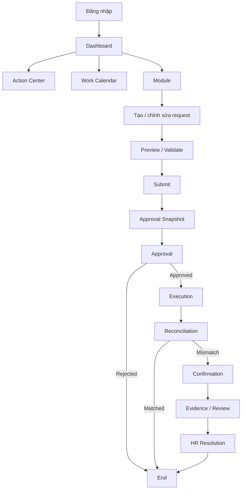
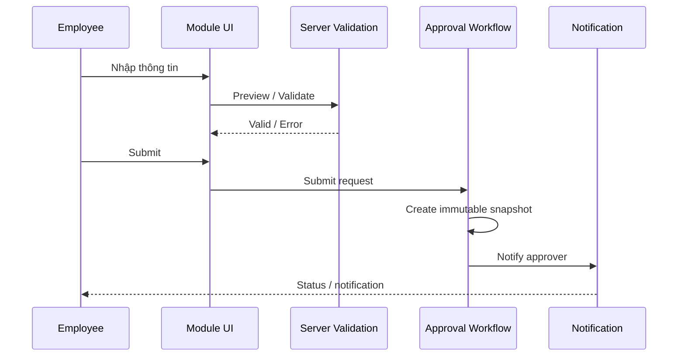
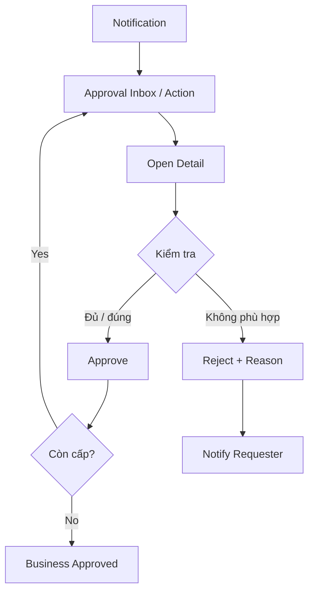
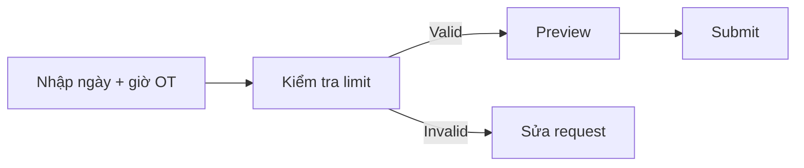
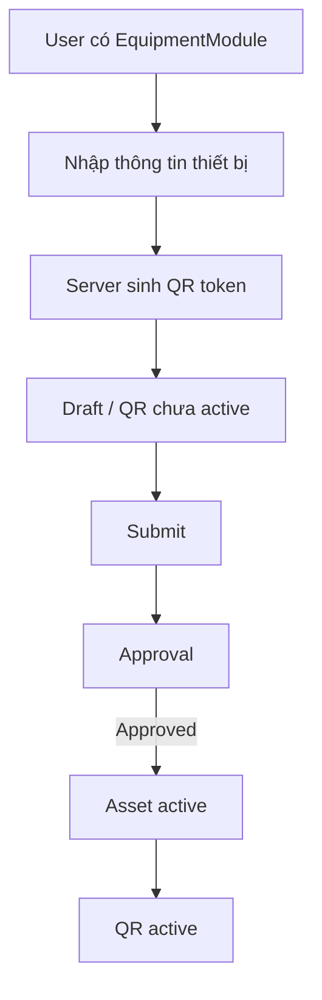
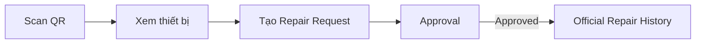
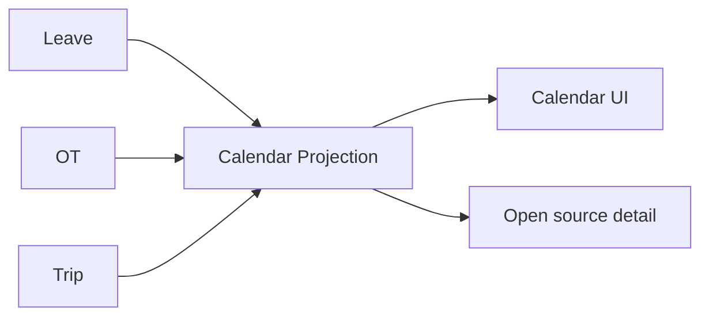
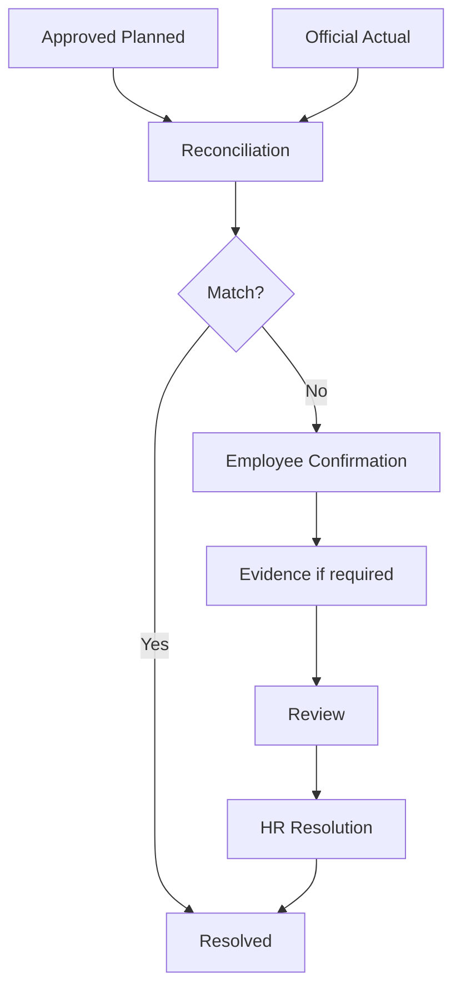
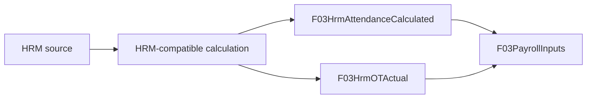
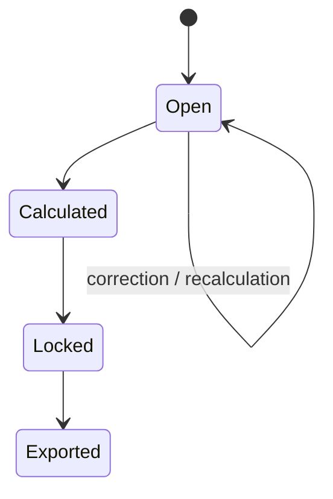

# FVN REGISTER — HƯỚNG DẪN SỬ DỤNG

## 1. Luồng sử dụng tổng quát

## 2. Đăng nhập

1. Đăng nhập bằng tài khoản được cấp.
2. Kiểm tra Dashboard sau khi đăng nhập.
3. Nếu không thấy module, kiểm tra quyền với Admin/HR.
4. Không chia sẻ tài khoản.

## 3. Dashboard

Dashboard tập trung:
- Pending approvals.
- Module widgets.
- Action.
- Notification.
- Calendar.
- Thống kê được cấp quyền.

Dashboard là màn hình tổng hợp, không phải nơi thay thế business workflow.

## 4. Employee — tạo request

### Quy trình chung

### Trước khi Submit

Kiểm tra:
- Ngày giờ.
- Nội dung.
- Bộ phận.
- Người tham gia nếu có.
- File/evidence nếu yêu cầu.
- Hạn mức/policy.

Không Submit khi dữ liệu chưa chính xác.

## 5. Approver — quy trình phê duyệt

### Luồng chuẩn

### Checklist trước khi Approve

- Đúng nhân viên?
- Đúng bộ phận?
- Đúng ngày/giờ?
- Nội dung hợp lý?
- Có đủ thông tin?
- Có vi phạm policy/hạn mức?
- Request có đúng phạm vi mình được duyệt?

### Khi Reject

Luôn nhập lý do rõ ràng để người tạo biết cần sửa gì.

### Approval Snapshot

Sau Submit, workflow đã snapshot hierarchy. Thay đổi cấu hình approver sau đó không tự thay đổi lịch sử của request đã Submit.

## 6. Leave

### Employee
1. Mở Leave.
2. Chọn loại phép.
3. Chọn ngày.
4. Kiểm tra balance.
5. Preview.
6. Submit.
7. Theo dõi Approval.

### Approver
1. Mở Action/Approval.
2. Kiểm tra ngày và người đăng ký.
3. Approve hoặc Reject + Reason.

Chỉ Leave Approved được coi là lịch nghỉ chắc chắn.

## 7. Overtime

### Employee

Hạn mức hiện hành: ngày, tuần nếu được cấu hình, tháng 40h, năm 200h và ngưỡng tối đa 300h theo policy. Hệ thống phải kiểm tra server-side.

### Approver

Không coi "đã đăng ký" là "đã thực hiện". Approval xác nhận kế hoạch; actual được đối soát sau đó.

## 8. Trip

1. Tạo Draft.
2. Nhập thời gian, địa điểm, mục đích, chi phí và người đi cùng.
3. Preview.
4. Submit.
5. Theo dõi Approval.
6. Sau khi Approved, execution/actual được dùng cho reconciliation.

Trip dùng approval engine chung; không tự chọn cấp approval.

## 9. Equipment

### Đăng ký thiết bị

### Sửa chữa

Repair chưa Approved không được coi là lịch sử sửa chữa chính thức.

## 10. Action Center

Action là việc cần xử lý, không phải kết quả nghiệp vụ.

Trạng thái thường gặp:
- Open.
- InProgress.
- Completed.
- Dismissed.

**Action.Completed không đồng nghĩa Business Approved/Matched.**

Nếu reconciliation còn Evidence bị Reject/NeedMoreEvidence, Action phải tiếp tục mở/in progress theo policy.

## 11. Notification

Notification có thể đến từ:
- Submit.
- Approval.
- Reject.
- Next approver.
- Escalation.
- Confirmation.
- HR Review.

Notification chỉ là kênh delivery/read state. Không dùng việc "đã đọc notification" để suy ra request đã được duyệt.

## 12. Work Calendar

Calendar là projection/navigation.

Calendar không phải source-of-truth cho approval.

## 13. Execution Reconciliation

Các module áp dụng: OT, Leave, Trip và module tương lai.

## 14. HR Review

### OK
- Xác nhận phản hồi hợp lệ.
- Tạo resolution.
- Với Attendance, tạo correction và chạy lại HRM-compatible calculation.
- Cập nhật CalendarAction.
- Đóng Action.
- Thông báo User.

### NG
- Bắt buộc Reason.
- Không tự sửa nguồn nghiệp vụ.
- Ghi audit.
- Thông báo User.

## 15. Attendance Calculation

FVN đọc HRM; không ghi ngược HRM. Mỗi lần tính có CalculationBatchId để truy vết.

## 16. Payroll

Kỳ hiện hành: ngày 21 tháng hiện tại → ngày 20 tháng kế tiếp.

Không prepare/lock/export chính thức khi kỳ còn execution mismatch hoặc correction chưa xử lý theo policy.

## 17. Reports

1. Mở Reports.
2. Chọn nhóm.
3. Chọn bộ lọc trong phạm vi được phép.
4. Xem kết quả.
5. Export nếu có capability Export.

Có View không đồng nghĩa có Export.

## 18. Những điều không được làm

- Không dùng UI hide để coi là security.
- Không tự thay đổi approver bằng client.
- Không coi notification là approval.
- Không coi Action.Completed là business result.
- Không sửa trực tiếp attendance snapshot.
- Không bypass Data Scope bằng cách gửi DeptCode/EmployeeCode khác.
- Không coi Calendar là nguồn dữ liệu nghiệp vụ.
- Không đóng Action để bypass reconciliation.
