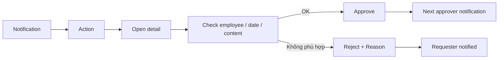
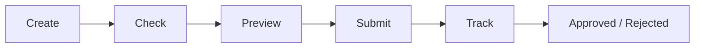
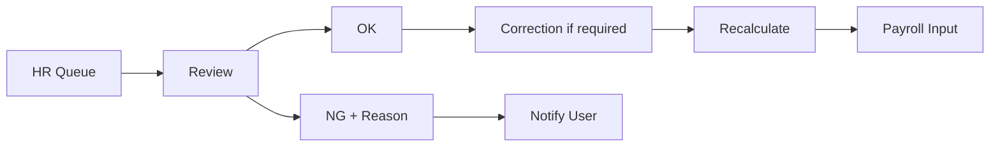
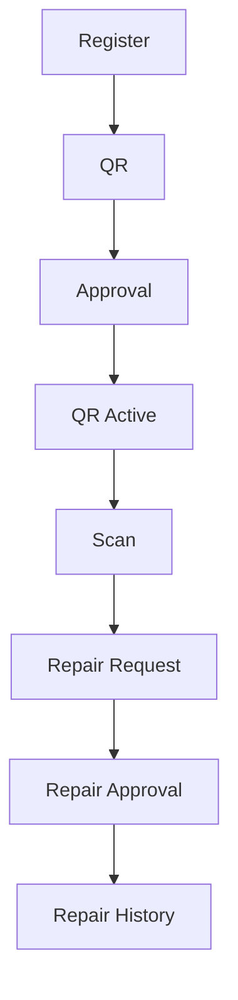
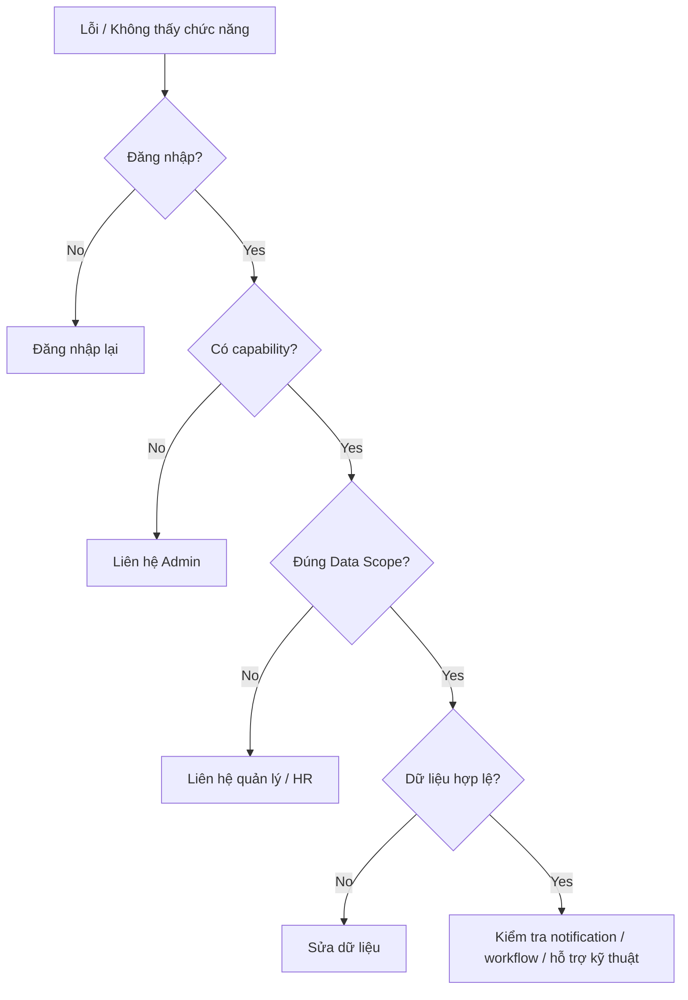

# FVN REGISTER — QUICK GUIDE

## 1. Approver — 60 giây

### Trước khi Approve
- Đúng người.
- Đúng ngày/giờ.
- Đúng nội dung.
- Đúng scope.
- Đúng policy.

### Nhớ
**Approve = quyết định nghiệp vụ.**

Không phải "đã xem".

## 2. Employee — 60 giây

Không Submit khi thông tin chưa chính xác.

## 3. HR — 60 giây

HR không sửa trực tiếp attendance result.

## 4. Equipment — 60 giây

## 5. Trạng thái cần nhớ

| Khái niệm | Ý nghĩa |
|---|---|
| Draft | Chưa gửi |
| Pending | Đang chờ xử lý/duyệt |
| Approved | Business đã được duyệt theo workflow |
| Rejected | Bị từ chối |
| Escalated | Hệ thống chuyển cấp do timeout; không đồng nghĩa Rejected |
| Action Open | Có việc cần xử lý |
| Action Completed | Công việc đã đóng |
| Mismatch | Planned và Actual khác nhau |
| Resolved | Reconciliation đã được giải quyết |

## 6. 8 nguyên tắc

1. Notification ≠ Approval.
2. Action ≠ Business Result.
3. Calendar ≠ Source of Truth.
4. Approved ≠ Actual.
5. Mismatch ≠ Rejected.
6. HR OK ≠ sửa trực tiếp database.
7. View ≠ Export.
8. Scope ≠ Role name.

## 7. Khi có lỗi

