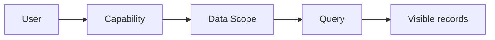
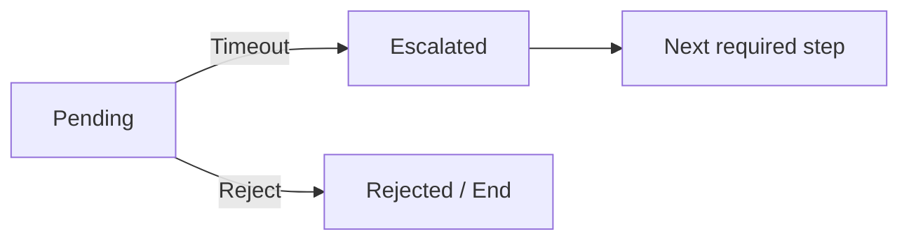
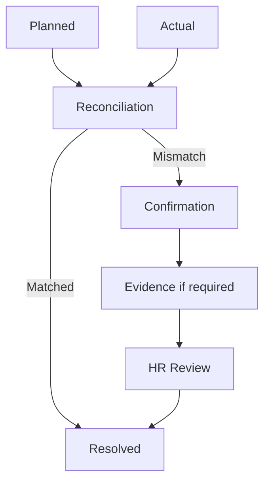
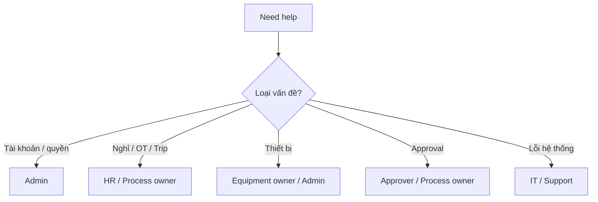

# FVN REGISTER — FAQ & TÌNH HUỐNG THƯỜNG GẶP

## 1. Tôi nhận notification nhưng không thấy nút Approve?

Có thể request đã được xử lý, đã chuyển cấp, đã bị Reject hoặc bạn không còn là actor hiện tại. Notification là delivery state, không đảm bảo request vẫn actionable.

## 2. Tôi không thấy một nhân viên khác?

Kiểm tra Data Scope. Quyền View/Approve không mặc định cho phép xem toàn hệ thống.

## 3. Tôi có quyền Approve nhưng không thấy request?

Kiểm tra:
- Request đang ở đúng required step?
- Request còn Pending?
- Approver có đúng scope?
- Request có bị xử lý bởi người khác?
- Workflow có vừa chuyển cấp không?

## 4. Cấu hình approver thay đổi sau khi tôi gửi đơn?

Request đã Submit sử dụng Approval Snapshot tại thời điểm Submit. Cấu hình mới áp dụng cho request mới theo workflow.

## 5. Escalated có nghĩa là Rejected không?

Không.

Escalated là system decision để chuyển cấp.

## 6. Action đã Completed thì request đã Approved?

Không nhất thiết. Action là work item. Business status phải được kiểm tra ở module nguồn.

## 7. Calendar hiển thị một sự kiện, tôi có thể coi đó là dữ liệu chính thức không?

Không. Calendar là projection/navigation. Muốn biết trạng thái chính thức, mở request/business module.

## 8. Approved OT có nghĩa là đã làm đủ số giờ đó?

Không. Approved là Planned/được duyệt. Actual lấy từ attendance/official execution data và được reconciliation.

## 9. Planned và Actual khác nhau thì sao?

Hệ thống tạo/duy trì reconciliation theo policy.

## 10. Evidence bị Reject thì sao?

Reconciliation chưa được coi là Resolved và Action không được tự động hoàn tất.

## 11. HR chọn NG thì sao?

HR phải nhập Reason. Hệ thống lưu quyết định và thông báo người dùng.

## 12. HR có sửa trực tiếp attendance result không?

Không theo luồng chuẩn. Attendance correction phải đi qua correction/calculation pipeline.

## 13. Tôi có View nhưng không Export được báo cáo?

Đúng theo thiết kế: View và Export là capability riêng.

## 14. Tôi chọn DeptCode khác trên màn hình nhưng dữ liệu vẫn không hiện?

Client filter không thể mở rộng quyền. Server áp dụng Data Scope.

## 15. Tôi không thấy module Equipment?

Có thể user chưa được cấp function EquipmentModule hoặc dữ liệu nằm ngoài scope.

## 16. QR thiết bị đã in nhưng chưa dùng được?

QR token có thể được tạo ở Draft, nhưng QR chỉ active sau khi Equipment Registration được approval hoàn tất.

## 17. Repair đã nhập nhưng không thấy trong lịch sử chính thức?

Repair History chính thức chỉ phản ánh repair đã được duyệt theo workflow.

## 18. Khi nào Payroll được prepare?

Sau khi dữ liệu attendance/OT đã được tính và các điều kiện execution/reconciliation của kỳ được đáp ứng. Kỳ hiện hành là 21 → 20.

## 19. Có thể đóng Action để bỏ qua reconciliation không?

Không nên. Action chỉ là work item; đóng Action không giải quyết business mismatch. Reconciliation phải được xử lý theo workflow.

## 20. Tôi gặp lỗi 403?

403 thường có nghĩa authentication đã được nhận nhưng authorization/scope không cho phép thao tác. Kiểm tra capability và data scope với Admin/HR.

## 21. Tôi nên liên hệ ai?

## 22. Checklist trước khi báo lỗi

- Chụp màn hình lỗi.
- Ghi module.
- Ghi mã request nếu có.
- Ghi thời điểm xảy ra.
- Ghi thao tác ngay trước khi lỗi.
- Không gửi mật khẩu/token.
- Không tự thay đổi dữ liệu để thử bypass.
