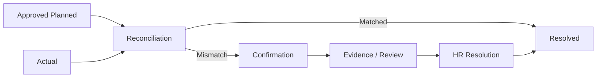

# FVN REGISTER — FAQ & TÌNH HUỐNG THƯỜNG GẶP

## 1. Tôi nhận notification nhưng không thấy Approve?
Notification chỉ là delivery/read state. Request có thể đã được xử lý, chuyển cấp, bị từ chối hoặc bạn không còn là actor hiện tại.

## 2. Tôi có quyền Approve nhưng không thấy request?
Kiểm tra required step, trạng thái request, actor hiện tại và data scope. Có capability không đồng nghĩa có quyền xem mọi dữ liệu.

## 3. Approver thay đổi sau khi tôi Submit?
Request đã Submit dùng Approval Snapshot tại thời điểm Submit. Cấu hình mới áp dụng cho request phù hợp sau đó; không sửa lịch sử snapshot cũ.

## 4. Escalated có phải Rejected?
**Không.** Escalated là system decision do timeout để chuyển sang cấp/actor tiếp theo theo workflow.

## 5. Approved OT có nghĩa đã làm đủ giờ OT?
**Không.** Approved là Planned. Actual được lấy từ attendance/calculation chính thức và được reconciliation.

## 6. Ngày tương lai không có chấm công có phải lỗi?
**Không.** Ngày tương lai chưa có Actual attendance là bình thường. Không tạo attendance mismatch chỉ vì ngày chưa tới.

## 7. Calendar hiển thị Pending/Approved có phải Calendar là nguồn dữ liệu chính?
Không. Calendar là projection/navigation. Trạng thái Pending/Approved/Rejected lấy từ business module source.

## 8. Tôi đã đăng ký OT nhưng Calendar vẫn cho đăng ký?
Registration Opportunity phải bị suppress khi đã có registration tương ứng. Nếu UI không đồng nhất, kiểm tra refresh/projection và báo lỗi kèm ngày + mã request.

## 9. Dấu `?` màu đỏ là gì?
Đó là **Issue marker** của Calendar. Nó biểu diễn case cần chú ý/xử lý; không phải một request mới. Click để xem Issue và ActionOption.

## 10. Planned và Actual khác nhau thì sao?
Reconciliation tạo/duy trì case mismatch theo policy. Có thể cần Confirmation, Evidence và HR Resolution.

## 11. Action Completed có giải quyết mismatch không?
Không. Action là work item. Business result/reconciliation phải được xử lý theo workflow.

## 12. Evidence bị Reject/NeedMoreEvidence?
Reconciliation chưa được coi là Resolved và Action không tự động hoàn tất.

## 13. HR có sửa trực tiếp attendance result không?
Theo luồng chuẩn, không. Correction phải đi qua calculation pipeline và để lại audit.

## 14. Tôi có View nhưng không Export được?
Đúng theo thiết kế. View và Export là capability riêng.

## 15. Tôi chọn DeptCode khác trên UI nhưng dữ liệu không hiện?
UI filter không cấp quyền. Server vẫn áp dụng Data Scope.

## 16. Không thấy Equipment?
Kiểm tra capability/module assignment và data scope với Admin. Quyền dùng module và quyền approve là hai lớp khác nhau.

## 17. QR đã in nhưng chưa scan/use được?
QR có thể tồn tại trước approval nhưng chỉ active khi Equipment request được approval hoàn tất.

## 18. Repair đã nhập nhưng chưa thấy lịch sử chính thức?
Repair History chính thức chỉ phản ánh repair đã qua workflow approval theo policy.

## 19. Payroll dùng kỳ nào?
Kỳ hiện hành theo thiết kế là **ngày 21 → ngày 20**. Payroll input phải dựa trên dữ liệu đã tính và các readiness gate của kỳ.

## 20. Tôi gặp 401/403?
401 thường liên quan authentication/session. 403 cho biết request đã xác thực nhưng capability/scope không cho phép thao tác. Liên hệ Admin/HR/IT theo loại vấn đề.

## 21. Khi báo lỗi cần gửi gì?
Module, thời điểm, thao tác, mã request nếu có và ảnh màn hình. Không gửi password, access token hoặc secret.