# FVN REGISTER
## Báo cáo tổng quan nền tảng

**Smart Employee Request & e-Approval Platform**

> Từ yêu cầu đến phê duyệt — từ thực tế đến đối soát

---

# 01 — Executive Summary

FVN REGISTER là nền tảng tập trung cho vòng đời nghiệp vụ nhân sự:

**Request → Approval → Execution → Reconciliation → HR Review → Reporting / Payroll**

### Mục tiêu
- Chuẩn hóa quy trình.
- Minh bạch trạng thái.
- Tập trung approval.
- Quản lý Planned vs Actual.
- Tăng khả năng truy vết.
- Kiểm soát quyền bằng **Capability + Data Scope**.

---

# 02 — Vì sao cần FVN REGISTER?

### Quy trình phân tán
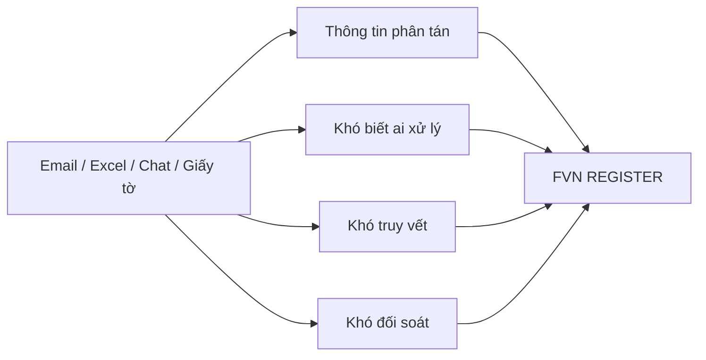

### Chuyển đổi
**Phân tán → Tập trung → Có workflow → Có audit → Có reconciliation**

---

# 03 — Giá trị cho doanh nghiệp

| Đối tượng | Giá trị |
|---|---|
| Employee | Đăng ký và theo dõi minh bạch |
| Approver | Tập trung việc cần duyệt |
| HR | Review, reconciliation, attendance |
| Manager | Dashboard, Calendar, Reports |
| Admin | Capability, Scope, Configuration |
| Leadership | Chuẩn hóa, kiểm soát, truy vết |

---

# 04 — Vòng đời nghiệp vụ chuẩn

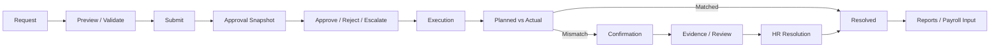

**Thông điệp:** Approved chưa đồng nghĩa Actual đã hoàn thành.

---

# 05 — Bản đồ nền tảng

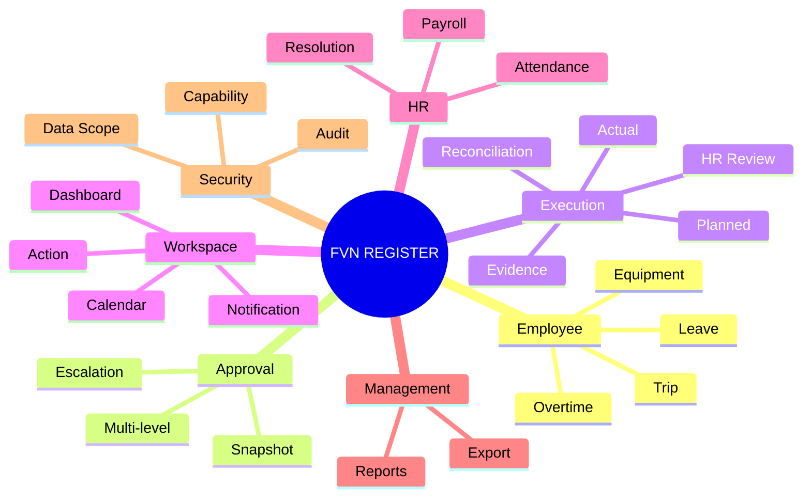

---

# 06 — Approval: trung tâm của quy trình

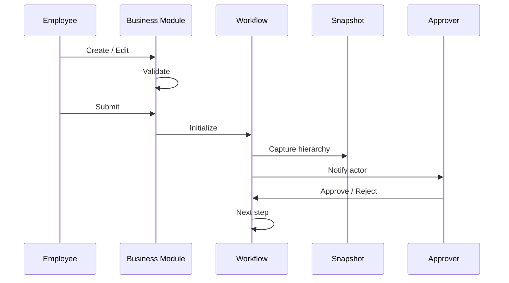

### Nguyên tắc
- Approval Snapshot bảo toàn hierarchy tại thời điểm Submit.
- Escalated do timeout **không đồng nghĩa Rejected**.
- Approval là quyết định nghiệp vụ; Notification chỉ là delivery.

---

# 07 — Leave

### Employee
**Create → Check Balance → Preview → Submit → Track**

### Approver
**Open → Check → Approve / Reject + Reason**

### Kết quả
- Request được quản lý theo workflow.
- Lịch nghỉ được phản ánh sau khi đủ điều kiện.
- Calendar chỉ là projection; module Leave là nguồn nghiệp vụ.

---

# 08 — Overtime

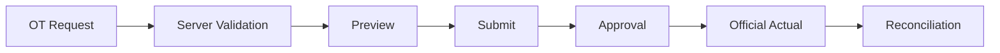

### Điểm kiểm soát
- Hạn mức được kiểm tra **server-side**.
- Policy có thể cấu hình theo ngày/tuần/tháng/năm.
- Approved OT là **Planned**, không phải Actual.
- Actual được đối soát trước khi đi vào các bước HR/Payroll.

---

# 09 — Trip

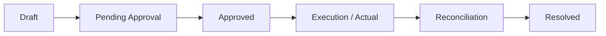

- Một approval engine dùng chung.
- Không tự chọn cấp approval từ client.
- Actual được xử lý riêng với Planned.

---

# 10 — Equipment & QR

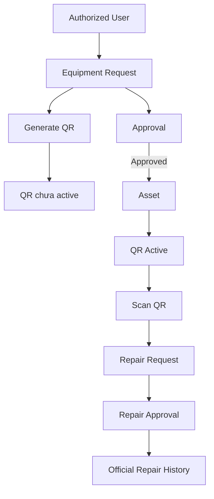

### Điểm kiểm soát
- **EquipmentModule ≠ Approval authority**.
- QR có thể tồn tại trước approval nhưng chưa có hiệu lực nghiệp vụ.
- Repair chỉ trở thành lịch sử chính thức sau approval.

---

# 11 — Planned vs Actual

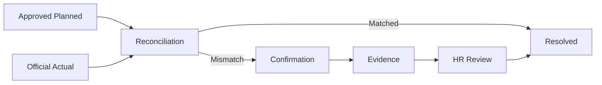

### Ý nghĩa
**Approved = kế hoạch được duyệt**

**Actual = thực tế**

**Reconciliation = kiểm tra sự phù hợp giữa hai nguồn**

---

# 12 — HR Review & Resolution

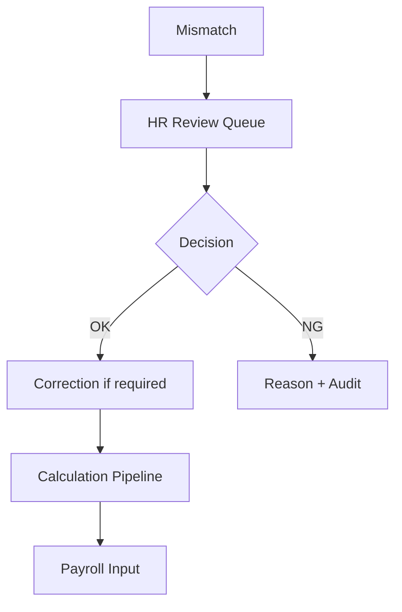

- Evidence có lifecycle riêng.
- HR OK không có nghĩa sửa trực tiếp database.
- NG phải có Reason.
- Correction cần audit và đi qua calculation pipeline.

---

# 13 — Attendance

### Nguồn và kết quả

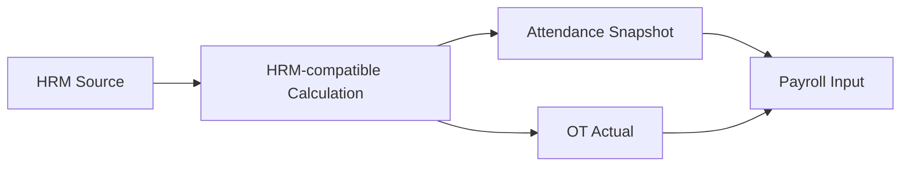

### Nguyên tắc
- HRM là nguồn dữ liệu / luật tính.
- FVN cung cấp UI và snapshot kết quả theo thiết kế.
- Correction không bypass calculation pipeline.
- Calculation batch cần truy vết.

---

# 14 — Payroll

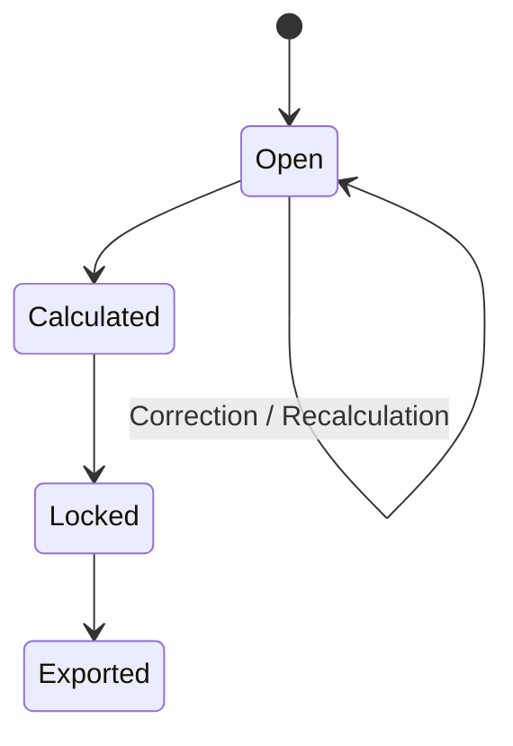

### Readiness
Payroll chỉ đi tiếp khi các điều kiện của kỳ được đáp ứng.

**Kỳ hiện hành: ngày 21 → ngày 20**

Không dùng Payroll để che giấu execution mismatch hoặc correction chưa xử lý.

---

# 15 — Action Center

### Action = công việc cần xử lý

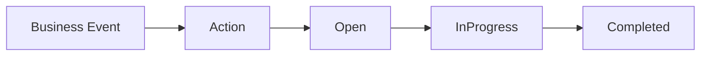

> **Action.Completed ≠ Business Approved**

Action là work item; business module mới là nguồn trạng thái nghiệp vụ.

---

# 16 — Work Calendar

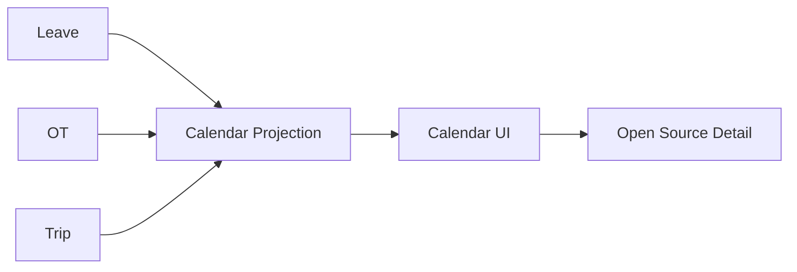

### Nguyên tắc
- Calendar giúp nhìn kế hoạch.
- Calendar không thay thế approval state.
- Khi cần quyết định nghiệp vụ → mở source module.

---

# 17 — Notification

### Notification phục vụ
- Submit.
- Approval.
- Reject.
- Next approver.
- Escalation.
- Confirmation.
- HR Review.

### Cần nhớ

**Notification ≠ Approval**

Đã đọc notification không có nghĩa request đã được duyệt.

---

# 18 — Dashboard & Reports

### Dashboard
- Pending approvals.
- Action.
- Notification.
- Calendar.
- Module widgets.
- Statistics theo scope.

### Reports
- Leave.
- OT.
- Trip.
- Equipment.
- Attendance.

**View và Export là hai capability riêng.**

---

# 19 — Security: Capability + Data Scope

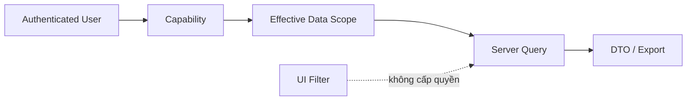

### 2 lớp kiểm soát

**Capability:** được làm gì?

**Data Scope:** được xem / xử lý dữ liệu nào?

> Có quyền Approve không đồng nghĩa có Scope All.

---

# 20 — Vai trò trong hệ thống

| Vai trò | Trách nhiệm chính |
|---|---|
| Employee | Create / Track Request |
| Approver | Review / Approve / Reject |
| HR | Reconciliation / Resolution / Attendance |
| Manager | Dashboard / Calendar / Reports |
| Admin | Security / Configuration |
| Payroll | Payroll Input theo kỳ |

---

# 21 — Những nguyên tắc cần nhớ

### 8 nguyên tắc vận hành

1. **Notification ≠ Approval**
2. **Action ≠ Business Result**
3. **Calendar ≠ Source of Truth**
4. **Approved ≠ Actual**
5. **Mismatch ≠ Rejected**
6. **HR OK ≠ Direct DB Edit**
7. **View ≠ Export**
8. **Scope ≠ Role Name**

---

# 22 — Employee Journey

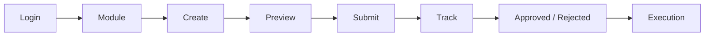

### Người dùng cần tập trung vào
**Dữ liệu đúng → Submit đúng → Theo dõi đúng trạng thái**

---

# 23 — Approver Journey

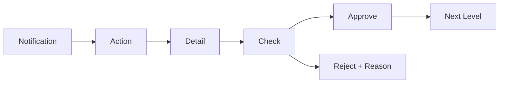

### Checklist
- Đúng người.
- Đúng ngày/giờ.
- Đúng nội dung.
- Đúng scope.
- Đúng policy.

---

# 24 — HR Journey

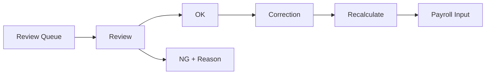

### Mục tiêu
**Không chỉ xử lý lỗi — phải tạo được resolution có thể truy vết.**

---

# 25 — FAQ: các tình huống quan trọng

### Tôi có notification nhưng không thấy Approve?
Request có thể đã được xử lý, chuyển cấp hoặc bạn không còn là actor hiện tại.

### Tôi có quyền Approve nhưng không thấy request?
Kiểm tra required step, Pending status, Data Scope và actor hiện tại.

### Escalated có phải Rejected?
**Không.** Escalated là system decision do timeout để chuyển cấp.

### Action Completed có phải Approved?
**Không nhất thiết.** Kiểm tra business state ở module nguồn.

---

# 26 — FAQ: Planned / Actual / Reconciliation

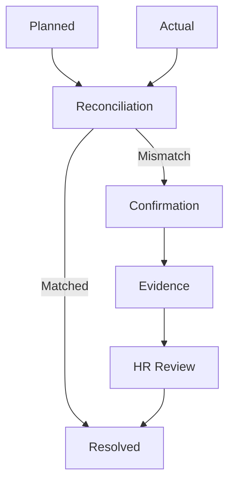

### Quy tắc
- Không tự sửa Actual để làm cho dữ liệu khớp.
- Không đóng Action để bypass mismatch.
- Evidence chưa đạt → case chưa Resolved.

---

# 27 — Triển khai & Adoption

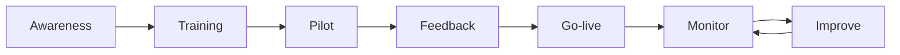

### Đo lường
- Tỷ lệ request trên hệ thống.
- Tỷ lệ approval xử lý trên hệ thống.
- Request tồn.
- Thời gian xử lý.
- Reconciliation chưa giải quyết.
- Mức sử dụng Dashboard / Reports.

---

# 28 — Thông điệp truyền thông

## FVN REGISTER

### **Một nền tảng. Một quy trình. Một nơi để theo dõi.**

Nghỉ phép • OT • Công tác • Thiết bị  
Approval • Calendar • Action • HR Review • Reports

**Request → Approval → Execution → Reconciliation → Resolution**

---

# 29 — Góc nhìn quản trị

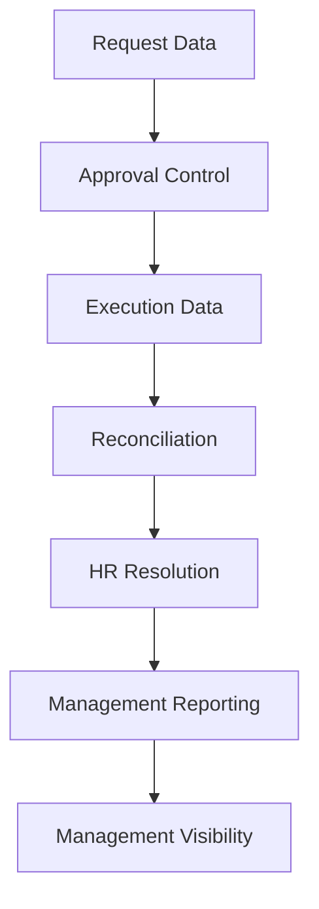

### Kết quả mong muốn
- Một nguồn dữ liệu nghiệp vụ rõ ràng.
- Một workflow approval có kiểm soát.
- Một cơ chế reconciliation thống nhất.
- Một lớp báo cáo phục vụ quản trị.

---

# 30 — Kết luận

## FVN REGISTER

**Từ Request đến Approval**

**Từ Approval đến Execution**

**Từ Execution đến Reconciliation**

**Từ Reconciliation đến HR Resolution**

**Từ dữ liệu đến Management Insight**

### FVN REGISTER
**Từ yêu cầu đến phê duyệt — từ thực tế đến đối soát.**

---

<!--
## Speaker Notes — định hướng trình bày

Mục tiêu của deck:
1. Nêu vấn đề quản trị trước khi đi vào chức năng.
2. Cho lãnh đạo thấy toàn bộ lifecycle, không chỉ từng màn hình.
3. Nhấn mạnh 4 giá trị: chuẩn hóa, minh bạch, truy vết, đối soát.
4. Khi demo, đi theo một request xuyên suốt: Employee → Approver → Execution → HR → Report.
5. Không đi sâu code/kiến trúc kỹ thuật trong phần trình bày quản trị.
-->
