

<!-- _class: hero -->

# FVN REGISTER
## Số hóa công việc — giảm chi phí vận hành

### Từ **giấy • bảng tính • ký • tìm • đối chiếu • nhắc việc**
### thành **một quy trình số hóa thống nhất**

**Đăng ký → Phê duyệt → Thực tế → Đối soát → Xử lý → Báo cáo**

> **Không chỉ bỏ giấy. Quan trọng hơn là giảm công việc lặp lại phía sau tờ giấy.**

---

# 01 — Vấn đề thật sự không phải là tờ giấy

⌨
<b>Nhập lại</b> Một thông tin phải đi qua nhiều tệp, phiếu và bảng tổng hợp.

🔎
<b>Tìm kiếm</b> Mất thời gian tìm hồ sơ, trạng thái và lịch sử.

✓
<b>Đối chiếu</b> Nhân sự phải kiểm tra kế hoạch và thực tế thủ công.

⏰
<b>Nhắc việc</b> Phụ thuộc vào việc con người nhớ đúng lúc.

### Chi phí ẩn

**Giờ công + giấy tờ + tìm kiếm + sửa sai + xử lý chậm + nguy cơ bỏ sót**

---

# 02 — QUY TRÌNH HIỆN TẠI

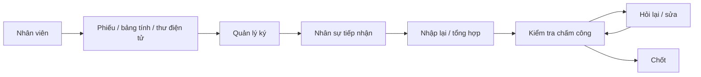

### Mỗi vòng lặp đều tiêu tốn thời gian

**Ghi → gửi → ký → nhập → kiểm tra → hỏi → sửa → kiểm tra lại**

> Khi số lượng nhân viên tăng, khối lượng kiểm tra tăng gần như theo số giao dịch.

---

# 03 — FVN REGISTER THAY ĐỔI ĐIỀU GÌ?

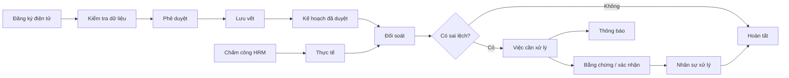

### Ý nghĩa kinh tế

**Hệ thống làm phần việc lặp lại → con người tập trung vào trường hợp ngoại lệ.**

---

# 04 — CHẤM CÔNG • PHÉP • OT • CÔNG TÁC

## Trước

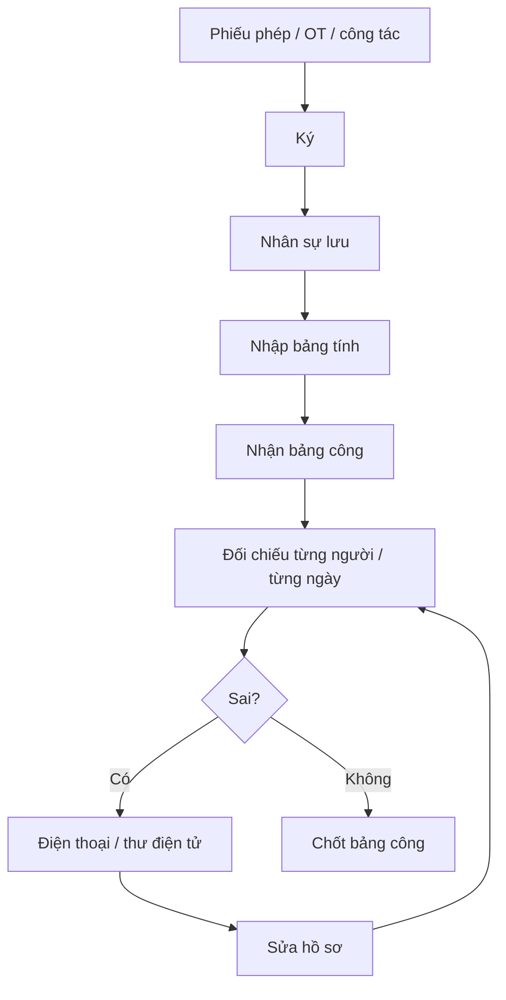

## Sau

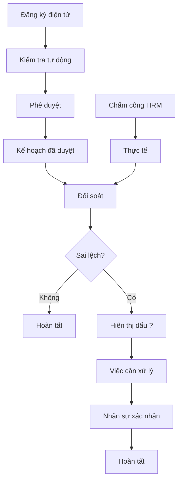

### Một số lỗi hệ thống có thể phát hiện

- **OT thực tế nhưng chưa có đăng ký.**
- **OT đã duyệt nhưng không có OT thực tế.**
- **Nghỉ phép/công tác đã duyệt nhưng vẫn có chấm công.**
- **Chênh lệch giờ thực tế và giờ yêu cầu.**

> Không cần chờ đến cuối kỳ mới bắt đầu tìm lỗi.

---

# 05 — LỊCH LÀM VIỆC CỦA TÔI

## Từ nhiều nơi → một màn hình theo ngày

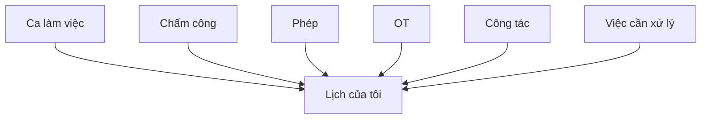

### Người dùng nhìn thấy ngay

**Ca • Vào/Ra • Giờ thực tế • Giờ yêu cầu • Phép • OT • Công tác • Dấu ?**

### Giá trị

**Ít tìm kiếm hơn • ít đối chiếu hơn • phát hiện vấn đề sớm hơn**

---

# 06 — DẤU “?” KHÔNG PHẢI TRANG TRÍ

### Mỗi dấu “?” là một vấn đề có ngữ cảnh

### Ví dụ

🟡 **Chênh lệch giờ:** kiểm tra lại hoặc đăng ký OT.

🔴 **OT đã duyệt nhưng không có thực tế:** xác nhận / xử lý hủy theo quy trình.

🔴 **Đã duyệt nghỉ nhưng có chấm công:** gửi xử lý cho nhân sự.

> **Từ “có lỗi” → “biết phải làm gì”.**

---

# 07 — QUẢN LÝ THIẾT BỊ: TỪ SỔ GIẤY ĐẾN QR

## Trước

**Phiếu → Sổ → Tìm → Phiếu kiểm tra giấy → Ký → Lưu**

## Sau

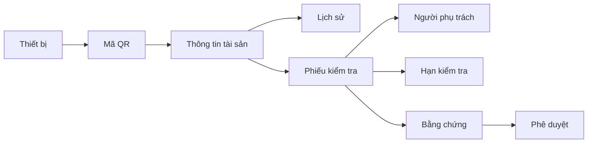

### Một lần quét QR

**→ đúng thiết bị  
→ đúng bộ phận  
→ đúng phiếu kiểm tra  
→ đúng lịch sử**

---

# 08 — PHIẾU KIỂM TRA KHÔNG CÒN LÀ “NHỚ THÌ LÀM”

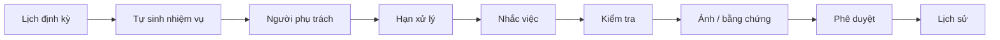

### Hiện hệ thống đã có

- Phiếu kiểm tra theo ngày / tuần / tháng / quý / năm.
- Tự sinh nhiệm vụ kiểm tra theo lịch.
- Nhắc trước hạn.
- Việc cần xử lý trên hệ thống.
- Bằng chứng hình ảnh.
- Phiên bản phiếu kiểm tra.
- Lịch sử kiểm tra/sửa chữa.

---

# 09 — PHẦN MỀM CHỦ ĐỘNG LÀM VIỆC

5'
<b>Đồng bộ HRM</b> Theo chu kỳ hiện tại

5'
<b>Hàng đợi thư điện tử</b> Tách gửi thông báo khỏi nghiệp vụ

10'
<b>Kiểm tra thiết bị</b> Sinh nhiệm vụ và nhắc việc

30'
<b>Đối soát</b> Quét sai lệch gần nhất

### Ngoài ra

**Tính công tự động hằng ngày • Nhắc phê duyệt • Chuyển cấp khi quá hạn**

> Mục tiêu là **không bắt nhân sự phải nhớ mọi việc**.

---

# 10 — TỪ “AI NHỚ THÌ LÀM” → “HỆ THỐNG NHẮC VIỆC”

## Cách cũ

## Cách mới

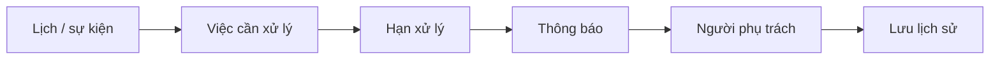

### Lợi ích

**Đúng người • đúng việc • đúng hạn • có truy vết**

---

# 11 — KIỂM SOÁT TRƯỚC KHI CHỐT BẢNG LƯƠNG

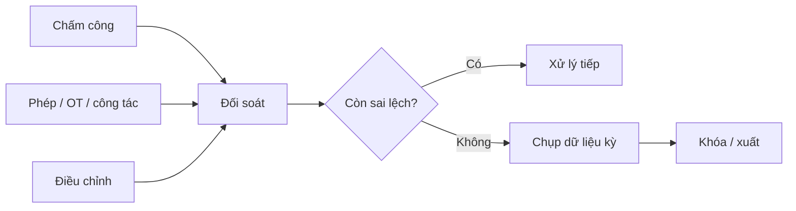

### Điểm quan trọng

**Phát hiện trước khi chốt tốt hơn phát hiện sau khi đã chốt.**

Hệ thống có cơ chế kiểm tra sai lệch và điều chỉnh còn tồn trước khi khóa/xuất kỳ lương.

---

# 12 — BÁO CÁO KHÔNG CÒN PHỤ THUỘC VÀO NHIỀU tệp

## Trước

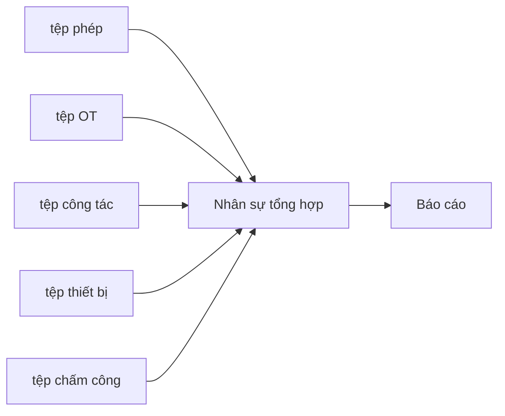

## Sau

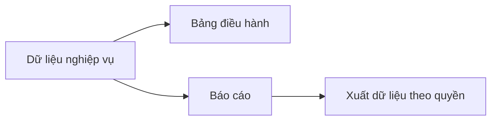

### Giá trị

**Một nguồn dữ liệu → nhiều góc nhìn quản trị**

---

# 13 — 4 NGUỒN TẠO RA HIỆU QUẢ NGÂN SÁCH

①
<b>Giờ công</b> Giảm nhập lại, tìm kiếm, tổng hợp, đối chiếu

②
<b>Giấy tờ</b> Giảm in, quét, lưu trữ, luân chuyển

③
<b>Sai sót</b> Giảm sửa lại và kiểm tra lặp

④
<b>Rủi ro</b> Giảm bỏ sót, quá hạn, thiếu lịch sử

> Đây là **cơ chế tạo lợi ích**. Mức tiết kiệm thực tế phải đo bằng số liệu trước/sau triển khai.

---

# 14 — CÁCH TÍNH TIỀN

### 1. Giờ công giải phóng

**Giờ tiết kiệm = số giao dịch × phút tiết kiệm / 60**

### 2. Giá trị nhân công

**Giá trị = giờ tiết kiệm × chi phí nhân công quy đổi/giờ**

### 3. Lợi ích năm

**Lợi ích năm = nhân công + giấy tờ + giảm sửa sai + tránh tổn thất**

### 4. Hiệu quả đầu tư

**Hiệu quả đầu tư = lợi ích ròng / tổng mức đầu tư**

### 5. Thời gian hoàn vốn

**Thời gian hoàn vốn = vốn đầu tư ban đầu / lợi ích ròng mỗi tháng**

---

# 15 — VÍ DỤ MINH HỌA

> ⚠️ **Đây là số liệu minh họa, không phải số liệu thực tế của FCC Việt Nam.**

1.500
<b>giao dịch/tháng</b>

16'
<b>tiết kiệm/giao dịch</b>

120h
<b>giảm tổng hợp báo cáo/tháng</b>

75.000đ
<b>chi phí/giờ</b>

### Mô hình tính

**≈ 520 giờ được giải phóng/tháng**

**≈ 39 triệu đồng/tháng**

**≈ 468 triệu đồng/năm**

> Con số chính thức phải được thay bằng **số liệu hiện trạng thực tế + kết quả thử nghiệm**.

---

# 16 — KHÔNG ĐỒNG NGHĨA “GIẢM NGƯỜI”

## 1 giờ công được giải phóng có thể dùng để:

- giảm làm thêm;
- giảm thuê ngoài;
- xử lý được nhiều hồ sơ hơn với cùng đội ngũ;
- chuyển nhân sự sang kiểm soát và phân tích;
- đáp ứng tăng trưởng mà chưa phải bổ sung nhân sự tương ứng.

### Vì vậy nên trình 3 lớp

**Tiết kiệm tiền mặt**

**Giải phóng năng lực**

**Giảm rủi ro**

---

# 17 — ĐO HIỆU QUẢ THỰC TẾ

### 8 chỉ số nên đo

| Chỉ số | Mục tiêu |
|---|---|
| Phút xử lý / hồ sơ | Giảm |
| Số lần nhập lại / hồ sơ | Giảm |
| Thời gian đối chiếu | Giảm |
| Thời gian lập báo cáo | Giảm |
| Tỷ lệ phiếu kiểm tra đúng hạn | Tăng |
| Tỷ lệ sửa lại | Giảm |
| Tỷ lệ thiếu lịch sử | Giảm |
| Số sai lệch phát hiện trước chốt lương | Tăng khả năng phát hiện sớm |

---

# 18 — TỪ PHẦN MỀM ĐĂNG KÝ → NỀN TẢNG VẬN HÀNH

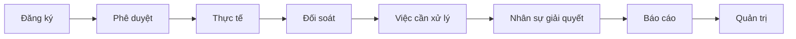

### Đây là giá trị khác biệt

**Không chỉ lưu thông tin.**

**Hệ thống theo dõi toàn bộ vòng đời công việc.**

---

<!-- _class: dark -->

# 19 — MỘT HỆ THỐNG, NHIỀU BÀI TOÁN

### 👤 Nhân viên
Đăng ký • Theo dõi • Nhận thông báo

### 👔 Người phê duyệt
Duyệt • Từ chối • Theo dõi quá hạn

### 🧑‍💼 Nhân sự
Đối soát • Xử lý sai lệch • Kiểm soát chốt lương

### 🖥 Quản trị
Phân quyền • Cấu hình • Theo dõi

### 🏢 Ban lãnh đạo
Số liệu • Chi phí • Rủi ro • Hiệu quả

---

<!-- _class: hero -->

# 20 — THÔNG ĐIỆP CUỐI CÙNG

## Trước đây

**Con người nhớ việc → tìm hồ sơ → nhập lại → đối chiếu → nhắc → sửa**

## Với FVN REGISTER

**Hệ thống lưu → tự kiểm tra → tự phát hiện → tự nhắc → con người xử lý ngoại lệ**

### **FVN REGISTER**
## Số hóa công việc để giảm chi phí vận hành và tăng khả năng kiểm soát.

---

<!--
Gợi ý trình bày:
1. Nói về chi phí ẩn trước, không nói về công nghệ trước.
2. Cho xem một tình huống chấm công + OT + phép.
3. Chuyển sang lịch làm việc và dấu ?.
4. Cho xem thiết bị + QR + phiếu kiểm tra.
5. Kết thúc bằng công thức tiền và phương án thử nghiệm 1–2 phòng ban.
6. Không dùng số minh họa như kết quả đã đạt được.
-->
