# FVN REGISTER
## Nhìn 5 giây: **TRƯỚC → SAU → THAY ĐỔI → HIỆU QUẢ**

### 🔴 TRƯỚC ↔ 🟢 SAU

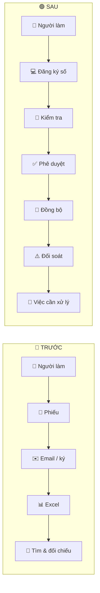

| 🔄 THAY ĐỔI | 📈 HIỆU QUẢ |
|---|---|
| Từ **nhập → chuyển → tìm → đối chiếu** sang **một luồng dữ liệu xuyên suốt** | Ít thao tác lặp • ít tìm kiếm • phát hiện sớm • giảm bỏ sót |

**Từ “làm hồ sơ” → “quản lý toàn bộ vòng đời công việc”.**

---

# 01 — MỘT VIỆC, HAI CÁCH VẬN HÀNH

### 🔴 TRƯỚC ↔ 🟢 SAU

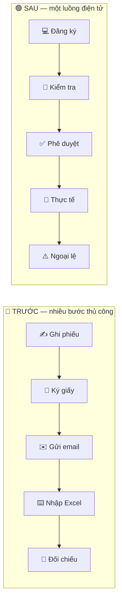

| 🔄 THAY ĐỔI | 📈 HIỆU QUẢ |
|---|---|
| **Một hồ sơ – một luồng dữ liệu** | Giảm nhập lại và giảm tìm kiếm |
| Phần lặp lại do hệ thống xử lý | Con người tập trung vào quyết định / ngoại lệ |

**Nguyên tắc:** sơ đồ cho thấy **cách làm**, phần dưới giải thích **vì sao hiệu quả**.

---

# 02 — 5 LƯU TRÌNH NHÌN LÀ HIỂU

### 📋 Đăng ký / phê duyệt
👤 Đăng ký → 🔐 Kiểm tra → 👔 Phê duyệt → 🔔 Thông báo

### 🕐 Kế hoạch / thực tế
📅 Kế hoạch → 🕐 Chấm công → 🔄 Đồng bộ HRM → ⚠️ Đối soát

### 🏖️ Phép / OT / công tác
📝 Đăng ký → ✅ Duyệt → 📅 Lịch → 🕐 Thực tế → ⚠️ Ngoại lệ

### 🖥️ Thiết bị / QR
📷 Quét QR → 🖥️ Thiết bị → 📋 Phiếu → 📸 Bằng chứng → 🕘 Lịch sử

### 🔔 Việc / hạn xử lý
📅 Sự kiện → ⚙️ Tạo việc → ⏰ Hạn → 🔔 Nhắc → 👤 Xử lý → ✅ Hoàn tất

> Quy ước: 🔴/✍️/📄 = thao tác thủ công   🟢/💻/🔄/🔔 = thao tác điện tử.

---
# 03 — MỘT QUY TRÌNH, HAI CÁCH VẬN HÀNH

### 🔴 TRƯỚC ↔ 🟢 SAU

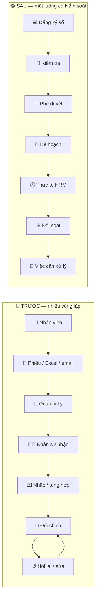

### Điểm thay đổi lớn
**Không cố gắng tự động hóa mọi quyết định — tự động hóa phần lặp lại để con người xử lý đúng chỗ.**

---

# 04 — CHẤM CÔNG • PHÉP • OT • CÔNG TÁC

| 🔴 TRƯỚC | 🟢 SAU | 🔄 THAY ĐỔI | 📈 HIỆU QUẢ |
|---|---|---|---|
| Phiếu → ký → lưu → nhập bảng → nhận bảng công → đối chiếu từng người | Đăng ký → duyệt → kế hoạch → HRM → đối soát | **Kế hoạch và thực tế được nối trực tiếp** | Giảm đối chiếu thủ công |
| Sai lệch phải gọi / email hỏi lại | Sai lệch xuất hiện trên lịch và danh sách xử lý | **Sai lệch trở thành một việc cụ thể** | Xử lý sớm hơn |
| Kiểm tra dồn vào cuối kỳ | Có thể phát hiện trong quá trình vận hành | **Từ kiểm tra muộn → kiểm tra liên tục** | Giảm dồn việc cuối kỳ |

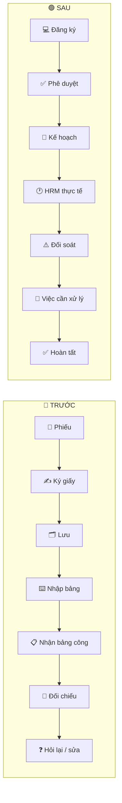

---

# 05 — CÁC SAI LỆCH ĐƯỢC NHÌN THẤY TRƯỚC KHI CHỐT

| Tình huống | Hệ thống làm gì | Việc còn lại của con người |
|---|---|---|
| **OT thực tế nhưng chưa đăng ký** | Đánh dấu sai lệch | Xác nhận / bổ sung hồ sơ |
| **OT đã duyệt nhưng không có thực tế** | Đưa vào xử lý | Xác nhận tình trạng |
| **Đã duyệt nghỉ nhưng vẫn có chấm công** | Hiển thị cảnh báo | Nhân sự kiểm tra |
| **Giờ thực tế khác giờ yêu cầu** | Đưa vào danh sách ngoại lệ | Xác nhận / điều chỉnh |

> **Thay đổi quan trọng:** từ **“tìm lỗi trong dữ liệu”** → **“hệ thống chỉ ra trường hợp cần xử lý”.**

---

# 06 — LỊCH LÀM VIỆC: MỘT MÀN HÌNH THAY CHO NHIỀU NƠI TÌM KIẾM

| 🔴 TRƯỚC | 🟢 SAU | 🔄 THAY ĐỔI | 📈 HIỆU QUẢ |
|---|---|---|---|
| Tìm ca ở một nơi, chấm công ở nơi khác, phép/OT ở hồ sơ khác | **Một lịch theo ngày** | Gom dữ liệu theo **ngữ cảnh thời gian** | Ít chuyển màn hình |
| Muốn biết “hôm đó có gì?” phải tra nhiều nguồn | Một ngày hiển thị **ca + vào/ra + phép + OT + công tác + cảnh báo** | **Một ngày = một bức tranh hoàn chỉnh** | Nhìn nhanh hơn |
| Sai lệch nằm trong dữ liệu chi tiết | Dấu **?** ngay tại ngày | Đưa vấn đề đến đúng vị trí | Phát hiện sớm |

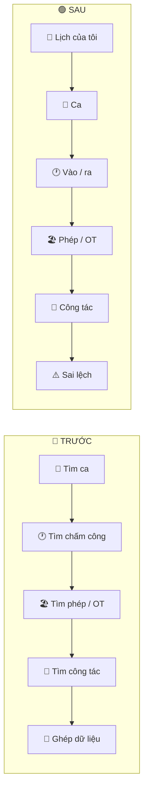

---

# 07 — DẤU “?” = VIỆC CẦN XỬ LÝ, KHÔNG PHẢI BIỂU TƯỢNG TRANG TRÍ

| 🔴 CÁCH CŨ | 🟢 CÁCH MỚI |
|---|---|
| **Có vấn đề** → phải tự tìm nguyên nhân | **?** → xem nguyên nhân ngay |
| Tìm hồ sơ nguồn | Có liên kết tới **hồ sơ / dữ liệu nguồn** |
| Tự hỏi ai xử lý | Có **người / đơn vị phụ trách** |
| Tự nhớ phải làm gì | Có **việc cần xử lý + hạn** |

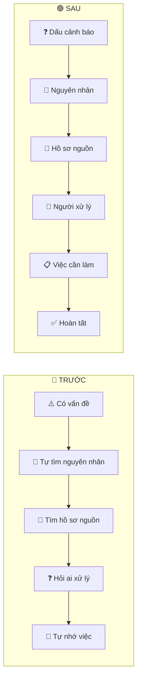

---

# 08 — QUẢN LÝ THIẾT BỊ: TỪ SỔ THEO DÕI → QR + LỊCH SỬ

| 🔴 TRƯỚC | 🟢 SAU | 🔄 THAY ĐỔI | 📈 HIỆU QUẢ |
|---|---|---|---|
| Tìm thiết bị trong sổ / Excel | **Quét QR** | Nhận diện trực tiếp thiết bị | Giảm thời gian tìm |
| Tìm phiếu kiểm tra cũ | QR → thông tin → lịch sử | Hồ sơ gắn với thiết bị | Dễ truy vết |
| Nhớ lịch kiểm tra | Hệ thống sinh nhiệm vụ | Theo dõi theo lịch | Giảm bỏ sót |

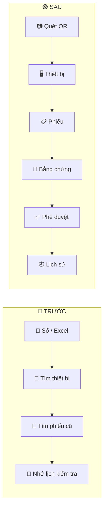

---

# 09 — PHIẾU KIỂM TRA: TỪ “NHỚ THÌ LÀM” → “HỆ THỐNG GIAO VIỆC”

| 🔴 TRƯỚC | 🟢 SAU | 🔄 THAY ĐỔI | 📈 HIỆU QUẢ |
|---|---|---|---|
| Có lịch nhưng người phụ trách phải tự nhớ | Tự sinh nhiệm vụ theo lịch | **Lịch → nhiệm vụ** | Giảm bỏ sót |
| Không rõ việc nào quá hạn | Có hạn xử lý + nhắc việc | **Theo dõi trạng thái** | Giảm quá hạn |
| Ảnh / giấy tờ rời khỏi hồ sơ | Bằng chứng gắn với phiếu | **Một hồ sơ có đủ bằng chứng** | Dễ kiểm tra |
| Khó biết lịch sử | Lưu lịch sử kiểm tra / sửa chữa | **Có truy vết** | Tăng khả năng kiểm soát |

---

# 10 — PHẦN MỀM CHỦ ĐỘNG THỰC HIỆN CÔNG VIỆC LẶP LẠI

| 🔴 TRƯỚC | 🟢 SAU |
|---|---|
| Nhân sự phải nhớ thời điểm đồng bộ | **Đồng bộ HRM theo chu kỳ** |
| Người dùng phải nhớ gửi thông báo | **Hàng đợi gửi thông báo** |
| Phải kiểm tra thủ công nhiệm vụ thiết bị | **Tự sinh nhiệm vụ / nhắc việc** |
| Đợi cuối kỳ mới rà sai lệch | **Đối soát định kỳ** |
| Quá hạn mới đi tìm | **Nhắc trước / chuyển cấp theo quy trình** |

| Chu kỳ | Chức năng |
|---:|---|
| **5 phút** | Đồng bộ HRM |
| **5 phút** | Hàng đợi thông báo |
| **10 phút** | Kiểm tra thiết bị |
| **30 phút** | Đối soát |

Các chu kỳ trên là cấu hình vận hành hiện tại, không phải cam kết hiệu năng.

---

# 11 — TỪ “AI NHỚ THÌ LÀM” → “HỆ THỐNG QUẢN LÝ HẠN”

### 🔴 CÁCH CŨ ↔ 🟢 CÁCH MỚI

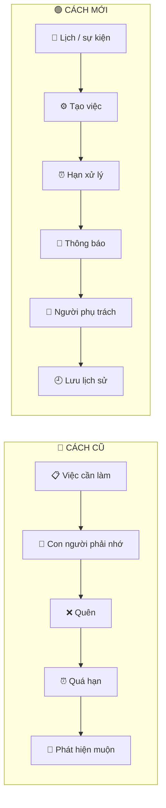

### Giá trị
**Đúng người • đúng việc • đúng hạn • có truy vết**

---

# 12 — KIỂM SOÁT TRƯỚC KHI CHỐT BẢNG LƯƠNG

| 🔴 TRƯỚC | 🟢 SAU | 🔄 THAY ĐỔI | 📈 HIỆU QUẢ |
|---|---|---|---|
| Tổng hợp nhiều nguồn rồi mới phát hiện vấn đề | Chấm công + phép + OT + công tác được đối soát | **Kiểm tra trước khi khóa** | Giảm sửa sau chốt |
| Sai lệch nằm rải rác | Có danh sách ngoại lệ | **Tập trung việc cần xử lý** | Giảm thời gian rà |
| Điều chỉnh khó truy vết | Có dữ liệu và lịch sử xử lý | **Có dấu vết** | Tăng kiểm soát |

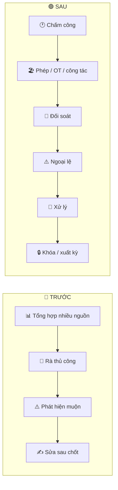

---

# 13 — BÁO CÁO: TỪ NHIỀU TỆP → MỘT NGUỒN DỮ LIỆU

### 🔴 TRƯỚC ↔ 🟢 SAU

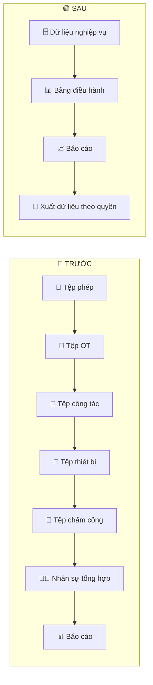

### Thay đổi
**Từ “gom dữ liệu để làm báo cáo” → “báo cáo lấy từ dữ liệu đã quản lý”.**

---

# 14 — HIỆU QUẢ ĐẾN TỪ 4 NHÓM

| 🔴 CHI PHÍ / LÃNG PHÍ | 🟢 CƠ CHẾ GIẢM |
|---|---|
| **Giờ công** | Giảm nhập lại, tìm kiếm, tổng hợp, đối chiếu |
| **Giấy tờ** | Giảm in, ký, quét, lưu, luân chuyển |
| **Sai sót** | Kiểm tra tự động + phát hiện ngoại lệ |
| **Rủi ro** | Nhắc việc + hạn xử lý + lịch sử + truy vết |

> **Đây là cơ chế tạo lợi ích. Không nên biến số liệu minh họa thành “kết quả đã đạt được”.**

---

# 15 — CÁCH CHUYỂN HIỆU QUẢ THÀNH TIỀN

| Bước | Cách tính |
|---|---|
| **01. Đo thời gian** | Số giao dịch × phút tiết kiệm / giao dịch |
| **02. Quy đổi giờ** | Tổng phút / 60 |
| **03. Quy đổi tiền** | Giờ tiết kiệm × chi phí nhân công quy đổi / giờ |
| **04. Cộng lợi ích khác** | Giấy tờ + giảm sửa sai + giảm tổn thất có thể đo |
| **05. Tính hiệu quả đầu tư** | Lợi ích ròng / tổng mức đầu tư |
| **06. Tính hoàn vốn** | Vốn đầu tư ban đầu / lợi ích ròng mỗi tháng |

### Nguyên tắc
**Đo trước → triển khai → đo sau → mới kết luận.**

---

# 16 — VÍ DỤ MINH HỌA: CÁCH TRÌNH BÀY, KHÔNG PHẢI KẾT QUẢ THỰC TẾ

> ⚠️ **Số liệu dưới đây chỉ để minh họa phương pháp tính.**

| Chỉ số | Ví dụ |
|---|---:|
| Giao dịch / tháng | 1.500 |
| Thời gian tiết kiệm / giao dịch | 16 phút |
| Giảm tổng hợp báo cáo | 120 giờ / tháng |
| Chi phí nhân công quy đổi | 75.000 đ / giờ |

**Mô hình minh họa:** khoảng **520 giờ/tháng** được giải phóng → khoảng **39 triệu đồng/tháng** → khoảng **468 triệu đồng/năm**.

> Số chính thức phải thay bằng **số liệu hiện trạng + kết quả đo sau triển khai**.

---

# 17 — “GIẢI PHÓNG NĂNG LỰC” KHÁC VỚI “GIẢM NGƯỜI”

| Giá trị | Có thể chuyển thành |
|---|---|
| Giờ nhập liệu giảm | Xử lý hồ sơ khác |
| Giờ tìm kiếm giảm | Kiểm soát / phân tích |
| Giờ đối chiếu giảm | Phòng ngừa sai lệch |
| Giờ làm báo cáo giảm | Phân tích dữ liệu |
| Ít việc lặp lại | Có thêm năng lực đáp ứng tăng trưởng |

> **Mục tiêu của số hóa là giảm công việc lặp lại, không mặc định đồng nghĩa với giảm nhân sự.**

---

# 18 — ĐO HIỆU QUẢ THỰC TẾ

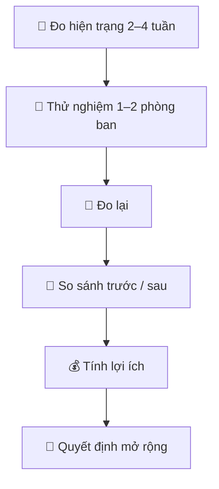

| Chỉ số | Cách nhìn |
|---|---|
| Phút xử lý / hồ sơ | ↓ |
| Số lần nhập lại / hồ sơ | ↓ |
| Thời gian đối chiếu | ↓ |
| Thời gian lập báo cáo | ↓ |
| Tỷ lệ phiếu kiểm tra đúng hạn | ↑ |
| Tỷ lệ sửa lại | ↓ |
| Tỷ lệ thiếu lịch sử | ↓ |
| Sai lệch phát hiện trước chốt | ↑ |

---

# 19 — TỪ PHẦN MỀM ĐĂNG KÝ → NỀN TẢNG VẬN HÀNH

| 🔴 CÁCH NHÌN CŨ | 🟢 CÁCH NHÌN MỚI |
|---|---|
| **Đăng ký** là điểm kết thúc của một chức năng | **Đăng ký** là điểm bắt đầu của một vòng đời |

### 🔴 TRƯỚC ↔ 🟢 SAU

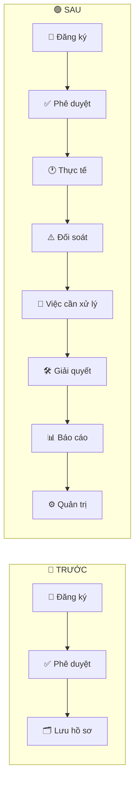

### Giá trị cốt lõi
**Hệ thống không chỉ lưu thông tin — hệ thống theo dõi vòng đời công việc.**

---

# 20 — MỘT HỆ THỐNG, NHIỀU GÓC NHÌN

| Người dùng | Giá trị nhận được |
|---|---|
| 👤 **Nhân viên** | Đăng ký • Theo dõi • Xem lịch • Nhận thông báo |
| 👔 **Người phê duyệt** | Duyệt • Từ chối • Theo dõi việc quá hạn |
| 🧑‍💼 **Nhân sự** | Đối soát • Xử lý sai lệch • Kiểm soát kỳ lương |
| 🖥 **Quản trị** | Phân quyền • Cấu hình • Theo dõi |
| 🏢 **Quản lý** | Số liệu • Chi phí • Rủi ro • Hiệu quả |

---

# 21 — KẾT LUẬN TRONG 5 GIÂY

| 🔴 TRƯỚC | 🟢 FVN REGISTER |
|---|---|
| **Con người nhớ việc** | **Hệ thống quản lý việc** |
| Tìm hồ sơ | Hồ sơ tập trung |
| Nhập lại | Dùng lại dữ liệu |
| Đối chiếu thủ công | Đối soát tự động |
| Phát hiện muộn | Phát hiện sớm |
| Tự nhắc nhau | Hệ thống nhắc việc |
| Sửa sau khi sai | Xử lý ngoại lệ theo quy trình |

## **Từ “quản lý hồ sơ” → “quản lý công việc”.**

### FVN REGISTER
**Số hóa để giảm thao tác lặp, tăng khả năng kiểm soát và đo được hiệu quả.**

---
