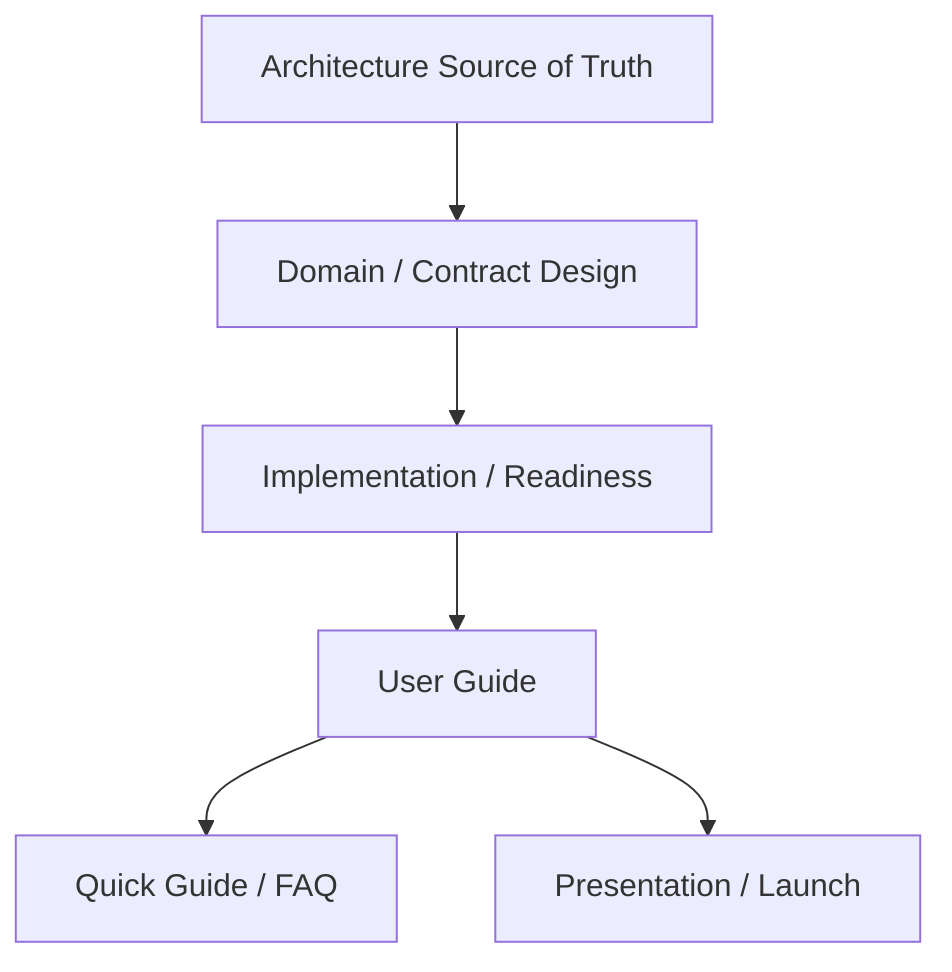
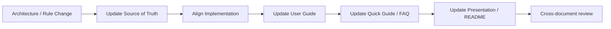

# FVN REGISTER — DOCUMENTATION STANDARD

> Quy định cách tổ chức, viết và duy trì toàn bộ tài liệu FVN REGISTER để tài liệu thiết kế, tài liệu vận hành và tài liệu trợ giúp luôn cùng một mô hình.

## 1. Source of truth

| Nội dung | Source of truth | Tài liệu phụ |
|---|---|---|
| Kiến trúc runtime + Work Calendar/Action | `MÔ HÌNH/24_WORK_CALENDAR_AND_ACTION_IMPLEMENTATION.md` | Design note cũ chỉ tham khảo |
| Execution Reconciliation | `MÔ HÌNH/18_OT_ATTENDANCE_RECONCILIATION.md` | User Guide / FAQ |
| Approval route + snapshot | `MÔ HÌNH/20_APPROVAL_ROUTE_SELECTION.md` + implementation | User Guide / FAQ |
| Security / RBAC / data scope | `MÔ HÌNH/12_SECURITY_RBAC.md` + implementation | User Guide / FAQ |
| Dashboard capability | `MÔ HÌNH/13_DASHBOARD_CAPABILITIES.md` | Features / Presentation |
| Reports | `MÔ HÌNH/19_REPORTS_STATISTICS.md` | User Guide |
| Attendance calculation | `MÔ HÌNH/22_HRM_ATTENDANCE_CALCULATION.md` | User Guide / FAQ |
| Product readiness | `MÔ HÌNH/23_PRODUCT_READINESS_PLAN.md` | Release / launch |
| User-facing documentation | `MÔ HÌNH/DOCUMENTATION/*` | README links |

**Không tạo thêm architecture document cùng cấp với 24 để mô tả lại Work Calendar/Action.** Khi architecture thay đổi, cập nhật 24 trước; sau đó đồng bộ các tài liệu người dùng.

## 2. Documentation layers



- **Architecture:** hệ thống phải hoạt động thế nào.
- **Domain design:** rule của từng nghiệp vụ.
- **Implementation/readiness:** trạng thái đã kiểm chứng; không biến kế hoạch thành fact.
- **User Guide:** người dùng phải làm gì và thấy gì.
- **Quick Guide/FAQ:** tra cứu nhanh; không định nghĩa rule mới.
- **Presentation:** diễn giải giá trị và flow; không chứa contract kỹ thuật độc lập.

## 3. Quy tắc không mâu thuẫn

1. Một thuật ngữ chỉ có một nghĩa chuẩn.
2. Một business rule chỉ có một nơi định nghĩa chính.
3. Guide không được mô tả behavior chưa có evidence runtime hoặc implementation rõ ràng.
4. Presentation có thể đơn giản hóa nhưng không được đảo nghĩa business state.
5. FAQ chỉ giải thích behavior đã được định nghĩa; nếu rule đổi, FAQ phải đổi cùng commit.
6. Tài liệu lịch sử phải ghi rõ **Historical / Reference**, không để người đọc hiểu là current design.
7. Không dùng “đã hoàn thành”, “đã certify” hoặc “production ready” nếu readiness evidence chưa có.

## 4. Thuật ngữ chuẩn

| Thuật ngữ | Nghĩa chuẩn |
|---|---|
| Request | Bản ghi nghiệp vụ do người dùng tạo |
| Planned | Kế hoạch nghiệp vụ đã có hiệu lực; với reconciliation là business state được Approved |
| Actual | Thực tế từ nguồn execution/attendance chính thức |
| Approval | Quyết định phê duyệt theo workflow |
| Approval Snapshot | Snapshot bất biến của hierarchy/approver tại Submit |
| Reconciliation | Đối chiếu Planned và Actual |
| Confirmation | Xác nhận nguyên nhân/kết quả mismatch |
| Evidence | Chứng cứ gắn với confirmation, có review lifecycle riêng |
| HR Resolution | Quyết định xử lý case execution của HR |
| Action | Work item cần người dùng xử lý; không phải business result |
| Notification | Kênh delivery/read; không phải approval |
| Calendar | Projection/navigation theo ngày; không phải business source of truth |
| Dashboard | Aggregation theo capability và data scope |
| Data Scope | Phạm vi dữ liệu server cho phép truy cập |
| Capability | Quyền thực hiện một chức năng/hành động |
| Registration Opportunity | Cơ hội mở form đăng ký cho ngày/module đủ điều kiện |

## 5. Work Calendar wording chuẩn

Calendar phải được mô tả theo thứ tự:

**Company calendar → Shift → Attendance → Registration → Issues/Actions → Registration Opportunity**.

Một ngày có thể đồng thời có attendance, registration và issue. UI không được biến mỗi source record thành một business state độc lập.

Registration và Confirmation là hai loại interaction khác nhau:

- **Registration:** tạo/sửa request nghiệp vụ.
- **Confirmation:** xử lý mismatch/action đã tồn tại.
- **Detail:** mở dữ liệu nghiệp vụ hiện có.
- **Info:** chỉ xem thông tin.

Với registration đã tồn tại, Calendar có thể hiển thị **module + trạng thái request/approval hiện có** (ví dụ Pending, Approved, Rejected theo source contract). Trạng thái đó không được suy diễn từ màu của Calendar.

Với ngày tương lai, không có Actual attendance là trạng thái bình thường; Calendar không được tạo attendance-mismatch chỉ vì ngày chưa tới.

## 6. Approval wording chuẩn

- **Pending:** đang chờ workflow xử lý.
- **Approved:** request đã hoàn tất điều kiện approval theo business workflow.
- **Rejected:** request bị từ chối.
- **Escalated:** hệ thống chuyển cấp do timeout; **không đồng nghĩa Rejected**.
- Sau Submit, Approval Snapshot là cơ sở xử lý request; thay đổi cấu hình approver về sau không sửa lịch sử của request đã Submit.

## 7. Reconciliation wording chuẩn

```text
Approved Planned + Actual
        ↓
   Reconciliation
    ↙          ↘
 Matched      Mismatch
    ↓             ↓
 Resolved     Confirmation
                   ↓
              Evidence/Review
                   ↓
              HR Resolution
```

- Approved không đồng nghĩa Actual.
- Action Completed không đồng nghĩa business Approved/Matched.
- Evidence Reject/NeedMoreEvidence không tự động đóng reconciliation.
- HR correction không bypass calculation pipeline.

## 8. Security wording chuẩn

Luôn phân biệt:

**Capability = được làm gì?**  
**Data Scope = được làm trên dữ liệu nào?**

UI filter không cấp quyền. Server phải áp dụng scope cho query và export.

## 9. Quy trình cập nhật tài liệu



Mỗi thay đổi business rule nên cập nhật trong cùng change set/commit nếu có thể.

## 10. Checklist review

- [ ] Tài liệu chỉ tham chiếu current contract.
- [ ] Không còn tên bảng/controller/service legacy trong phần current behavior.
- [ ] Status terminology thống nhất.
- [ ] Calendar không bị mô tả như source of truth.
- [ ] Action không bị mô tả như business result.
- [ ] Approval Snapshot được mô tả nhất quán.
- [ ] Capability và Data Scope được phân biệt.
- [ ] Future date không bị coi là missing attendance.
- [ ] Registration không bị trộn với Confirmation/Action.
- [ ] Guide/FAQ không claim behavior chưa được chứng minh.
- [ ] Link giữa các tài liệu còn hợp lệ.

## 11. Versioning

Tài liệu current ghi branch/revision khi có thay đổi lớn. Không dùng số phiên bản để tạo một architecture source song song; lịch sử thay đổi ghi trong changelog của source-of-truth.