# FVN REGISTER — BUSINESS CASE, COST REDUCTION & MANAGEMENT VALUE

> **Mục đích:** tài liệu dùng cho Ban lãnh đạo đánh giá hiệu quả đầu tư số hóa và tác động đến chi phí vận hành.
>
> **Nguyên tắc:** mọi số %/giờ/chi phí trong phần “Ví dụ minh họa” **không phải số liệu thực tế của FCC Việt Nam**. Khi lập ngân sách chính thức, thay bằng baseline đo thực tế trong 2–4 tuần.

## 1. Executive message

FVN REGISTER không chỉ thay **một tờ giấy bằng một màn hình**.

Giá trị kinh tế nằm ở việc chuyển chuỗi:

**Đăng ký → Phê duyệt → Thực tế → Đối chiếu → Nhắc việc → Xử lý sai lệch → Lưu lịch sử → Báo cáo**

từ các thao tác rời rạc sang một quy trình có dữ liệu, rule, automation và lịch sử tập trung.

### 4 nhóm giá trị

| Nhóm | Cơ chế tạo lợi ích |
|---|---|
| **Giảm giờ công thủ công** | Giảm nhập lại, tìm hồ sơ, đối chiếu Excel, tổng hợp báo cáo, nhắc người xử lý |
| **Giảm chi phí giấy tờ** | Giảm in, scan, lưu trữ và luân chuyển hồ sơ |
| **Giảm rework / sai sót** | Validation, workflow, reconciliation và audit trail phát hiện vấn đề sớm hơn |
| **Giảm rủi ro vận hành** | Reminder, escalation, QR, checklist, evidence và payroll readiness gate |

> **Lưu ý:** “giảm giờ công” trước hết là **giải phóng năng lực**. Chỉ trở thành tiết kiệm tiền mặt khi doanh nghiệp thực sự giảm overtime/thuê ngoài/vị trí bổ sung hoặc tái phân bổ nguồn lực có hiệu quả.

## 2. BEFORE — quy trình giấy / Excel / kênh rời rạc

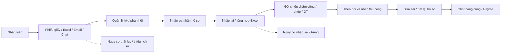

### Những điểm làm tăng chi phí

- Nhập cùng một thông tin nhiều lần.
- HR phải tìm giấy/Excel/email để xác định trạng thái và bản cuối.
- Đối chiếu Planned và Actual bằng tay.
- Sai lệch có thể chỉ được phát hiện khi HR kiểm tra hoặc gần payroll.
- Nhắc người duyệt/người kiểm tra phụ thuộc vào con người.
- Lịch sử dễ phân tán theo email, thư mục, bản giấy.
- Báo cáo quản trị thường cần thêm một vòng tổng hợp Excel.

## 3. AFTER — một luồng dữ liệu thống nhất

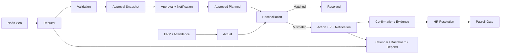

### Điểm khác biệt kinh tế

**Một lần nhập dữ liệu → nhiều nơi sử dụng lại**

- Request dùng cho Approval.
- Approval Snapshot bảo toàn lịch sử quyết định.
- Approved request dùng làm Planned.
- Attendance dùng làm Actual.
- Reconciliation tự phát hiện chênh lệch.
- Action/Notification đưa đúng việc tới đúng người.
- Calendar/Dashboard/Reports dùng chung nguồn dữ liệu.
- Payroll chỉ đi tiếp khi điều kiện readiness đạt yêu cầu.

# 4. BEFORE / AFTER — Chấm công + Nghỉ phép + OT + Công tác

## BEFORE

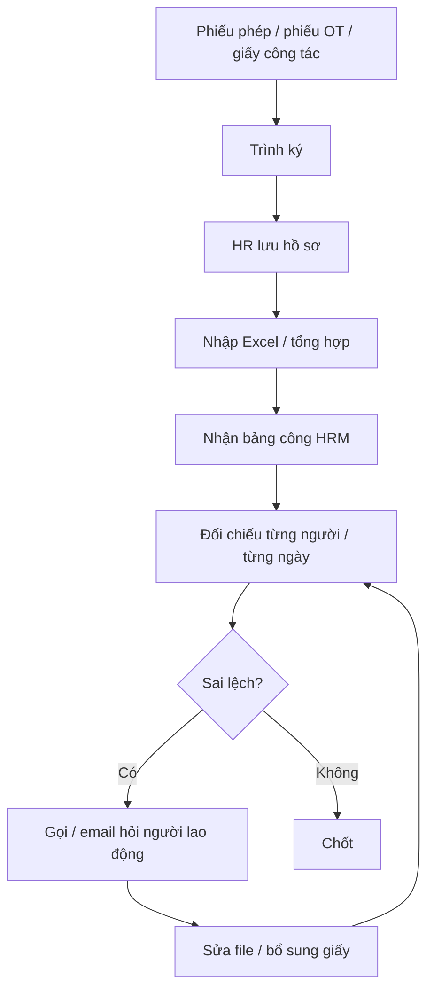

## AFTER

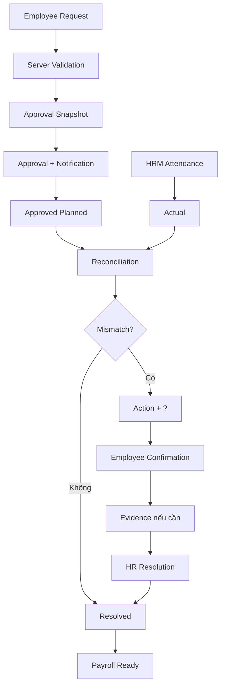

### Tác động trực tiếp

| Điểm tốn công | Cơ chế của FVN REGISTER |
|---|---|
| Nhập phiếu | Form số hóa + server validation |
| Theo dõi phê duyệt | Workflow + Notification |
| Tìm hồ sơ | Request + History tập trung |
| Đối chiếu thủ công | Execution Reconciliation |
| OT thực tế không có đơn | OT_ACTUAL_WITHOUT_REQUEST |
| OT đã duyệt nhưng không có Actual | OT_NO_ACTUAL |
| Nghỉ phép/công tác nhưng vẫn có attendance | Conflict rules |
| Nhắc xử lý sai lệch | Action + Notification + DueAt |
| Chốt payroll | Payroll readiness kiểm tra reconciliation/correction còn tồn |

## 5. BEFORE / AFTER — Quản lý thiết bị

### BEFORE: sổ giấy + checklist giấy

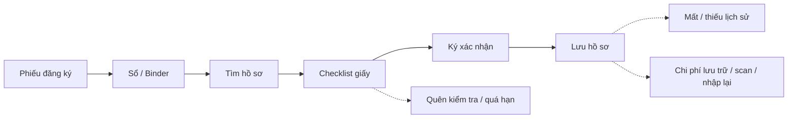

### AFTER: Equipment + QR + Checklist số

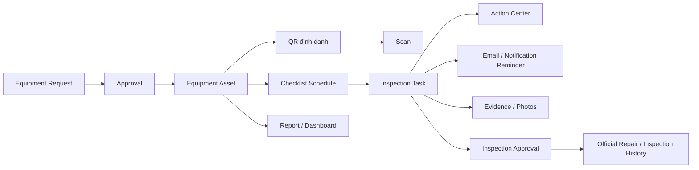

### Tác động kinh tế

- Giảm thời gian tìm thiết bị và hồ sơ.
- Giảm việc nhập lại tài sản từ Excel.
- Có QR để truy cập đúng tài sản thay vì tìm bằng sổ.
- Import Excel theo schema phòng ban nhưng vẫn có staging/validation trước Commit.
- Checklist có chu kỳ Daily/Weekly/Monthly/Quarterly/Yearly.
- Task tự sinh theo lịch.
- Có reminder trước hạn.
- Có Action Center cho người phải kiểm tra.
- Có ảnh/evidence cho các hạng mục yêu cầu bằng chứng.
- Checklist Active đã phát hành được khóa; thay đổi dùng cơ chế version/Clone.
- Có lịch sử sửa chữa/kiểm tra chính thức sau workflow.

> Hệ thống không chỉ “lưu checklist điện tử” mà chuyển checklist thành **một quy trình có lịch, người phụ trách, deadline, reminder, evidence và trạng thái**.

## 6. BEFORE / AFTER — Báo cáo quản trị

### BEFORE

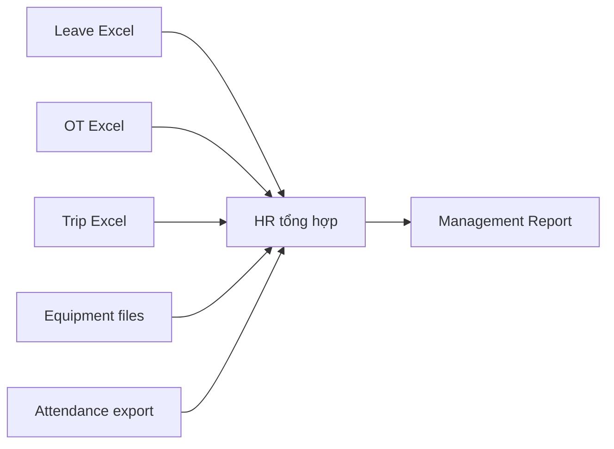

### AFTER

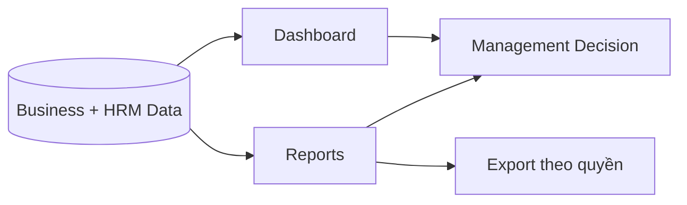

### Hiệu quả

- Không cần gom nhiều file cho các câu hỏi vận hành cơ bản.
- Report có bộ lọc theo ngày/phòng ban/nhân viên.
- View và Export tách capability.
- Data Scope được kiểm soát phía server.
- Cùng nguồn dữ liệu phục vụ Dashboard, Calendar, Report và Payroll.

## 7. Nguồn tiết kiệm số 1 — Giờ công hành chính

Gọi:

- N = số giao dịch/tháng.
- E = phút tiết kiệm của nhân viên/giao dịch.
- A = phút tiết kiệm của approver/giao dịch.
- H = phút tiết kiệm của HR/giao dịch.
- R = phút tiết kiệm báo cáo/tổng hợp/tháng.
- C = chi phí nhân công quy đổi/giờ.

**Giờ công giải phóng/tháng**

HoursSaved = (N × (E + A + H) + R) / 60

**Giá trị nhân công quy đổi/tháng**

LaborValue = HoursSaved × C

**Giá trị nhân công quy đổi/năm**

AnnualLaborValue = LaborValue × 12

### Các tác vụ được giảm

- nhập lại dữ liệu;
- kiểm tra trạng thái;
- tìm hồ sơ;
- đối chiếu thủ công;
- gửi mail nhắc;
- tổng hợp báo cáo;
- tìm lịch sử thiết bị;
- tìm checklist quá hạn;
- tổng hợp bằng chứng.

## 8. Nguồn tiết kiệm số 2 — Chi phí giấy tờ

AnnualPaperSaving = PrintedForms + Copy/Scan + Filing/Storage + InternalTransport

Có thể đo bằng:

- số biểu mẫu in/tháng;
- số trang/tháng;
- chi phí in/trang;
- chi phí scan;
- chi phí kho/tủ/hồ sơ;
- thời gian vận chuyển hồ sơ nội bộ.

> Với hồ sơ được số hóa, lợi ích không chỉ là tiền giấy mà còn là **giảm số lần con người phải chạm vào hồ sơ**.

## 9. Nguồn tiết kiệm số 3 — Giảm rework và sai sót

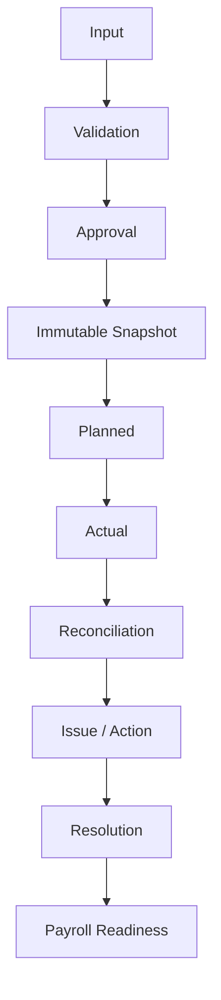

### Sai sót được phát hiện gần nguồn hơn

- Thiếu dữ liệu bắt buộc → validation.
- Người duyệt không hợp lệ → approval route/candidate resolution.
- Planned khác Actual → reconciliation.
- OT thực tế không có đơn → issue.
- Nghỉ phép/công tác nhưng có attendance → conflict issue.
- Checklist chưa thực hiện → task/reminder/action.
- Payroll snapshot cũ hoặc còn mismatch → chặn bước khóa/xuất.

Điều này **được thiết kế để giảm** chi phí của lỗi phát hiện muộn; chưa nên gọi đó là mức giảm thực tế nếu chưa có baseline.

## 10. Nguồn tiết kiệm số 4 — Giảm rủi ro do quên / quá hạn

### Quy trình giấy

### FVN REGISTER

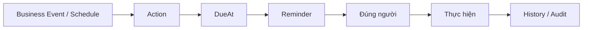

Áp dụng cho approval reminder, approval escalation, execution action, equipment inspection và các workflow có deadline.

## 11. Nguồn tiết kiệm số 5 — Quản lý tài sản và kiểm tra thiết bị

Khi một tài sản có:

**Asset → QR → Assignment → Checklist → Evidence → Approval → History**

doanh nghiệp có thể:

1. xác định nhanh tài sản;
2. biết tài sản thuộc bộ phận nào;
3. biết checklist nào đang áp dụng;
4. biết ai chịu trách nhiệm kiểm tra;
5. biết việc kiểm tra có đúng hạn hay không;
6. biết bằng chứng nằm ở đâu;
7. truy lại lịch sử sửa chữa/kiểm tra;
8. xuất báo cáo theo phòng ban.

Điều này **được thiết kế để giảm** chi phí “tìm thông tin” và rủi ro audit; cần đo thực tế sau pilot.

## 12. Ví dụ minh họa ROI — thay bằng số liệu thực tế

> **Không phải số liệu FCC. Chỉ là mô hình để trình bày cách tính.**

Giả sử doanh nghiệp đo được:

- N = 1.500 giao dịch/tháng.
- Tiết kiệm trung bình E + A + H = 16 phút/giao dịch.
- Tiết kiệm tổng hợp báo cáo R = 120 giờ/tháng.
- Chi phí nhân công quy đổi C = 75.000 VNĐ/giờ.

Khi đó:

HoursSaved = (1.500 × 16 / 60) + 120 = 520 giờ/tháng

LaborValue = 520 × 75.000 = 39.000.000 VNĐ/tháng

AnnualLaborValue ≈ 468.000.000 VNĐ/năm

Chưa tính giấy tờ, scan/lưu trữ, rework, quá hạn và chi phí tìm kiếm lịch sử.

**Các số này phải được thay bằng baseline thực tế trước khi trình ngân sách.**

## 13. Mô hình ROI cho Ban lãnh đạo

AnnualBenefit = LaborCapacityValue + PaperSaving + ReworkSaving + AvoidedOperationalLoss

AnnualCost = SoftwareOperation + Infrastructure + Support + Maintenance

NetBenefit = AnnualBenefit - AnnualCost

ROI = NetBenefit / TotalInvestment

PaybackMonths = InitialInvestment / MonthlyNetBenefit

### Tách business case thành 3 lớp

| Lớp | Cách trình bày |
|---|---|
| **Cashable saving** | Chi phí thực sự giảm |
| **Capacity release** | Giờ công được giải phóng và tái phân bổ |
| **Risk avoidance** | Giảm xác suất/chi phí của sai sót, thất lạc, quá hạn |

## 14. Automation đã được thiết kế trong hệ thống

Một phần lợi ích của FVN REGISTER đến từ các tác vụ nền, thay vì yêu cầu nhân sự phải nhớ chạy thủ công:

| Automation | Nhịp hiện tại trong branch | Giá trị vận hành |
|---|---|---|
| HRM synchronization | Mặc định mỗi **5 phút** | Đồng bộ Employee và dữ liệu HRM liên tục theo chu kỳ |
| Attendance calculation | Catch-up khi khởi động + **00:30 hằng ngày** | Tự tính bảng công theo kỳ, giảm phụ thuộc thao tác thủ công |
| Execution Reconciliation | Mỗi **30 phút**, rà vùng ngày gần nhất | Phát hiện Planned vs Actual mismatch sớm hơn |
| Equipment Inspection | Mỗi **10 phút** | Tự sinh inspection task theo lịch và cập nhật Action |
| Inspection reminder | Theo DueAt + ReminderHoursBefore | Nhắc đúng người trước hạn |
| Email queue | Mỗi **5 phút** | Tách delivery email khỏi thao tác nghiệp vụ |
| Approval escalation | Theo rule thời gian làm việc | Reminder / escalation / auto-reject theo policy |

Điểm cần nhấn mạnh với lãnh đạo:

**Hệ thống không chỉ lưu thông tin; hệ thống chủ động thực hiện một phần công việc theo lịch và rule.**

Các chu kỳ trên là contract hiện tại của branch và vẫn cần theo dõi hiệu quả thực tế sau pilot.

## 14. KPI nên đo trước và sau triển khai

| KPI | BEFORE | AFTER | Cách đo |
|---|---:|---:|---|
| Thời gian tạo request | Baseline | Pilot/Go-live | Stopwatch/log |
| Thời gian HR xử lý 1 request | Baseline | Pilot/Go-live | Sample 30–50 hồ sơ |
| Thời gian đối chiếu 1 ngày công | Baseline | Pilot/Go-live | Sample theo ngày |
| Số lần nhập lại dữ liệu | Baseline | Pilot/Go-live | Count touch-points |
| Tỷ lệ request có audit trail đầy đủ | Baseline | Pilot/Go-live | Audit sample |
| Tỷ lệ checklist hoàn thành đúng hạn | Baseline | Pilot/Go-live | Scheduled vs Completed |
| Tỷ lệ hồ sơ thất lạc/thiếu lịch sử | Baseline | Pilot/Go-live | Audit |
| Thời gian lập báo cáo | Baseline | Pilot/Go-live | Stopwatch |
| Số lỗi cần rework | Baseline | Pilot/Go-live | HR/IT log |
| Thời gian tìm lịch sử thiết bị | Baseline | Pilot/Go-live | Sample |
| Số issue phát hiện trước payroll | Baseline | Pilot/Go-live | Reconciliation |
| Tỷ lệ notification đúng người | Baseline | Pilot/Go-live | Delivery log |

### KPI cấp lãnh đạo

**Manual Touches / transaction**

**Minutes / transaction**

**Cost / transaction**

**Late / Overdue rate**

**Error & Rework rate**

**Digital adoption rate**

**Audit completeness**

**Payroll exception rate**

## 15. Đề xuất cách chứng minh hiệu quả

### Phase A — Baseline 2–4 tuần

Lấy mẫu Leave, OT, Trip, Attendance reconciliation, Equipment request, Equipment checklist và báo cáo HR/Quản lý.

Ghi nhận **thời gian thực**, số lần chạm hồ sơ và số lần sửa.

### Phase B — Pilot

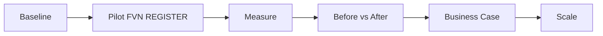

### Phase C — Annualize

Benefit per transaction × Annual transaction volume

=> business case toàn công ty.

## 16. Thông điệp lãnh đạo

> **FVN REGISTER không chỉ số hóa biểu mẫu.**
>
> Hệ thống chuyển một phần công việc “nhập – tìm – hỏi – đối chiếu – nhắc – tổng hợp” thành **dữ liệu + workflow + rule + automation**.

### Trước

**Con người nhớ việc → tìm hồ sơ → nhập lại → đối chiếu → nhắc → sửa**

### Sau

**Hệ thống lưu → hệ thống kiểm tra → hệ thống phát hiện → hệ thống nhắc → con người xử lý ngoại lệ**

Đây là cơ chế tạo ra **tiềm năng giảm chi phí vận hành lâu dài**; mức giảm cần được chứng minh bằng KPI Before/After.

## 17. Evidence đã có trong branch

Business case này dựa trên capability hiện hữu đã rà soát:

- Leave / OT / Trip request + approval.
- Approval Snapshot và approval history.
- Approval reminder / escalation.
- Work Calendar dùng chung.
- Official attendance calculation và automatic background calculation.
- Execution Reconciliation cho Planned vs Actual.
- Action / Notification dùng chung.
- Calendar Issue / ActionOption.
- Equipment registration + QR.
- Equipment import theo department schema, staging và validation.
- Equipment inspection template/versioning.
- Equipment inspection assignment theo chu kỳ.
- Scheduled inspection task.
- Reminder email/in-app notification.
- Action Center cho inspection task.
- Inspection evidence.
- Repair/inspection approval và history.
- Dashboard / Reports / Export.
- Payroll readiness gate dựa trên reconciliation/correction.

### Mô hình mở rộng

**Approval → Action → Notification → Reconciliation → Calendar → Dashboard → Reports**

được tái sử dụng cho module mới thay vì tạo một quy trình giấy/Excel mới cho từng nghiệp vụ.

## 18. Kết luận đề xuất

FVN REGISTER nên được xem như một **nền tảng giảm chi phí vận hành**, không chỉ là một ứng dụng đăng ký.

Trọng tâm đầu tư không phải “bao nhiêu màn hình”, mà là:

**Bao nhiêu giờ công thủ công được loại bỏ?**

**Bao nhiêu lần nhập lại được loại bỏ?**

**Bao nhiêu lỗi được phát hiện trước khi trở thành rework/payroll issue?**

**Bao nhiêu hồ sơ có thể truy vết ngay thay vì tìm trong giấy/Excel?**

**Bao nhiêu checklist/approval được hoàn thành đúng hạn nhờ automation?**

Khi đo được các chỉ số này trước và sau pilot, FVN REGISTER có thể chuyển từ một **dự án IT** thành một **business case có thể lượng hóa bằng ngân sách**.