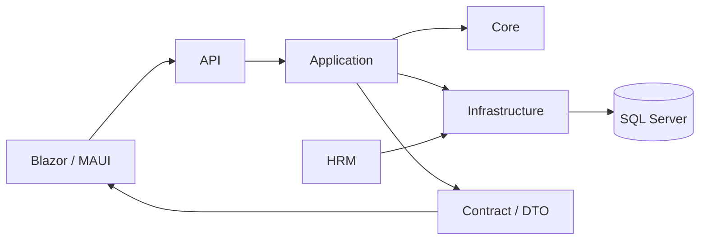

# FVN_REGISTER

FVN_REGISTER là nền tảng đăng ký nghiệp vụ nhân sự và e-Approval, bao gồm Leave, OT, Trip, Equipment, Attendance/Execution, Work Calendar, Action, Notification, Dashboard và Reports.

## Documentation

- **Tài liệu kiến trúc/source of truth:** [24 — Work Calendar & Action](MÔ%20HÌNH/24_WORK_CALENDAR_AND_ACTION_IMPLEMENTATION.md)
- **Execution Reconciliation:** [18 — Reconciliation](MÔ%20HÌNH/18_OT_ATTENDANCE_RECONCILIATION.md)
- **Documentation Hub:** [Documentation](MÔ%20HÌNH/DOCUMENTATION/00_INDEX.md)
- **User Guide:** [User Guide](MÔ%20HÌNH/DOCUMENTATION/04_USER_GUIDE.md)
- **Quick Guide:** [Quick Guide](MÔ%20HÌNH/DOCUMENTATION/05_QUICK_GUIDE.md)
- **FAQ:** [FAQ](MÔ%20HÌNH/DOCUMENTATION/06_FAQ.md)
- **Documentation Standard:** [Documentation Standard](MÔ%20HÌNH/DOCUMENTATION/08_DOCUMENTATION_STANDARD.md)

## Architecture boundary

### Shared Work Calendar

Leave, OT và Trip dùng một Work Calendar. Calendar là projection/navigation, không sở hữu business state.

- `GET /api/calendar`
- `GET /api/calendar/availability`
- UI: `WorkCalendar`
- Rule contract: `CalendarDayDto` + `ICalendarDayRule`
- Source of truth: `MÔ HÌNH/24_WORK_CALENDAR_AND_ACTION_IMPLEMENTATION.md`, section 24A

Một ngày có thể hiển thị shift, attendance, registration, request/approval status, issue/action và registration opportunity. Ngày tương lai chưa có Actual attendance là bình thường.

### Reports & Statistics

`/reports` cung cấp Leave, OT, Trip, Equipment và Attendance theo capability + data scope. View và Export là hai quyền độc lập.

### OT / Leave / Trip

Đây là các business request domain có validation, registration, approval và history riêng. Approved là Planned; Actual được lấy từ official attendance/execution calculation và reconciliation.

## Configuration

API dùng `ConnectionStrings:DefaultConnection`. Secret/JWT/connection string không được commit vào repository. Development nên dùng .NET User Secrets; production dùng environment/secret store.